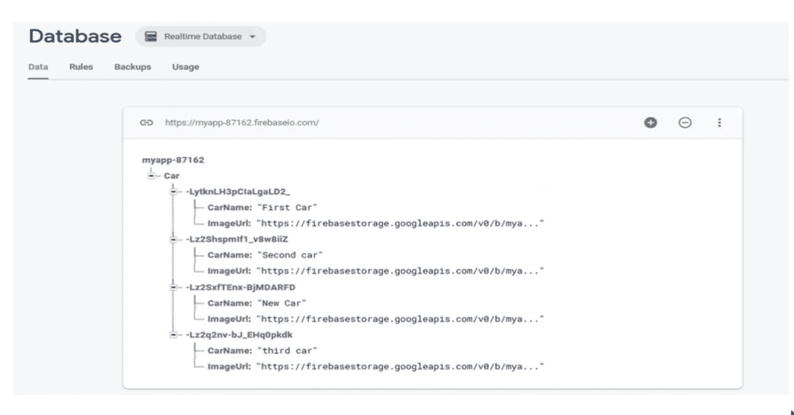
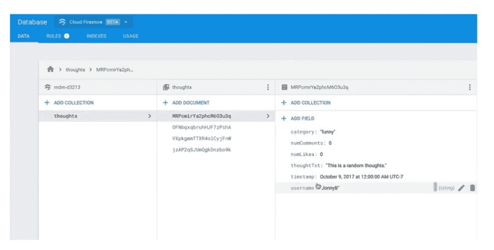

# 实时数据库 vs Firestore

> 原文:[https://www . geesforgeks . org/real-database-vs-firestore/](https://www.geeksforgeeks.org/realtime-database-vs-firestore/)

### 实时数据库:

*   Firebase 是一个实时数据库，是一个 **JSON 数据存储**。
*   完全**无组织**是福也是祸。
*   它是 Firebase 第一个也是最早的**云数据库**。
*   这个  实时数据库展示了**极低的延迟**。
*   **Firebase 数据库规则**是实时数据库唯一的安全选项。
*   让实时数据库流行起来的是它们令人敬畏的**客户端库**。客户端库允许您从您的应用程序(无论是网络、安卓还是 iOS)直接连接到数据库，因此您可以将您的 JSON 直接保存到实时数据库，而无需对其进行任何转换，并且您可以通过实时更改检测快速取回数据。实时数据库让我们的生活变得轻松多了。

实时数据库

### forestore:

*   Firestore 旨在与实时数据库并行工作，使用 firestore 并不意味着放弃实时数据库，但您可能会发现它更适合大多数任务。
*   Firestore 被认为是实时数据库的**下一代**。
*   它有很棒的**客户端库**。
*   它有**安全规则**，它与 firebase 的云功能一起工作。
*   forestore 是**结构化数据**。
*   Firestore 还支持**复杂查询**。
*   Firestore 根据您的**结果集**进行缩放，而不是根据您的收藏记录计数。
*   它在应用程序的数据库中提供跨客户端的同步状态。

大爆发

### 细节差异:

*   Firestore 是一个文档收集数据库，如果你使用过谷歌云数据存储或 MongoDB，那么你会熟悉 firestore 有一个**严格的模式**。首先，您定义一个集合，然后添加文档，每个文档都支持包含自己文档的子集合，这样您就可以像在实时数据库中一样嵌套数据，但它的结构要复杂得多。先思考集合，再文档集合，再文档。这是一个新的模式，但不难理解。
*   Firestore 有客户端库就像实时数据库一样，firestore 客户端库使您能够执行单个查询或收听文档或集合的更改与实时数据库不同，您的 firestore 查询可以有多个查询和按语句排序，与实时数据库不同，您的 firestore 查询**对于大量集合**保持性能。
*   如果你强迫实时数据库查询数百万条记录，它就会变得古怪，而 firestore 不在乎你的查询有多复杂，也不在乎集合中有多少条记录，但 firestore 在乎你返回了多少条记录。这是 firebase 和 firestore 的主要区别之一。实时数据库总是根据连接计数和数据传输给你开账单**，firestore 不会根据连接的客户端计数给你开账单，但是 firestore 会根据传输的数据量**给你开账单**，firestore 会根据你的读写**和删除计数**给你开账单。所以你从数据库中提取的每一条记录都会计入你的阅读量。您需要认识到 firestore 是根据结果集进行扩展的，因此如果您正在构建的功能具有大量快速的小读写，并且坚持使用实时数据库，您会发现大多数应用程序功能在 firestore 上更容易构建。**
*   Firestore 和实时数据库都是 NoSQL 数据库。实时数据库将数据存储为一个大的 JSON 树，而 Firestore 将数据存储在按集合排列的文档中。