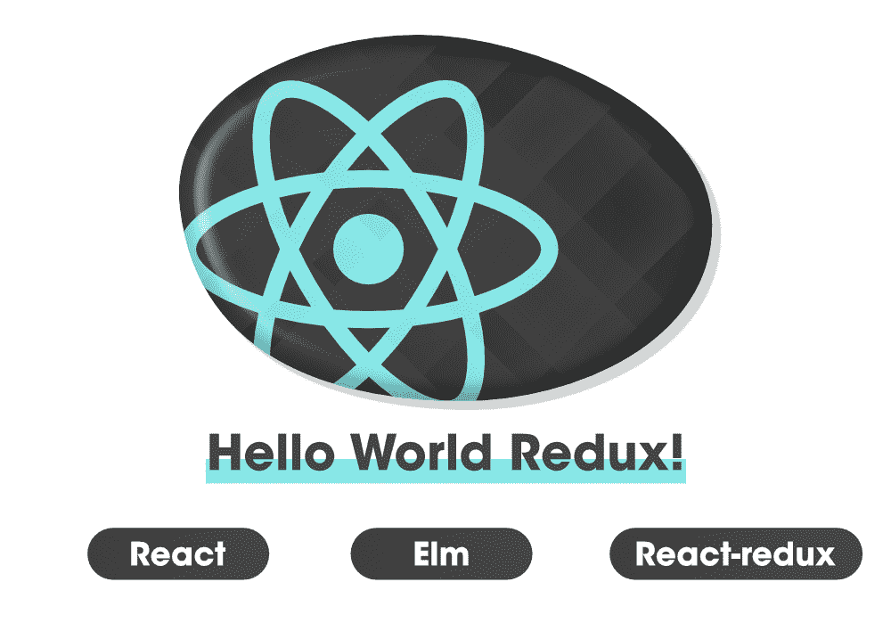
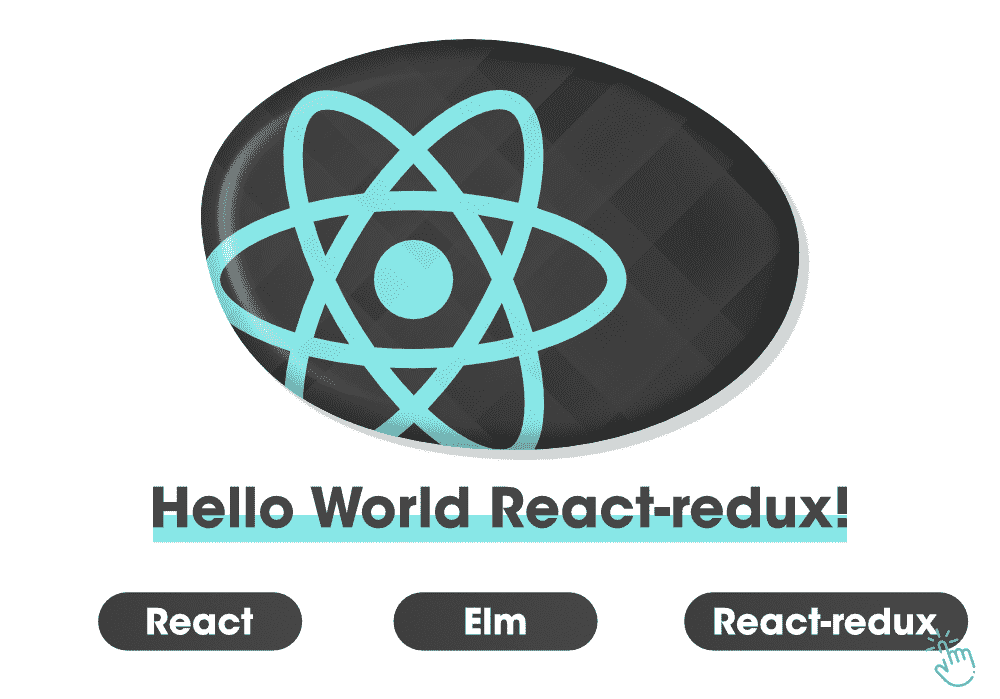

# Redux–初学者对概念的基本理解

> 原文:[https://www . geesforgeks . org/redux-初学者基本概念理解/](https://www.geeksforgeeks.org/redux-basic-understanding-of-the-concepts-for-beginners/)

对于试图从头开始学习的人来说，Redux 是最令人困惑的话题之一，也可能是一个困难的话题。但是**为什么呢？？**

***是因为 Redux 中的样板文件数量或者术语让你无法学习吗？**T3】*

你在搜索 Redux 指南，你看了一些博客/教程，你看了一些 YouTube 视频，但是当你发现不同的视频讲述了构建应用程序的不同方法时，事情变得更加混乱和复杂。

**Store、Reducer、Action、Dispatch、Subscribe** ，Redux 中的很多术语迫使你思考，如果事情可以直接解决，为什么我们需要走这么长的流程。你可能会想，与其简化事情，不如增加应用程序的复杂性。您可能还遇到过一些库，如 Redux、React-Redux、Redux-thunk、Redux-saga、Redux-promise、Reselect、Recompose 等等。路由、身份验证、服务器端呈现、捆绑。 ***哦天哪！！！*** 有很多东西需要学习，对你来说是压倒性的。在某个时候，你开始失去理智…

***放松！*** 经历这个问题并努力学习 Redux 的不止你一个人。


如果你正在寻找一个单一的资源来理解所有的基础知识，把其他不重要的东西放在一边，那么我们在这里帮助你，在这个博客中，我们将尽最大努力让你理解 Redux 的所有基本概念，而不会让你与一堆术语混淆。让我们从那开始…

首先，抛开所有多余的东西，让我们只使用 Redux。现在我们只介绍 Redux 中现在需要学习的最基本的东西。最初不需要深入一些概念，如反应路由器、Redux-form、重选、Ajax、Webpack、身份验证、测试等。记住，你不是一天跑的，你首先需要学会走路。

在开始学习 Redux 之前，请确保您了解 React 的基础知识。

### **Redux 是什么？**

在官方文档中，Redux 被定义为…

> **Redux 是 JavaScript 应用程序的可预测状态容器。**

嗯，刚开始这 9 个字给你的感觉是 90 个不完整的句子，你什么都得不到。嗯，当你开始阅读时，文档中有说明性的内容。以 React 应用程序为例。大多数情况下，您在组件的顶层定义应用程序中的状态，但是您是否注意到，当您的应用程序增长时，顶层组件中的所有状态对您来说已经不再足够，现在很难管理应用程序中的所有状态了？ 随着时间的推移，您的应用程序中可能也会有很多数据发生变化。Redux 的引入解决了所有这些问题。

状态管理是大型应用程序中的一个大问题，Redux 解决了这个问题。你可以用 Redux 做的一些好事情是日志记录、热重装、时间旅行、通用应用程序、记录和重放等。

### Redux 的三个核心原则

我们将为您保持简单，让我们首先理解它，而不使用技术术语。让我们考虑银行的现实场景。你想从你的银行账户中提取一些现金。你带着一个**的意图/行动**去银行分行，即取款。当你进入银行时，你直接去收银台提出你的要求。*但是。你为什么需要和收银员说话？* *你为什么不直接进入* *进入银行金库取钱？*

你知道取钱需要遵循一个过程。当你和收银员交谈时，他会花一些时间，检查一些细节，输入一些命令，然后把现金交给你。让我们将这个例子与 Redux 联系起来，了解它的一些术语。

**1。**把 **Redux Store** 当成银行金库，你申请的**州**就像钱一样。应用程序的整个用户界面取决于您的状态。就像您的钱在银行保险库中是安全的一样，您的应用程序的状态在 Redux Store 中也是安全的。现在，这就引出了 Redux 的**第一原则**

> **单一真实来源:整个应用程序的状态存储在单一存储内的对象树中。**

让我们进一步简化这个陈述。不要把钱扔在银行的任何地方，而是把钱放在一个金库里。因此在 Redux 中，建议将应用程序状态存储在 Redux 存储管理的单个对象中。

**2。**你带着**行动**去银行，也就是取款。如果你到处闲逛，没人会给你钱。Redux 中也发生了类似的事情。如果你想更新你的 Redux 的状态(就像你在 React 中使用 setState 一样)，你需要让 Redux 知道你的动作。就像您遵循从银行取钱的流程一样，Redux 也遵循更改/更新应用程序状态的流程。这就引出了 Redux 的**第二原则**。

> **状态为只读**

> **改变状态的唯一方法是向描述发生的事情的对象发出动作。**

以上说法的意思相当简单。在 Redux 中，您的操作 retract _ MONEY 将由一个对象表示，它看起来如下所示…

```
{  
 type: "WITHDRAW_MONEY",
 amount: "$10,000"
}

```

上面的对象是 Redux 应用程序中的一个**动作**，它有一个**类型**字段，描述您想要执行的动作。因此，每当您需要更改/更新 Redux 应用程序的状态时，您都需要调度一个操作。

**3。**在你的 Redux 应用程序中，将你在银行的出纳员视为**减速器**。要从您的银行保险库中提取现金，您需要首先向出纳员传达您的意图/行动。现在，收银员将遵循一些流程，并与存放所有银行资金的银行保险库进行通信。Redux 中也发生了类似的事情。要更新应用程序的状态，您需要将您的**动作** 传送到**减速器。**现在减速器会采取你的行动，它会执行它的工作，它会确保你得到你的钱。您的减速器总是返回您的**新状态**。将动作发送给减速器称为调度动作。这就引出了 Redux 的最后一个或者**第三个原理**。

> **要指定状态树是如何通过动作进行转换的，您需要编写纯缩减器。**

我们将在本博客后面了解纯减速器。希望我们已经解释好了 Redux 的三个主要术语: **S** **撕****R****educer****T9】和 an**A****action**。**

### 让我们构建第一个简单的 Redux 应用程序

通过一个真实的例子，我们了解了 Redux 的原理和一些常用术语，但是*如何在一个应用程序中介绍所有这些东西？*为了加深您在 Redux 中的基本概念，让我们举一个简单的 React 应用程序的例子，我们将重构应用程序，在其中引入 Redux。


如果您熟悉 React，那么在理解上面 React 应用程序的结构时就不会有问题。您可以使用**创建-反应-应用程序**命令创建该应用程序。在您的应用程序中，主**应用程序** 组件正在导入一个 **< HelloTech / >** 组件，并在其主体中呈现信息。 **< HelloTech / >** 组件收纳一个**科技** 道具，该道具向用户展示不同的科技。例如**<hello tech = " Redux "/>**将向用户显示以下结果…



下面是应用程序组件的代码…

**src/App.js**

## java 描述语言

```
import React, { Component } from "react";
import HelloTech from "./HelloTech";

class App extends Component {
 state = { 
  tech : "React"
}
render() {
  return <HelloTech tech={this.state.tech}/>
}
}

export default App;
```

我们将**技术**作为**道具**传递到 HelloTech 组件，如下图所示:

```
<HelloTech tech={this.state.tech}/>

```

现在，忘掉 HelloTech 组件实现。只是拿了**科技**道具，用了一些 CSS 做造型。这里主要关注的是重构**应用**组件，并在其中使用 **Redux** 。Redux 是我们应用程序的状态管理器，所以我们需要带走状态对象，我们希望它由 Redux 管理。还记得银行金库的例子吗，它保存着所有的钱。以类似的方式，Redux **存储**管理整个应用程序状态，并保持应用程序状态对象。所以我们首先需要从 **App.js** 中移除当前状态对象，我们需要通过运行**NPM install–从命令行界面保存 redux** 来安装 Redux。

## java 描述语言

```
import React, { Component } from "react";
import HelloTech from "./HelloTech";

class App extends Component {
 // the state object has been removed. 
render() {
  return <HelloTech tech={this.state.tech}/>
}
}

export default App;
```

#### **创建 Redux 商店**

就银行保险库而言，可能会雇佣一些工程师来创建一个安全的货币保管设施。类似地，在 Redux 中，Redux 库提供了一些 API 来创建存储工具。以下是在 Redux 中创建商店的代码…

```
import { createStore } from "redux"; //an import from the redux library
const store = createStore(); 

```

我们已经从 Redux 导入了 **createStore** 工厂函数，然后调用了 createStore()函数来创建存储。

#### **定义存储和减速器关系**

当你去银行取钱并让收银员知道你的行为时，你不会立即拿到钱。首先，出纳员会检查你的账户，看你是否有足够的钱进行交易。它与银行保险库通信以获取该信息。简而言之，收银台和金库总是同步的。Redux 中也发生了类似的事情。商店(银行金库)和减速器(收银台)相互通信，并且始终保持同步。但是如何在我们的代码中编写这个逻辑呢？？？我们在 createStore()函数中将减速器作为参数传递，下面是 **App.js** 的完整代码

**App.js**

## java 描述语言

```
import React, { Component } from "react";
import HelloTech from "./HelloTech";

 import { createStore } from "redux";  
 const store = createStore (reducer);  

 class App extends Component {
 render() {
   return <HelloTech tech={this.state.tech}/>
 }
}

export default App;
```

#### 减速器

如果你听到减压器这个词，它听起来像是一个执行“减少”工作的减少功能。在 JavaScript 中，您已经使用了 reduce，这是一个 Array.reduce()方法(您可能知道这个方法)。该方法采用两个值**累加器**和**当前值。**看看下面给出的例子…

```
let arr = [1, 2, 3, 4, 5]
let sum = arr.reduce((x,y) => x + y)
console.log(sum) // 15

```

这里 **x** 是**累加器**，而 **y** 是**当前值。**热毒里也发生了类似的的事情。Reducer 是 Redux 中的一个函数，它接受两个参数。一个是 app 的**状态**，另一个是**动作**。

现在，我们需要在我们的应用程序中包括减速器，我们还没有这样做。所以创建一个目录缩减器，并在其中创建一个文件**。**减速器功能的路径将是 **src/reducers/index.js.** 现在我们将只通过**存储**作为减速器中的参数，我们将只导出一个简单的功能。代码如下所示…

```
export default (state) => {
}

```

在 **Array.reduce()** 中，我们返回了累加器和当前值的**和**。如果你以我们的银行场景为例，那么在取款后，你银行金库里的钱就不再是了。它将再次更新，收银台和金库将与您帐户中的余额保持同步。就像收银员一样，减速器总是返回您的应用程序的**新状态**。我们将在本博客后面讨论更改/更新状态。现在考虑一个案例，你访问银行，你没有执行任何操作，所以银行余额保持不变。在 Redux 中，如果您不执行任何操作，并且您没有在 reduce 中将**操作**作为参数传递，则**状态**将保持不变，并且 reduce 将返回相同的**状态**作为**新状态。**此时点保持一个**新状态**被返回，与传入的**状态** 相同。

```
export default (state) => {
    return state  
}

```

#### 【createStore 的第二个参数

当你在你的银行创建一个账户时，你可能已经在你的账户里存了一些钱，如果你问出纳员你的银行余额，他们会查出来并告诉你。同样，当你创建一个 Redux Store 时，你做了一个类似的初始存款，称为**初始状态。**我们将把这个**初始状态**表示为**第二个** **参数**传递到 **createStore** 。

```
const store = createStore(reducer, initialState);

```

因此**初始状态**就像是您的商店(银行金库)中的初始存款，如果您不执行任何操作，该**初始状态**将作为应用程序的**状态**返回。下面是我们应用程序中带有 initialState 的 **App.js** 中的更新代码。

**App.js**

## java 描述语言

```
import React, { Component } from "react";
import HelloTech from "./HelloTech";
import reducer from "./reducers";
import { createStore } from "redux";  

const initialState = { tech: "React " };
const store = createStore(reducer, initialState);

class App extends Component {
 render() {
   return <HelloTech tech={this.state.tech}/>
 }
 }

export default App;
```

此时，如果您运行应用程序，它将会抛出一个错误，因为 **tech** 属性仍然是， **this.state.tech.** 我们已经从应用程序中移除了状态对象，因此它将是未定义的。目前，状态完全由 Store 管理，因此我们需要用 getState()方法替换这一行，当您使用 createStore()方法创建存储时，该方法可用。如果我们在创建的**商店中调用 **getState** 方法，**我们将获得应用程序的当前状态。传递到 createStore()的初始状态由对象{tech: React}表示。所以在我们的例子中，store.getState()将返回这个对象。以下是 **App.js** 的更新代码

**App.js**

## java 描述语言

```
import React, { Component } from "react";
import HelloTech from "./HelloTech";
import { createStore } from "redux";  

const initialState = { tech: "React " };
const store = createStore(reducer, initialState);  

class App extends Component {
 render() {
   return <HelloTech tech={store.getState().tech}/>
 }
}
```

***恭喜！！！*** 我们刚刚重构了一个简单的 React 应用程序来使用 Redux。现在状态由 Redux 管理。现在我们进入下一个话题，Redux 中的**动作**。

#### **减速动作**

在我们的银行案例场景中，您的意图/行为是**取款。**你必须让收银员知道你的行为，收银员将负责****更新你账户中的钱并将其移交给你**。**同样的事情发生在 **Redux** 减速器**中。**在一个纯 React 应用程序中，我们使用 setState 方法来更新我们应用程序中的状态，但是这里我们需要让 Reducer 知道我们的动作来更新您应用程序中的状态。但是怎么做呢？？****

*******通过调度和动作！又是如何做到的呢？？？**T3】*****

****我们只需要用一个普通的 JavaScript 对象来描述**动作**，这个对象**必须有一个**类型的**字段来描述动作的意图。代码如下所示…******

```
{
 type: "withdraw_money"
} 
```

**如果你只告诉你的行动去收银台取钱，你就拿不到钱。你还需要提到金额。在我们的应用程序中，很多时候我们还需要添加一些额外的信息来获得完整的细节。因此，我们将在代码中再添加一个信息量，如下所示…**

```
{
 type: "withdraw_money",
 amount: "$3000"
} 
```

**我们可以包含一些更多的信息，但现在，这已经足够了，忽略其他细节。如何组织您的动作确实取决于您，但是 Redux 中的一种标准/通用方法是使用有效负载字段。我们把所有需要的数据/信息放在描述动作的有效载荷对象中，它看起来如下…**

```
{
 type: "withdraw_money",
 payload: {
    amount: "$3000"
 }
} 
```

#### ****处理对减速器中动作的响应****

**我们已经讨论过，Reducer 需要两个参数来更新应用程序**。**一是**状态**，二是**动作。**所以一个简单的减速器看起来如下…**

```
function reducer(state, action) {

 // return new state
} 
```

**现在，为了处理传递给 Reducer 的动作，我们通常在 Redux 中使用 switch 语句，这只是一个 if/else 语句。**

## **java 描述语言**

```
function reducer (state, action) {
    switch (action.type) {
         case "withdraw_money":
            //do something
            break;
        case "deposit-money":
             //do something
            break;
        default:
            return state;
        }

}
```

**在上面的例子中，我们采取了两个行动。一个是**取钱**，另一个是**存款。**在您的 Redux 应用程序中，根据需求，您可以定义任意多的动作，但是每个动作都要流经 Redux，这就是我们在上面的代码中所做的。在上面的代码中，两个动作通过同一个减速器，减速器通过切换**动作来区分它们。这就是如何在减速器中单独处理每个动作，而不会带来任何不便。在上面的代码中，我们只需要定义*做一些事情*部分来返回一个新的状态。****

#### ****检查应用程序中的动作****

**让我们回到先前 HelloTech 的示例，了解如何更新应用程序的状态。请看下图。有三个按钮，我们的目标是每当点击一个特定的按钮时改变文本/技术。为此，我们需要调度一个操作，并且需要更新应用程序的状态。**

****

**例如，如果按钮 React-redux 被点击，它应该如下所示…**

****

**从上面的图片中，很明显我们需要描述三个动作…**

**对于“反应”按钮:**

```
{
   type: "SET_TECHNOLOGY",
   text: "React"
} 
```

**对于反应-还原按钮:**

```
{
    type: "SET_TECHNOLOGY",
    text: "React-redux"
} 
```

**对于榆树按钮:**

```
{
 type: "SET_TECHNOLOGY",
 text: "Elm"
} 
```

**三个按钮都做同样的事情。这就是我们用相同的**类型**场定义所有三个动作的原因。把他们当成银行里有相同存款意图/行为的客户(**类型)**但是金额不同(**文字)**。**

#### ****动作创作者****

**如果您查看我们为创建动作而编写的代码，您会注意到在代码中很少有重复的地方。比如同一个**类型的**字段被多次写入，按照编程中的 DRY 原理是不好的。为了保持我们的代码干燥，我们需要看看新的术语**动作创作者**。*那些是什么。？？？*我们来讨论一下。**

**动作创建器只是一些简单的函数，可以帮助你创建动作，保持你的代码干燥，并返回动作对象。下面是代码…**

```
export function setTechnology (text) {
 return {
    type: "SET_TECHNOLOGY",
    tech: text
  }
} 
```

**在上面的函数中，我们只需要调用 setTechnology 函数，我们就可以取回操作。没有必要到处复制代码。我们可以进一步简化这一点，我们可以使用 ES6 特性编写相同的上述代码。**

```
const setTechnology = text => ({ type: "SET_TECHNOLOGY", text }); 
```

#### **让我们一起来**

**在这一节中，我们将讨论文件夹结构，我们将看到如何将所有东西放在特定的文件夹/文件中，以保持东西的有序性。如果我们谈论我们的银行案例场景，那么你会注意到事情是在他们自己的地方组织的。例如，收银员坐在他们自己的隔间/办公室里，保险库在单独的安全房间里是安全的。我们将在 Redux 中做类似的事情。如何组织项目完全取决于您，但是 Redux 中的一种常见方法是为主要组件(如 reducer、actions 和 store)创建一个单独的文件夹/目录。**

**创建三个不同的文件夹缩减器、存储和操作。在每个文件夹中创建一个 **index.js** 文件，作为每个 Redux 组件的入口点。现在重构我们之前构建的应用程序，并将所有内容放在它自己的位置上。**

****store/index.js****

```
import { createStore } from "redux";
import reducer from "../reducers";

const initialState = { tech: "React " };
export const store = createStore(reducer, initialState); 
```

**每当我们需要在我们的应用程序中的任何地方存储时，我们都可以导入上面提到路径**的文件来导入存储。/store”；****

**现在文件 **App.js** 的代码会略有不同。**

## **java 描述语言**

```
import React, { Component } from "react";
import HelloTech from "./HelloTech";
import ButtonGroup from "./ButtonGroup";
import { store } from "./store";

class App extends Component {
  render() {
    return [
      <HelloTech key={1} tech={store.getState().tech} />,
      <ButtonGroup key={2} technologies={["React", "Elm", "React-redux"]} />
    ];
  }
}

export default App;
```

**在上面的代码行中，4 已经按照**存储**的路径进行了更改。我们还导入了一个组件**按钮组**，其中**T5 基本上是负责渲染三个按钮。 **<按钮组/ >** 组件采用一系列技术并吐出按钮。****

**您需要注意的另一件事是，应用程序组件返回一个数组。在 React 16 中，你不需要使用 **< div >** 来包裹 JSX 元素。就像我们之前在《反应》中做的那样。我们可以使用数组并将**键**传递给数组中的每个元素来执行相同的工作。**

**让我们移至**按钮组**组件。它是一个无状态组件，采用了一系列技术，由**技术**表示。**

**button group . js**

## **java 描述语言**

```
import React from "react";

const ButtonGroup = ({ technologies }) => (
  <div>
    {technologies.map((tech, i) => (
      <button
        data-tech={tech}
        key={`btn-${i}`}
        className="hello-btn"
      >
        {tech}
      </button>
    ))}
  </div>
);

export default ButtonGroup;
```

**在上面的代码中，传入的按钮数组是[“React”、“Elm”、“React-redux”]。我们需要使用**贴图**来循环这个数组，以渲染**中的每个技术<按钮></按钮>。**生成的按钮也没有什么属性，如**键**和**数据技术**。完全渲染的按钮如下所示:**

```
<button  
 data-tech="React-redux"  
 key="btn-1"  
 className="hello-btn"> React 
</button> 
```

**这将渲染所有按钮，但如果您单击这些按钮，将不会发生任何事情。我们需要在渲染函数中使用 onClick 处理程序。**

## **java 描述语言**

```
<div>
    {technologies.map((tech, i) => (
      <button
        data-tech={tech}
        key={`btn-${i}`}
        className="hello-btn"
        onClick={dispatchBtnAction}
      >
        {tech}
      </button>
    ))}
  </div>
```