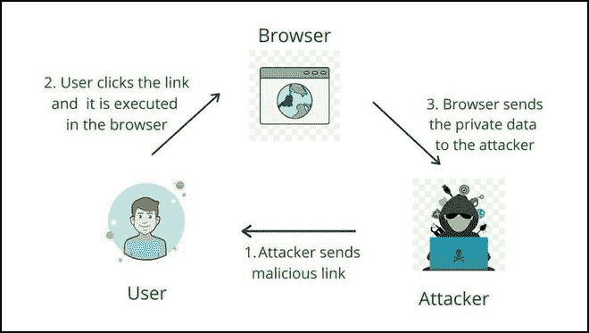

# 深度反映 XSS 脆弱性

> 原文:[https://www . geesforgeks . org/reflected-XSS-漏洞深度/](https://www.geeksforgeeks.org/reflected-xss-vulnerability-in-depth/)

在本文中，我们将讨论基于网络的应用程序中最常见的漏洞之一——反射 XSS。

**什么是跨站点脚本:**

*   跨站点脚本是大多数基于网络的实时应用程序中最常见的漏洞。web 应用程序是用户输入和搜索字段的集合。因此，这是跨站点脚本(XSS)攻击发生的载体。在这个用户输入中，攻击者输入了恶意的 JavaScript 代码，目的是窃取用户会话或进行残忍的代码执行。

*   XSS 攻击大多是由于对用户输入的不正确验证和清理而触发的。精心制作的输入可以提供给任何输入字段，并且可以很容易地传送到 web 服务器或数据库。如果在将信息发送到网络服务器之前对其进行了正确处理，那么应用程序就可以免受 XSS 攻击。

**跨站点脚本的类型:**

*   **反射 XSS —** 当恶意脚本反映在网站的结果或响应中时，就会发生反射 XSS 攻击。
*   **存储的 XSS —** 恶意数据被永久存储在数据库中，随后被受害者在不知情的情况下访问和运行。
*   **DOM XSS —** 基于 DOM 的 XSS，由于修改了原始客户端脚本使用的受害者浏览器中的 DOM“环境”，攻击者的有效负载被执行。客户端代码以“意外”的方式运行。

**深度反射 XSS:**

*   反射跨站点脚本是注入的脚本从网络服务器反射出来的类型，就像错误消息、搜索结果或任何其他响应一样。反射型攻击通过电子邮件或网络钓鱼等其他途径传递给受害者或目标。当用户被诱骗单击恶意脚本或链接时，此攻击会触发用户的浏览器。反射 XSS 的一个简单例子是搜索字段。
*   攻击者寻找直接使用用户输入生成响应的地方，以发起成功的反射 XSS 攻击。这通常涉及不期望托管脚本的元素，例如图像标签()，或者添加 onload 和 onmouseover 等事件属性。这些元素通常不接受相同的输入验证、输出编码和其他内容过滤和检查例程。

反射 XSS 的脚步

**上图:**

*   攻击者发送包含恶意 JavaScript 代码的链接。
*   恶意链接在任何特定浏览器的普通用户端执行。
*   执行后，像 cookies 或会话标识这样的敏感数据被发送回攻击者，普通用户受到威胁。

**示例 1:** 考虑一个通过查询字符串上提供的搜索参数从用户处获取搜索字符串的 web 应用程序。

> http://target.com/aform.html?search=Gaurav

应用服务器希望在 HTML 页面上显示用户提供的搜索值。在这种情况下，PHP 用于从 URL 中提取值并生成结果 HTML

检查用户在 URL 中提供的输入是如何直接向前传递的，没有执行输入验证，也没有输出编码。因此，可以形成恶意脚本，使得如果受害者点击该网址，则受害者的浏览器将执行恶意脚本，并将会话值发送给攻击者。

> http://target.com/aform.html?search=

**示例 2:** 当应用程序使用动态页面向用户显示错误消息时，也会出现反射 XSS。基本上，页面接受一个包含消息文本的输入参数，并在响应中简单地向用户显示该文本。
考虑以下返回错误消息的网址

> http://target.com/error/5/Error.ashx?message=Sorry%2c+an+error+occurred

如果我们检查返回页面的 HTML 源，应用程序只需复制 URL 中消息参数的值，并将其插入到错误页面的适当位置。

> 抱歉，出现错误。

由于没有对错误消息执行清理和验证，攻击者很容易插入恶意脚本，从而生成弹出对话框。

> http://target.com/error/5/Error.ashx?message=

请求此链接会生成一个 HTML 响应页面，其中包含以下内容来代替原始消息。

> T3】

**缓解:**

*   尝试使用不允许在输入字段或网址中使用客户端脚本的浏览器技术。
*   使用严格的类型字符和编码强制来避免 XSS。
*   确保所有用户提供的输入在发送到服务器之前都经过充分验证。

**反射 XSS 的影响:**

*   攻击者可以劫持用户帐户。
*   攻击者可以窃取凭据。
*   攻击者可以泄露敏感数据。
*   攻击者可以窃取 cookies 和会话。
*   攻击者可以快速访问您的其他客户端的计算机。