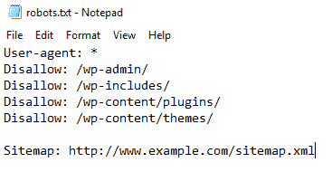

# robots.txt 文件

> 原文:[https://www.geeksforgeeks.org/robots-txt-file/](https://www.geeksforgeeks.org/robots-txt-file/)

**什么是 robots.txt 文件？**
网面是一个开阔的地方。表面上几乎所有的网站都可以被几个搜索引擎访问，例如，如果我们在谷歌上搜索某个东西，可以从中获得大量的结果。但是，如果网页设计师在他们的网站上创建了一些东西，并且不希望谷歌或其他搜索引擎访问它，那会怎么样呢？这就是 **robots.txt** 文件发挥作用的地方。Robots.txt 文件是由设计者创建的文本文件，以防止搜索引擎和机器人爬上他们的网站。它包含允许和不允许的站点列表，每当机器人想要访问网站时，它都会检查 robots.txt 文件，并且只访问那些允许的站点。它不会在搜索结果中显示不允许的网站。

**需要 robots.txt 文件:**这样做最重要的原因是为了保持一个网站的所有部分都是私有的，这样就没有机器人可以访问它。这也有助于防止搜索引擎索引某些文件。此外，它还指定了站点地图的位置。

**如何创建 robots.txt 文件？**
robots . txt 文件是放在你的网络服务器上的一个简单的文本文件，它告诉像 Google bot 这样的网络爬虫是否应该访问一个文件。这个文件可以在记事本中创建。语法由下式给出:

```html
User-agent: {name of user without braces}
Disallow: {site disallowed by the owner, i.e this can't be indexed}
Sitemap: {the sitemap location of the website}

```



**组件描述:**

*   用户代理:*
    不允许:
    该网站对所有搜索引擎开放(星号)，其所有内容均不允许。
*   用户代理:谷歌机器人
    不允许:/
    谷歌机器人搜索引擎不允许索引其任何内容。
*   用户代理:*
    不允许:/file.html
    这是部分访问。除 file.html 之外的所有其他内容都可以访问。
*   访问时间:0200-0300
    这是爬虫的时间界限。只能在给定的时间间隔内对内容进行索引。
*   爬行延迟:20
    禁止爬行器频繁攻击网站，因为这会使网站变慢。

一旦文件完成并准备好，以“robots.txt”的名称保存它(这很重要，不要使用其他名称)，并将其上传到网站的根目录。这将允许 robots.txt 文件完成它的工作。

**注:**robots . txt 文件在网上人人都可以访问。每个人都可以看到允许和不允许的用户代理和文件的名称。虽然没有人可以打开这些文件，但只显示了文件的名称。
要查看网站的 robots.txt 文件，

```html
"website name" + "/robots.txt"
eg: https://www.geeksforgeeks.org/robot.txt

```

**robots . txt 文件是如何工作的？**
当在任何搜索引擎上搜索某个东西时，搜索机器人(作为用户代理)会找到网站来显示结果。但是在显示它，甚至索引它之前，它会搜索网站的 robots.txt 文件，如果有的话。如果有，搜索机器人会通过它来检查网站上允许和不允许的网站。它会忽略文件中所有不允许的站点，并继续在结果中显示允许的内容。因此，它只能看到网站所有者允许的内容。

**示例:**

```html
User-agent: Googlebot
Disallow: /wp-admin/
Disallow: /wp-includes/
Disallow: /wp-content/plugins/
Disallow: /wp-content/themes/
Crawl-delay: 20
Visit-time: 0200-0300

```

这意味着谷歌机器人被允许以 20 毫秒的延迟抓取每个页面，除了那些仅在世界协调时 0200–0300 的时间间隔内不允许的网址。

**使用 robots.txt 文件的理由:**
人们对于在自己的网站上有一个 robots.txt 文件有不同的看法。
拥有 robots.txt 文件的理由:

*   它阻止搜索引擎的内容。
*   它调整了信誉良好的机器人对网站的访问。
*   它用于当前开发的网站，不需要在搜索引擎中显示。
*   它用于使内容对特定的搜索引擎可用。

**robots . txt 文件的使用？**
robots . txt 文件最重要的用途是维护隐私不受网络侵犯。并不是我们网页上的所有内容都应该展示给开放世界，因此这是一个很严重的问题，很容易用 robots.txt 文件处理。