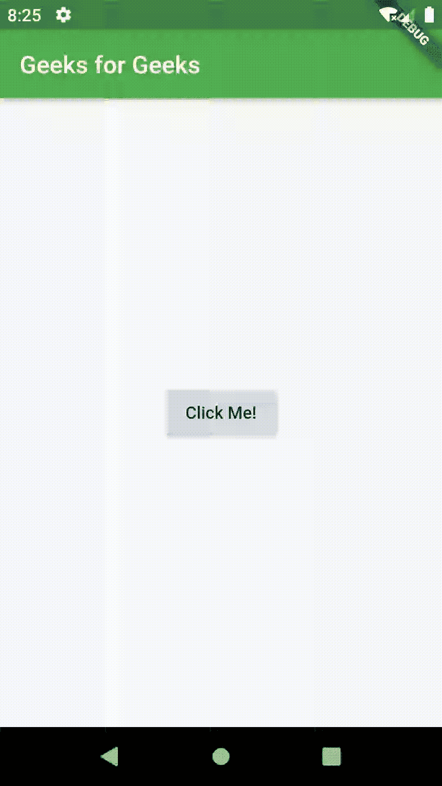

# 旋舞中的路线和导航

> 原文:[https://www . geesforgeks . org/routes-and-navigator-in-flutter/](https://www.geeksforgeeks.org/routes-and-navigator-in-flutter/)

**简介:** [Flutter](https://www.geeksforgeeks.org/flutter-an-introduction-to-the-open-source-sdk-by-google/) 是谷歌打造的开源手机应用 SDK。Flutter 使用 Dart 语言创建移动应用程序，遵循面向对象的概念。Flutter 在移动应用程序开发人员中有很好的影响力，因为它具有跨平台开发、热重新加载、热重启、吸引眼球的用户界面等显著特征。在 flutter 中，从文本到填充，一切都是一个小部件。Flutter 中的所有内容都是一个小部件。

**路线:**app 是新趋势。如今，游戏商店中可用的应用程序数量相当多。这些应用程序将内容显示在名为**页面或屏幕的全屏容器中。在颤动中，页面或屏幕被称为**路线**。在安卓系统中，这些页面/屏幕被称为活动，在 iOS 系统中，它被称为视图控制器。但是，在颤振中，路线被称为小部件。在 Flutter 中，页面/屏幕被称为路线。**

**创建路线:**使用面向对象的概念，可以在 Dart 中以“类”的形式编写路线。每个路由都可以写成一个独立的类，有自己的内容和用户界面。

现在让我们创建两条路线，每条都有独特的应用程序栏和凸起的按钮。代码如下:

```html
class HomeRoute extends StatelessWidget {
  @override
  Widget build(BuildContext context) {
    return Scaffold(
      appBar: AppBar(
        title: Text('Geeks for Geeks'),
        backgroundColor: Colors.green,
      ),
      body: Center(
        child: RaisedButton(
          child: Text('Click Me!'),
          onPressed: () {
            /* Contains the code that helps us
             navigate to the second route. */
          },
        ),
      ),
    );
  }
}

class SecondRoute extends StatelessWidget {
  @override
  Widget build(BuildContext context) {
    return Scaffold(
      appBar: AppBar(
        title: Text("Click Me Page"),
        backgroundColor: Colors.green,
      ),
      body: Center(
        child: RaisedButton(
          onPressed: () {
            /* Contains the code that helps us
             navigate to first route. */
          },
          child: Text('Home!'),
        ),
      ),
    );
  }
}
```

**导航器:**顾名思义，导航器是一个帮助我们在路线之间导航的小部件。导航器在处理路线时遵循堆栈方法。基于用户所做的动作，路线被一个堆叠在另一个之上，并且当被按下时，它转到最近访问的路线。导航器是一个遵循堆栈原则的小部件。

**定义主页:**在导航时，我们需要做的第一件事就是定义或初始化“主页”。主页可以是任何路线，根据我们的需要。主页通常会放在导航器堆栈的底部。现在让我们看看如何将我们的 HomeRoute()初始化为我们的主页:

```html
void main() {
  runApp(MaterialApp(
    home: HomeRoute(),
  ));
}
```

**导航到一个页面:**既然我们已经定义了我们的 home，剩下的就是从 Home 导航到 app 的另一条路线。为此，导航器小部件有一个名为 Navigator.push()的方法。此方法将路线推送到住宅顶部，从而显示第二条路线。将路由推入堆栈的代码如下:

```html
// Within the `HomeRoute` widget
onPressed: () {
  Navigator.push(
    context,
    MaterialPageRoute(builder: (context) => SecondRoute()),
  );
}
```

**导航回家:**现在我们已经到达目的地，但是我们如何回家呢？为此，导航器有一个名为 Navigator.pop()的方法。这有助于我们从堆栈中移除当前路线，以便我们返回到我们的主路线。这可以通过以下方式实现:

```html
// Within the SecondRoute widget
onPressed: () {
  Navigator.pop(context);
}
```

**示例:**那么，这就是我们如何在应用程序中的两个页面之间导航。上述 flutter app 的完整代码如下:

```html
import 'package:flutter/material.dart';

void main() {
  runApp(MaterialApp(
    home: HomeRoute(),
  ));
}

class HomeRoute extends StatelessWidget {
  @override
  Widget build(BuildContext context) {
    return Scaffold(
      appBar: AppBar(
        title: Text('Geeks for Geeks'),
        backgroundColor: Colors.green,
      ),
      body: Center(
        child: RaisedButton(
          child: Text('Click Me!'),
          onPressed: () {
              Navigator.push(
              context,
              MaterialPageRoute(builder: 
                (context) => SecondRoute()),
              );
          }
        ),
      ),
    );
  }
}

class SecondRoute extends StatelessWidget {
  @override
  Widget build(BuildContext context) {
    return Scaffold(
      appBar: AppBar(
        title: Text("Click Me Page"),
        backgroundColor: Colors.green,
      ),
      body: Center(
        child: RaisedButton(
          onPressed: () {
              Navigator.pop(context);
          },
          child: Text('Home!'),
        ),
      ),
    );
  }
}
```

**输出:** 