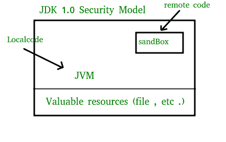

# 沙盒安全模型

> 原文:[https://www.geeksforgeeks.org/sandbox-security-model/](https://www.geeksforgeeks.org/sandbox-security-model/)

在计算机安全学中，沙箱是一种分离运行程序的安全机制，通常是为了尽量减少系统故障或软件漏洞的传播。一般来说，沙箱是一个隔离的计算环境，在其中可以执行程序或文件，而不会影响运行它的应用程序。沙箱被软件开发人员用来测试新的编程代码。

*   沙箱通常为来宾程序运行提供一组严格控制的资源，例如磁盘和内存上有限的空间。
*   在 Java 编程语言中，沙箱是程序区，它有一些规则，程序员在创建作为页面一部分发送的 Java 代码(如 applet)时需要遵循这些规则。
*   由于 Java 小程序是作为页面的一部分自动发送的，并且可以在它到达时立即执行，因此小程序很容易造成伤害，无论是意外还是有意
*   沙箱限制对小程序可以请求或访问的系统资源提供了严格的限制。程序员必须编写只在沙盒里“玩”的代码，比如允许孩子在一个地方的有限范围内玩。沙盒可以想象成你电脑中的一个小区域，小程序的代码可以在这里自由播放，但不允许在其他地方播放。

**Java 中的安全性**

*   Java 平台提供的原始安全模型被称为沙盒模型，它的存在是为了提供一个非常受限制的环境，在这个环境中运行从开放网络获得的不可信代码。
*   沙盒模型的本质是，本地代码被信任可以完全访问重要的系统资源(如文件系统)，而下载的远程代码(小程序)不被信任，只能访问沙盒内部提供的有限资源。

*   沙盒模型是通过 Java 开发工具包(JDK)部署的，并且通常被使用 JDK 1.0 构建的应用程序所采用，包括支持 Java 的 web 浏览器。
*   通过多种机制提供整体安全性。该语言被设计为类型安全且易于使用，即希望程序员的负担如此之重，以至于与使用其他编程语言(如 C 或 C++)相比，出错的可能性更小。诸如自动内存管理、垃圾收集以及字符串和数组的范围检查等语言特性是这种语言如何帮助程序员编写安全代码的例子。
*   其次，编译器和字节码验证器确保只执行合法的 Java 字节码。字节码验证器和 Java 虚拟机一起保证了运行时的语言安全。
*   类加载器定义了一个本地名称空间，可以用来确保不受信任的小程序不会干扰其他程序的运行。
*   最后，对关键系统资源的访问是由 Java 虚拟机中介的，并由 SecurityManager 类预先检查，该类将一段不受信任的代码的操作限制到最低限度。**(沙盒)**

用法

沙箱通常用于测试可能包含病毒或其他恶意代码的未经验证的程序，而不会让软件损害主机设备。

**实现**

*   在线评判系统，用于测试编程竞赛中的程序。
*   新一代粘贴箱允许用户在粘贴箱的服务器上执行粘贴的代码片段。
*   HTML5 有一个与 iframes 一起使用的“沙盒”属性。
*   安全计算模式(seccomp)是一个构建在 Linux 内核中的沙盒。激活后，seccomp 只允许写()、读()、退出()和 sigreturn()系统调用。

本文由 **[阿布舍克·古普塔](https://www.linkedin.com/in/abhishek-gupta-5279b7112/)** 供稿。如果你喜欢 GeeksforGeeks 并想投稿，你也可以使用[contribute.geeksforgeeks.org](http://www.contribute.geeksforgeeks.org)写一篇文章或者把你的文章邮寄到 contribute@geeksforgeeks.org。看到你的文章出现在极客博客主页上，帮助其他极客。

如果你发现任何不正确的地方，或者你想分享更多关于上面讨论的话题的信息，请写评论。