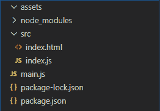
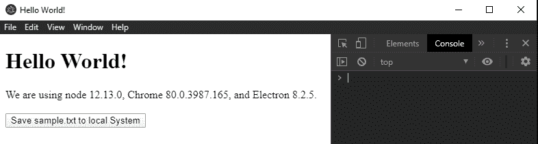

# 在电子表格中保存文件

> 原文:[https://www.geeksforgeeks.org/save-files-in-electronjs/](https://www.geeksforgeeks.org/save-files-in-electronjs/)

**[electronijs](https://www.geeksforgeeks.org/introduction-to-electronjs/)**是一个开源框架，用于使用能够在 Windows、macOS 和 Linux 操作系统上运行的 HTML、CSS 和 JavaScript 等网络技术构建跨平台的本机桌面应用程序。它将铬引擎和**T5 节点 T7】结合成一个单一的运行时。**

任何本机桌面应用程序都应该与系统操作系统环境集成。应用程序应该能够与核心操作系统功能交互，如文件系统、系统托盘等。电子为我们提供了内置的**对话框**模块，显示与文件交互的原生系统对话框。本教程将使用对话框模块的实例方法来演示如何在电子中本地保存文件。

我们假设您熟悉上述链接中介绍的先决条件。电子要工作， **[节点](https://www.geeksforgeeks.org/introduction-to-nodejs/)** 和 **[npm](https://www.geeksforgeeks.org/node-js-npm-node-package-manager/)** 需要预装在系统中。

**对话模块:**对话模块是**主流程**的一部分。要导入和使用**渲染器进程**中的对话框模块，我们将使用电子**远程**模块。有关远程模块的更多详细信息，请参考此[链接](https://www.electronjs.org/docs/api/remote)。

*   **项目结构:**
    

**示例:**我们将按照给定的步骤开始构建用于将文件保存到本地系统的电子应用程序。

*   **Step 1:** Navigate to an Empty Directory to setup the project, and run the following command.

    ```
    npm init
    ```

    生成**包. json** 文件。安装 **[电子](https://www.geeksforgeeks.org/introduction-to-electronjs/)** 如果没有安装，使用 npm。

    ```
    npm install electron --save
    ```

    该命令还将创建**包-lock.json** 文件，并安装所需的**节点 _ 模块**依赖项。根据项目结构创建**资产**文件夹。我们将从本机对话框将新文件保存到此文件夹。
    **包装:**

    ```
    {
      "name": "electron-save",
      "version": "1.0.0",
      "description": "Save Files to local in Electron",
      "main": "main.js",
      "scripts": {
        "start": "electron ."
      },
      "keywords": [
        "electron"
      ],
      "author": "Radhesh Khanna",
      "license": "ISC",
      "dependencies": {
        "electron": "^8.2.5"
      }
    }

    ```

*   **Step 2:** Create the **main.js** file according to the project structure. This file is the **Main Process** and acts as an entry point into the application. Copy the Boilerplate code for the **main.js** file as given in the following [link](https://www.electronjs.org/docs/tutorial/first-app#electron-development-in-a-nutshell). We have modified the code to suit our project needs.

    **main.js:**

    ```
    const { app, BrowserWindow } = require('electron')

    function createWindow () {
      // Create the browser window.
      const win = new BrowserWindow({
        width: 800,
        height: 600,
        webPreferences: {
          nodeIntegration: true
        }
      })

      // Load the index.html of the app.
      win.loadFile('src/index.html')

      // Open the DevTools.
      win.webContents.openDevTools()
    }

    // This method will be called when Electron has finished
    // initialization and is ready to create browser windows.
    // Some APIs can only be used after this event occurs.
    // This method is equivalent to 'app.on('ready', function())'
    app.whenReady().then(createWindow)

    // Quit when all windows are closed.
    app.on('window-all-closed', () => {
      // On macOS it is common for applications and their menu bar
      // to stay active until the user quits explicitly with Cmd + Q
      if (process.platform !== 'darwin') {
        app.quit()
      }
    })

    app.on('activate', () => {
        // On macOS it's common to re-create a window in the 
        // app when the dock icon is clicked and there are no 
        // other windows open.
      if (BrowserWindow.getAllWindows().length === 0) {
        createWindow()
      }
    })

    // In this file, you can include the rest of your 
    // app's specific main process code. You can also 
    // put them in separate files and require them here.
    ```

*   **Step 3:** Create the **index.html** file and **index.js** file within the **src** directory. We will also copy the boilerplate code for the **index.html** file from the above-mentioned link. We have modified the code to suit our project needs.

    **index.html:**

    ```
    <!DOCTYPE html>
    <html>
      <head>
        <meta charset="UTF-8">
        <title>Hello World!</title>
        <!-- https://electronjs.org/docs/tutorial
                               /security#csp-meta-tag -->
        <meta http-equiv="Content-Security-Policy" 
              content="script-src 'self' 'unsafe-inline';" />
      </head>
      <body>
        <h1>Hello World!</h1>
        We are using node 
        <script>
            document.write(process.versions.node)
        </script>, Chrome 
        <script>
            document.write(process.versions.chrome)
        </script>, and Electron 
        <script>
            document.write(process.versions.electron)
        </script>.

        <br><br>
        <button id="save">Save sample.txt to local System</button>

        <!-- Adding Individual Renderer Process JS File -->
        <script src="index.js"></script>
      </body>
    </html>
    ```

    **输出:**此时，我们的应用程序已经设置好了，我们可以启动应用程序来检查 GUI 输出。要启动电子应用程序，请运行命令:

    ```
    npm start
    ```

    

*   **Step 4:** The **Save sample.txt to local System** button does not have any functionality associated with it yet.
    **index.js:** Add the following snippet in that file.

    ```
    const electron = require('electron');
    const path = require('path');
    const fs = require('fs');
    // Importing dialog module using remote
    const dialog = electron.remote.dialog;

    var save = document.getElementById('save');

    save.addEventListener('click', (event) => {
        // Resolves to a Promise<Object>
        dialog.showSaveDialog({
            title: 'Select the File Path to save',
            defaultPath: path.join(__dirname, '../assets/sample.txt'),
            // defaultPath: path.join(__dirname, '../assets/'),
            buttonLabel: 'Save',
            // Restricting the user to only Text Files.
            filters: [
                {
                    name: 'Text Files',
                    extensions: ['txt', 'docx']
                }, ],
            properties: []
        }).then(file => {
            // Stating whether dialog operation was cancelled or not.
            console.log(file.canceled);
            if (!file.canceled) {
                console.log(file.filePath.toString());

                // Creating and Writing to the sample.txt file
                fs.writeFile(file.filePath.toString(), 
                             'This is a Sample File', function (err) {
                    if (err) throw err;
                    console.log('Saved!');
                });
            }
        }).catch(err => {
            console.log(err)
        });
    });
    ```

    **对话框显示保存对话框(浏览器窗口，选项)**接受以下参数。有关**对话框.显示保存对话框()**方法的更多详细信息，请参考此[链接](https://www.electronjs.org/docs/api/dialog#dialogshowsavedialogbrowserwindow-options)。

    *   **浏览器窗口:浏览器窗口(可选)****浏览器窗口**实例。该参数允许本地对话框将其自身附加到父窗口，使其成为**模式**。模态窗口是禁用父窗口的子窗口。如果**浏览器窗口**实例未显示，对话框将不会附加到其上。在这种情况下，它将显示为独立窗口。在上面的代码中，**浏览器窗口**实例没有被传递到对话框，因此单击**保存样本. txt 到本地系统**按钮，对话框作为独立窗口打开。有关**浏览器窗口**对象和模态窗口的更多详细信息，请参考此[链接](https://www.electronjs.org/docs/api/browser-window#modal-windows)。
    *   **选项:对象**它接受以下参数:
        *   **标题:字符串(可选)**对话框窗口显示的标题。
        *   **默认路径:字符串(可选)**单击**将 sample.txt 保存到本地系统**按钮，将由**默认打开/使用的绝对目录路径、绝对文件路径或文件名。在这种情况下，我们指定绝对目录路径，文件浏览器将导航到该目录，但不会填充对话框窗口中的**文件名:**文本字段。如果指定了绝对文件路径以及文件名和扩展名，**文件名:**文本字段将自动填充，如代码所示。在这两种情况下，文件路径和文件名都可以在对话框窗口中更改。**
        *   **按钮标签:字符串(可选)**确认按钮的自定义标签。如果为空，将使用默认标签。在上面的代码中定义为**保存**。
        *   **消息:字符串(可选)**此参数仅在 **macOS** 中支持。这用于在文本字段上方显示自定义消息。
        *   **名称字段标签:字符串(可选)**此参数仅在 **macOS** 中支持。它为显示在**文件名:**文本字段前面的文本定义了一个自定义标签。
        *   **显示 staggfield:Boolean(可选)**此参数仅在 **macOS** 中支持。显示**标签**输入框，为文件分配自定义标签。默认值为**真**。
        *   **securityScopedBookmarks:Boolean(可选)**此参数仅在 **macOS** 中支持。当为苹果应用商店打包时，该参数用于创建**安全范围的书签**。如果该选项设置为**真**并且该文件不存在，则将在所选路径创建一个空白文件。更多详细信息，请参考[链接](https://developer.apple.com/library/archive/documentation/Security/Conceptual/AppSandboxDesignGuide/AppSandboxInDepth/AppSandboxInDepth.html#//apple_ref/doc/uid/TP40011183-CH3-SW16)。
        *   **filters: FileFilter[{}] (Optional)** It is an Array of Objects. It defines an array of file types that can be displayed when we want to limit the user to a specific type. We can define multiple file types object belonging to different categories. The **FileFilter** object takes in the following parameters,
            *   **名称:字符串**扩展类别的名称。
            *   **扩展:String[]** 扩展数组应该由不带通配符或点的扩展组成，如代码所示。要显示所有文件，请使用 ***** 通配符(不支持其他通配符)。更多详细信息，请参考[链接](https://www.electronjs.org/docs/api/structures/file-filter)。

            在上面的代码中，我们希望限制用户只能访问文本文件。因此，我们将名称定义为**文本文件**，扩展名数组定义为 **['txt '，' docx']** 。

        *   **属性:字符串[](可选)**包含本机对话框可用的功能列表。它采用以下值，
            *   **显示隐藏文件:**在对话框中显示隐藏文件。
            *   **创建目录:**该值仅在 **macOS** 中支持。它允许在对话框中创建新目录。在**窗口**中，**上下文菜单**在对话框**(在对话框窗口中右键单击)**中预先可用，我们可以从中创建新的文件和目录。
            *   **治疗包目录:**该值仅在 **macOS** 中受支持。它对待包裹如**。app** 文件夹，作为目录而不是文件。
            *   **不支持:**该值仅在**窗口**中支持。该值表示正在保存的文件不应添加到最近的文档列表中。
            *   **showOverwriteConfirmation:**此值仅在 **Linux** 中支持。该值定义了如果用户键入的文件名已经存在于该目录中，是否应该向用户显示确认对话框。

**对话框显示保存对话框(浏览器窗口，选项)**返回**承诺**。它解析为包含以下参数的**对象**，

*   **取消:布尔型**对话框操作是否取消。
*   **文件路径:字符串(可选)**用户选择的文件路径。如果取消对话操作，将会是**未定义**。
*   **书签:字符串(可选)**此返回字符串仅在 **macOS** 中支持。这是一个 **Base64** 编码字符串，包含保存文件的安全范围书签数据。在**选项**对象中，当 **securityScopedBookmarks** 参数定义为 **true** 时，返回此值。不同的返回值请参考[链接](https://www.electronjs.org/docs/api/dialog#bookmarks-array)。

**fs.writeFile(文件、数据、选项、回调)**方法用于将指定的数据写入文件。默认情况下，如果文件存在于定义的文件路径中，这将替换该文件。在上面的代码中，我们指定了绝对文件路径、要写入的字符串数据和用于处理错误的回调。我们可以使用**选项**参数来修改功能。更多详细信息，请参考[链接](https://www.geeksforgeeks.org/node-js-fs-writefile-method/)。

我们现在应该能够成功地从对话框窗口中选择文件路径，给出一个新的文件名(如果需要，在我们的代码中默认为 **sample.txt** )并在该路径保存新创建的 **sample.txt** 文件。
**输出:**

<video class="wp-video-shortcode" id="video-414512-1" width="665" height="514" preload="metadata" controls=""><source type="video/mp4" src="https://media.geeksforgeeks.org/wp-content/uploads/20200514211548/Output-27.mp4?_=1">[https://media.geeksforgeeks.org/wp-content/uploads/20200514211548/Output-27.mp4](https://media.geeksforgeeks.org/wp-content/uploads/20200514211548/Output-27.mp4)</video>