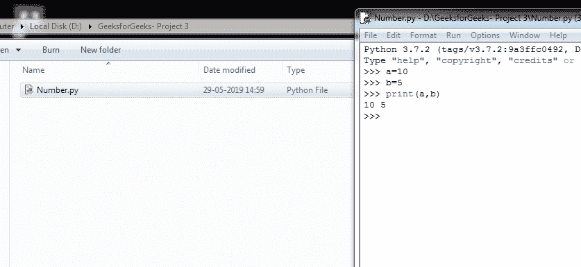
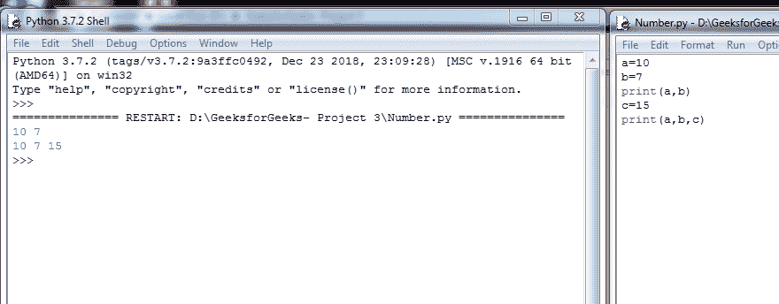
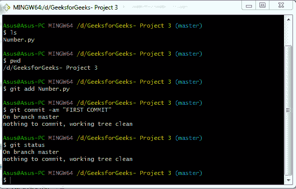
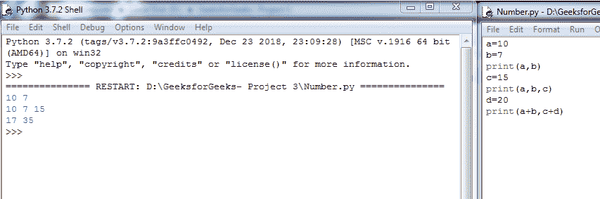
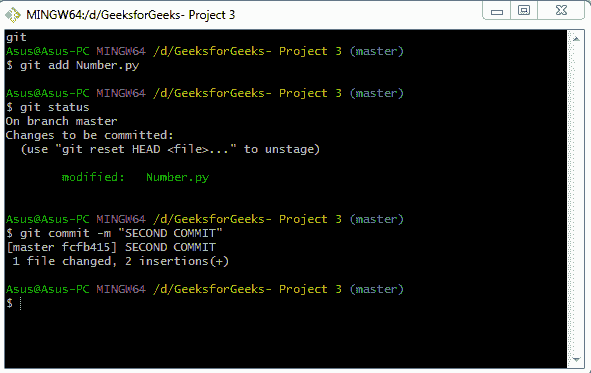

# 用 Git 保存文件

> 原文:[https://www.geeksforgeeks.org/saving-a-file-in-git/](https://www.geeksforgeeks.org/saving-a-file-in-git/)

在 git 中保存文件或文件集合的方法与在文件编辑器中完全不同。为了保存 git 项目的最新版本，我们将使用以下命令:

1.  ***去添加***
2.  **t1【去状态】T2**
3.  ***去委员会***

。

**Git add**
Git add 是一个线人的命令。它充当用户和 git 之间的中介。它通知 git，更改将包含在下一阶段中。除非调用 **git commit** 命令，否则它不会影响存储库。

**Git 状态**
顾名思义，该命令显示工作区和集结地的状态。它显示工作目录中的路径，并列出被跟踪或未被跟踪的文件。这个命令非常有帮助，因为它让用户在真正提交他不想做的更改之前知道他在做什么。

**Git commit**
这个命令捕捉到了变化。这个命令和 git add 是最常用的命令之一。Git commit 和 git add 是相互配合的命令。
以下是 git 提交命令的一些重要选项:

*   **-a**

    它包括此提交中所有当前已更改的文件，但新的未跟踪文件不受影响。

*   **-m “message**

    这将创建一个提交命令，并显示一条消息。默认情况下，此命令打开本地配置的文本编辑器。

*   **-am “message”**

    这是一个结合了-a 和-m 选项的快捷命令。

*   **–amend**

    该选项允许用户修改最后一次提交。如果用户没有用-m 指定提交消息，默认情况下，他/她将被提示上一个提交命令的消息。该命令不创建新的提交，而是创建最后一个提交。

**下面是上面命令如何工作的快照**

***创建 python 文件**

***使用 git add，git status，git commit 命令在我们的第一个 commit**

***在 IDLE 中更改或更新 Number.py 文件并保存**

***再次使用 git add，git status，git commit 命令在我们的第二次提交**

**汇总**
**Git add** 和 **git commit** 命令是核心命令。git add 用于告诉下一个提交命令需要转移的更改。然后 **git commit** 用于对阶段化的变更进行快照。 **Git 状态**用于提供中转区的状态。