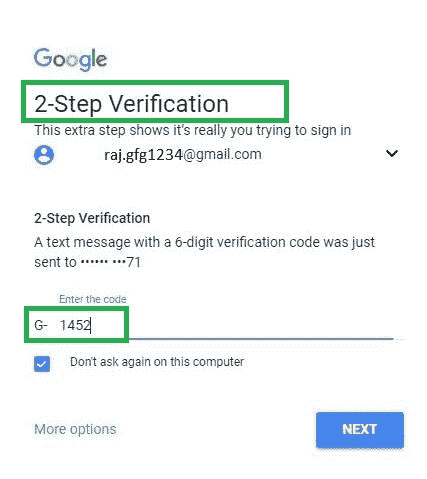

# 保存什么保存我们的密码–双因素身份验证

> 原文:[https://www . geesforgeks . org/saving-saves-password-双因素-身份验证/](https://www.geeksforgeeks.org/saving-saves-passwords-two-factor-authentication/)

短信仍然主导着两个因素，但问题是一个尺寸不适合所有人。

用栅栏围起你的花园可以阻止入侵者，但并不能完全将他们拒之门外。双因素身份验证(2FA)也是如此。让用户进入变得极其容易，让黑客通过变得极其困难的工作仍在进行，但在我们有 100%可靠的解决方案之前，一次性密码作为第二个因素仍然可以说是最好的选择。

**开始**

双因素身份认证多年来一直是网络安全解决方案的一种手段，但大多数组织是在 2012 年开始部署 2FA 的。科技公司对其重要性的认识相当缓慢，直到一场大规模的公众运动要求公司采用双因素身份认证作为安全功能后，它才获得了动力。

例如，当用户访问网上银行服务时，除了用户标识和密码之外，用户还需要输入一个额外的“第二因素密码”。第二个因素是通过短信传递的一次性密码，纯粹出于安全原因，该密码仅在短时间内有效。

**2FA 本应是一站式安全解决方案**

双因素身份验证要求用户提供三个凭证中的两个，这是你知道的；你有的东西；你真了不起。

卡尔·罗森格伦(karl Rosengren)一直是各种组织采用 2FA 背后的不变因素，他向不采用 2FA 的组织发出了数百条羞辱性推文。他的奉献似乎正在得到回报，因为几乎所有的大公司现在都提供某种双因素身份验证。但经过这么多年，现在看来 2FA 已经成为一个更复杂的产品，因为有各种各样的选择——短信；电子邮件；验证应用程序；专用 u 盘；声音；推送通知。

**双因素认证的好处**

*   **提高安全性:**由于需要第二种形式的身份识别，SMS-2FA 降低了攻击者冒充用户并获得访问权限的概率。
*   **提高生产率和灵活性:**移动性有助于提高生产率，大多数企业都在走向移动化。借助移动 2FA，员工可以安全地访问任何信息，而不会危及网络或敏感信息。
*   **降低帮助台和安全管理成本:**根据一项研究，35-40%的求助电话与密码相关。双因素身份验证可以为最终用户提供一种安全的方式来重置他们自己的密码，从而有助于减少这些耗时的呼叫。
*   **减少欺诈和建立安全的在线关系**身份盗窃呈上升趋势，对客户关系、hip、信誉和底线有直接影响。2FA 提供了一个额外的层来保护站点、交易和客户。

*研究人员展示了如何劫持一条短信——不要让这成为怀疑短信用于双因素认证的理由。*

几乎所有的 web 服务都提供某种双因素身份验证，但并非所有服务都是安全的。2FA 的总体框架仍然提供保护，但它有其局限性，这就是为什么越来越多的组织依靠双因素是不够的。

**2FA 似乎不再是被誉为**的安全战士

到 2014 年，很明显，黑客和网络犯罪分子致力于通过拦截令牌来寻找绕过额外安全性的方法。随着犯罪分子现在瞄准加密货币，他们愿意更进一步，这些攻击继续对加密货币用户构成威胁。

真正的问题不在于 2FA，而在于它周围的东西——设备、运营商账户、账户恢复过程。如果这些东西中的任何一个能够被突破，那么你的安全就会受到威胁。

*   尽管 2FA 降低了访问敏感数据的风险，但它并不能完全抵御其他网络犯罪活动
*   双因素身份验证的物理因素可能会丢失或被盗。
*   通过使用允许使用临时电子邮件和重置密码的“帐户恢复”功能，可以绕过 2FA。

**幸运的是，并不是所有 2FA 生来平等。**

只有通过添加一个认证码，你不能指望攻击者挡开。虽然它确实强化了登录页面，但攻击者会找到另一种方法来重置密码。正是这些弱点让黑客知道哪里是需要关注的地方。超越双因素不是解决方案，但利用技术进步让它变得不傻是时代的需要，就像 MSG91 的 SendOTP 一样。

有了 2FA 的实现，每次登录新设备上的帐户都要花一点时间，从长远来看，避免一些严重的在线盗窃是值得的。看看谁搞定了他们的 2FA
–谷歌
–脸书
–insta gram
–推特
–WhatsApp
–苹果
–微软
–亚马逊
–雅虎
–领英
–Snapchat
–Pinterest

*一些研究人员正忙着发现 2FA 的弱点，而一些人则忙着简化它，用声波振动令牌使其更加安全。*

*如果获得双因素似乎还不够，我们准备好什么是双因素了吗？*

**为生物认证让路:**

使用生物识别技术作为第三要素认证仍然存在争议。尽管它正在迅速成为使用人脸识别、指纹、声音指纹、虹膜扫描来保护您的帐户的最相关的身份验证手段之一，但主要的担忧仍然存在。
如果生物识别被泄露，说出你的声纹；你没有选择改变你的声音，重新开始。

*在我们有一些渐进的安全选项之前，我们不要忽视保存密码的东西。*