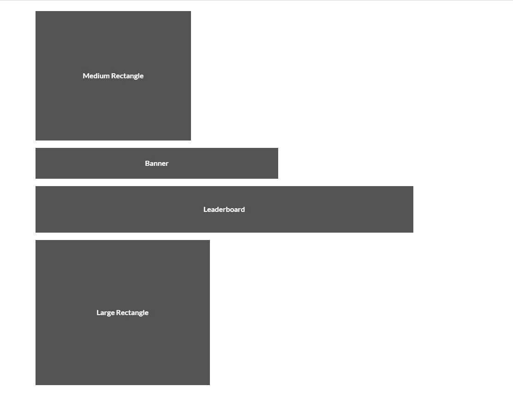
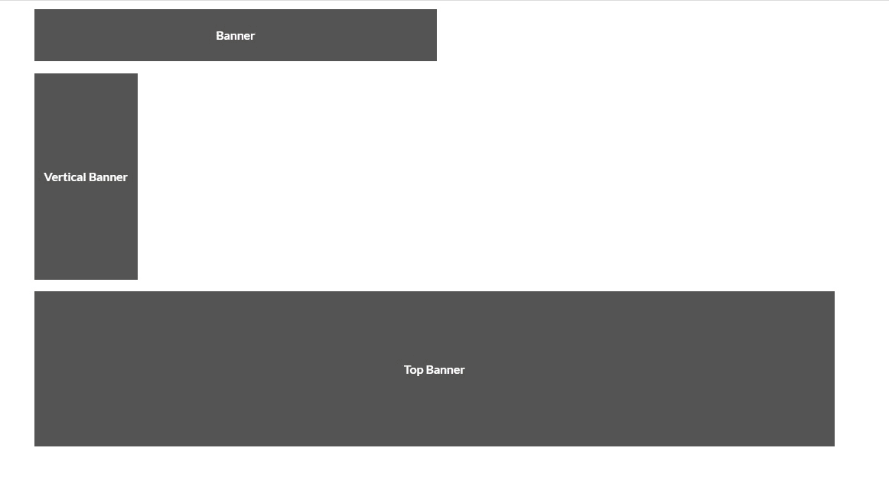
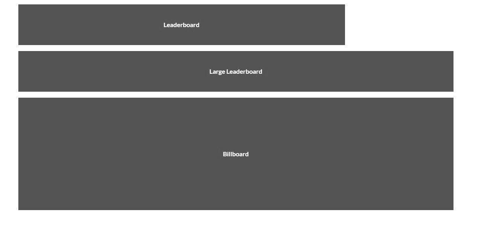
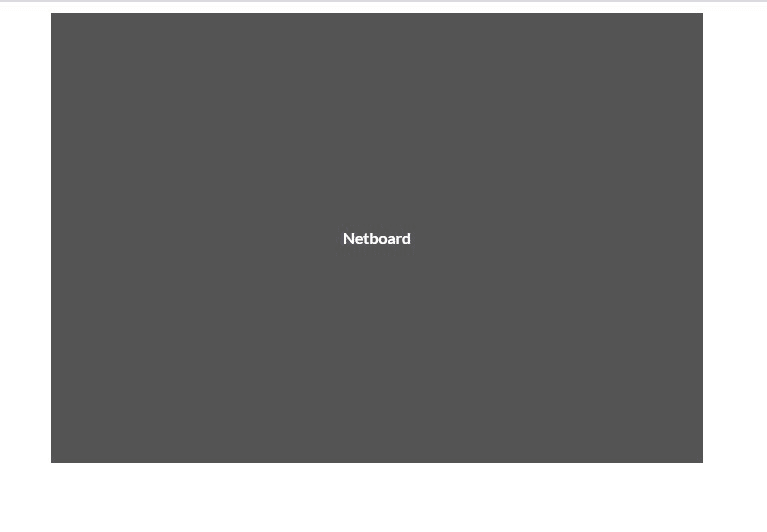

# 语义-UI |广告

> 原文:[https://www.geeksforgeeks.org/semantic-ui-advertisement/](https://www.geeksforgeeks.org/semantic-ui-advertisement/)

语义 UI 是一个开源框架，它使用 CSS 和 jQuery 来构建出色的用户界面。它和引导程序一样，有很大的不同元素，可以让你的网站看起来更加惊艳。它使用一个类向元素添加 CSS。

广告显示第三方促销内容。

这是一个简单的 addvertisement 代码的样子。

```
<HTML>
    <head>
        <title>Semantic UI</title>
        <link href=
"https://cdnjs.cloudflare.com/ajax/libs/semantic-ui/2.4.1/semantic.min.css"
              rel="stylesheet" />    
    </head>

    <body>
        <div class="ui container">
          <div class="ui banner ad">
            <!-- Banner
            <ins class="adsbygoogle"
                 style="display:inline-block;width:468px;height:60px"
                 data-ad-client="ca-pub-XXXXXXXXXXXXXXXX"
                 data-ad-slot="XXXXXXXXXXXXXXXX"></ins>
            <script>
            (adsbygoogle = window.adsbygoogle || []).push({});
            </script>
            !-->
            </div>
        </div>
        <script src=
"https://cdnjs.cloudflare.com/ajax/libs/semantic-ui/2.4.1/semantic.min.js">
        </script>  
    </body>
</html>
```

**示例 1:** 这个示例创建了一些不同大小的广告。

```
<!DOCTYPE html>
<html>

<head>
    <title>Semantic UI</title>

    <link href=
"https://cdnjs.cloudflare.com/ajax/libs/semantic-ui/2.4.1/semantic.min.css"
        rel="stylesheet" />

    <script src=
"https://cdnjs.cloudflare.com/ajax/libs/semantic-ui/2.4.1/semantic.min.js">
    </script>
</head>

<body>
    <div class="ui container">
        <div class="ui medium rectangle test ad" 
                data-text="Medium Rectangle">
        </div>
        <div class="ui banner test ad" 
                data-text="Banner">
        </div>
        <div class="ui leaderboard test ad"
                data-text="Leaderboard">
        </div>
        <div class="ui large rectangle test ad"
                data-text="Large Rectangle">
        </div>
    </div>
</body>

</html>
```

**输出:**


您可以添加类`'half page'`来代替横幅或任何广告大半页广告。

**例 2:** 摩天大楼大小的 ad。

```
<!DOCTYPE html>
<html>

<head>
    <title>Semantic UI</title>
    <link href=
"https://cdnjs.cloudflare.com/ajax/libs/semantic-ui/2.4.1/semantic.min.css"
        rel="stylesheet" />

    <script src=
"https://cdnjs.cloudflare.com/ajax/libs/semantic-ui/2.4.1/semantic.min.js">
    </script>
</head>

<body>
    <div class="ui container">
        <div class="ui skyscraper test ad"
            data-text="Skyscraper">
        </div>
    </div>
</body>

</html>
```

您可以添加类“UI 宽摩天大楼测试广告”来使摩天大楼变宽。
**输出:**


**示例 3:** 横幅尺寸 ad

```
<!DOCTYPE html>
<html>

<head>
    <title>Semantic UI</title>
    <link href=
"https://cdnjs.cloudflare.com/ajax/libs/semantic-ui/2.4.1/semantic.min.css"
        rel="stylesheet" />

    <script src=
"https://cdnjs.cloudflare.com/ajax/libs/semantic-ui/2.4.1/semantic.min.js">
    </script>
</head>

<body>
    <div style="margin-top: 10px" class="ui container">
        <div class="ui banner test ad" data-text="Banner">
        </div>
        <div class="ui vertical banner test ad" 
            data-text="Vertical Banner">
        </div>
        <div class="ui top banner test ad" 
            data-text="Top Banner">
        </div>
    </div>
</body>

</html>
```

**输出:**


**示例 4:** 排行榜规模广告

```
<!DOCTYPE html>
<html>

<head>
    <title>Semantic UI</title>
    <link href=
"https://cdnjs.cloudflare.com/ajax/libs/semantic-ui/2.4.1/semantic.min.css"
        rel="stylesheet" />

    <script src=
"https://cdnjs.cloudflare.com/ajax/libs/semantic-ui/2.4.1/semantic.min.js">
    </script>
</head>

<body>
    <div style="margin-top: 10px" 
        class="ui container">
        <div class="ui leaderboard test ad"
            data-text="Leaderboard">
        </div>
        <div class="ui large leaderboard test ad" 
            data-text="Large Leaderboard">
        </div>
        <div class="ui billboard test ad"
            data-text="Billboard">
        </div>
    </div>
</body>

</html>
```

**输出:**


**示例 5:** 网板尺寸

```
<!DOCTYPE html>
<html>

<head>
    <title>Semantic UI</title>
    <link href=
"https://cdnjs.cloudflare.com/ajax/libs/semantic-ui/2.4.1/semantic.min.css"
        rel="stylesheet" />

    <script src=
"https://cdnjs.cloudflare.com/ajax/libs/semantic-ui/2.4.1/semantic.min.js">
    </script>
</head>

<body>
    <div style="margin-top: 10px"
        class="ui container">
        <div class="ui netboard test ad"
            data-text="Netboard">
        </div>
    </div>
</body>

</html>
```

**输出:**


**例 6:** 居中 ad

```
<!DOCTYPE html>
<html>

<head>
    <title>Semantic UI</title>
    <link href=
"https://cdnjs.cloudflare.com/ajax/libs/semantic-ui/2.4.1/semantic.min.css"
        rel="stylesheet" />

    <script src=
"https://cdnjs.cloudflare.com/ajax/libs/semantic-ui/2.4.1/semantic.min.js">
    </script>
</head>

<body>
    <div style="margin-top: 10px" class="ui container">
        <div class="ui centered banner test ad"></div>
    </div>
</body>

</html>
```

**输出:**
