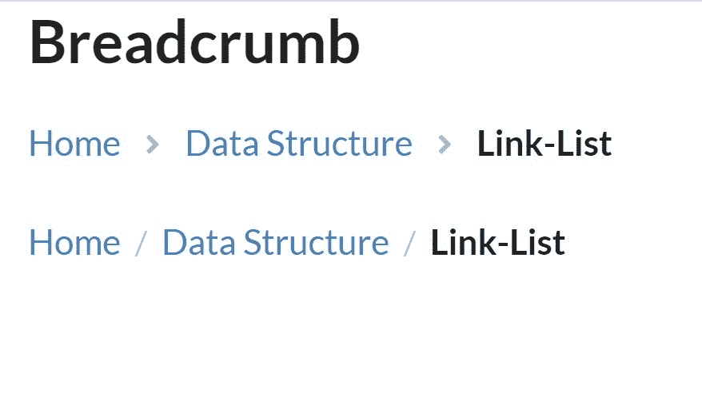
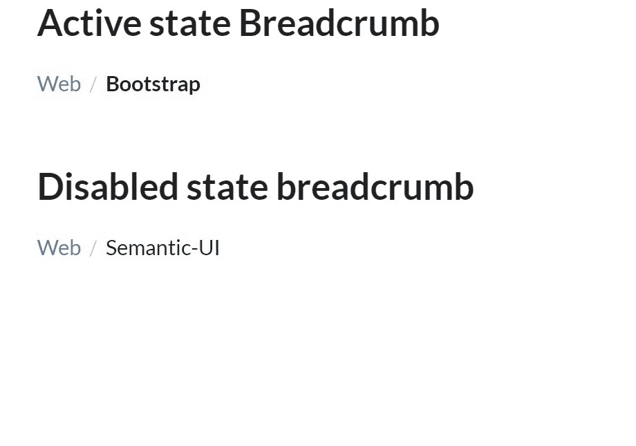
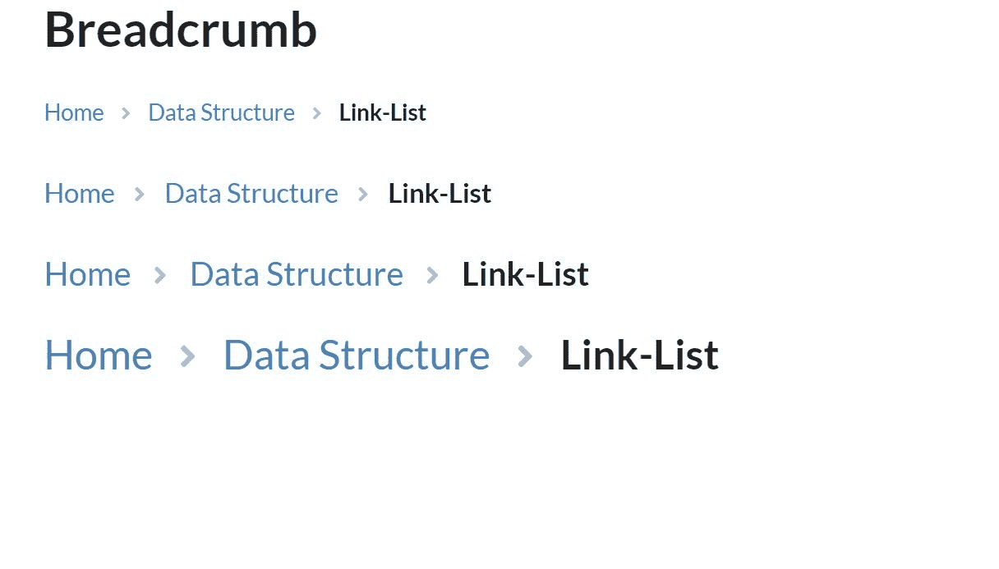

# 语义-用户界面|面包屑

> 原文:[https://www.geeksforgeeks.org/semantic-ui-breadcrumb/](https://www.geeksforgeeks.org/semantic-ui-breadcrumb/)

语义 UI 是一个开源框架，它使用 CSS 和 jQuery 来构建出色的用户界面。它和引导程序一样，有很大的不同元素，可以让你的网站看起来更加惊艳。它使用一个类向元素添加 CSS。

面包屑用于显示内容之间的层次结构。

**示例 1:** 本示例创建一个简单的面包屑。

```html
<!DOCTYPE html>
<html>

<head>
    <title>Semantic UI</title>
    <link href=
"https://cdnjs.cloudflare.com/ajax/libs/semantic-ui/2.4.1/semantic.min.css"
        rel="stylesheet" />

    <script src=
"https://cdnjs.cloudflare.com/ajax/libs/semantic-ui/2.4.1/semantic.min.js">
    </script>
</head>

<body>
    <div class="ui container">
        <h2>Breadcrumb</h2>
        <div class="ui breadcrumb">
            <a class="section">Home</a>
            <i class="right angle icon divider"></i>
            <a class="section">Data Structure</a>
            <i class="right angle icon divider"></i>
            <div class="active section">Link-List</div>
        </div>
        <br><br>
        <div class="ui breadcrumb">
            <a class="section">Home</a>
            <div class="divider"> / </div>
            <a class="section">Data Structure</a>
            <div class="divider"> / </div>
            <div class="active section">Link-List</div>
        </div>
    </div>
</body>

</html>
```

**输出:**


**示例 2:** 面包屑中的活动和禁用状态。

```html
<!DOCTYPE html>
<html>

<head>
    <title>Semantic UI</title>
    <link href=
"https://cdnjs.cloudflare.com/ajax/libs/semantic-ui/2.4.1/semantic.min.css"
        rel="stylesheet" />
    <script src=
"https://cdnjs.cloudflare.com/ajax/libs/semantic-ui/2.4.1/semantic.min.js">
    </script>
</head>

<body>
    <div class="ui container">
        <h2>Active state Breadcrumb</h2>
        <div class="ui breadcrumb">
            <a class="section">Web</a>
            <div class="divider"> / </div>
            <div class="active section">
                Bootstrap
            </div>
        </div>
        <br><br>
        <h2>Disabled state breadcrumb</h2>
        <div class="ui breadcrumb">
            <a class="section">Web</a>
            <div class="divider"> / </div>
            <div class="disabled section">
                Semantic-UI
            </div>
        </div>
    </div>
</body>

</html>
```

**输出:**


**例 3:** 不同大小的面包屑。

```html
<!DOCTYPE html>
<html>

<head>
    <title>Semantic UI</title>
    <link href=
"https://cdnjs.cloudflare.com/ajax/libs/semantic-ui/2.4.1/semantic.min.css"
        rel="stylesheet" />

    <script src=
"https://cdnjs.cloudflare.com/ajax/libs/semantic-ui/2.4.1/semantic.min.js">
    </script>
</head>

<body>
    <div class="ui container">
        <h2>Breadcrumb</h2>
        <div class="ui mini breadcrumb">
            <a class="section">Home</a>
            <i class="right angle icon divider"></i>
            <a class="section">Data Structure</a>
            <i class="right angle icon divider"></i>
            <div class="active section">Link-List</div>
        </div>
        <br><br>
        <div class="ui small breadcrumb">
            <a class="section">Home</a>
            <i class="right angle icon divider"></i>
            <a class="section">Data Structure</a>
            <i class="right angle icon divider"></i>
            <div class="active section">Link-List</div>
        </div>
        <br><br>
        <div class="ui large breadcrumb">
            <a class="section">Home</a>
            <i class="right angle icon divider"></i>
            <a class="section">Data Structure</a>
            <i class="right angle icon divider"></i>
            <div class="active section">Link-List</div>
        </div>
        <br><br>
        <div class="ui huge breadcrumb">
            <a class="section">Home</a>
            <i class="right angle icon divider"></i>
            <a class="section">Data Structure</a>
            <i class="right angle icon divider"></i>
            <div class="active section">Link-List</div>
        </div>
    </div>
</body>

</html>
```

您可以使用任何语义用户界面大小的类“大量”、“中等”。
**输出:**
