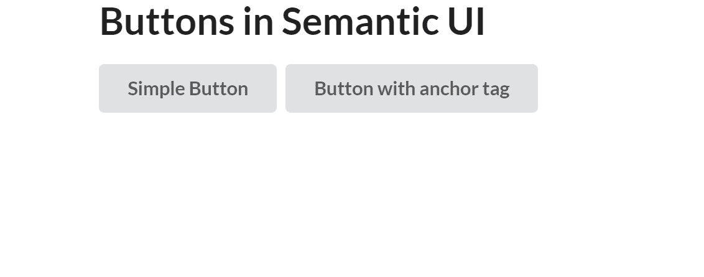
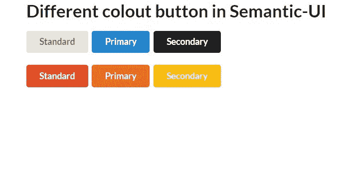
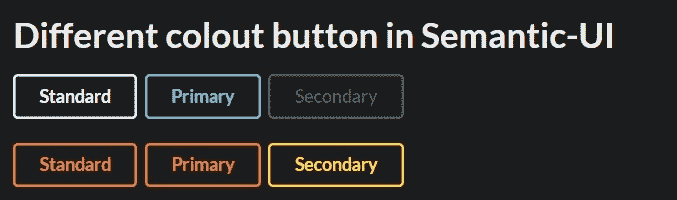
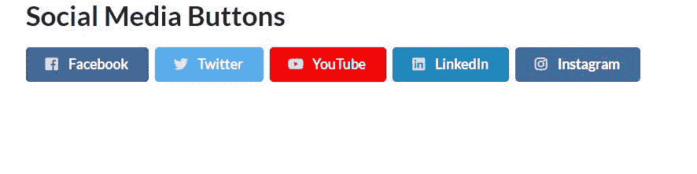
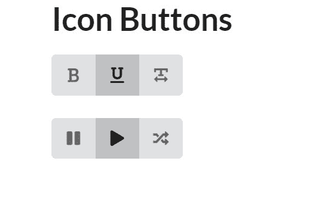
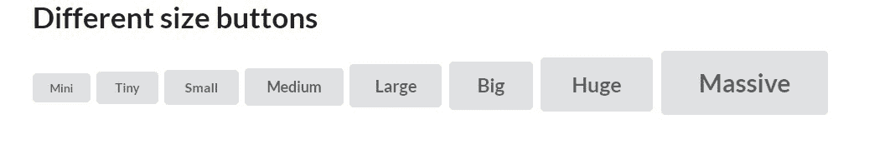

# 语义-用户界面|按钮

> 原文:[https://www.geeksforgeeks.org/semantic-ui-buttons/](https://www.geeksforgeeks.org/semantic-ui-buttons/)

语义 UI 是一个开源框架，它使用 CSS 和 jQuery 来构建出色的用户界面。它和引导程序一样，有很大的不同元素，可以让你的网站看起来更加惊艳。

CDN 可以直接使用。语义 UI 中有不同类型的按钮。它提供了各种各样的类来给按钮着色、制作按钮动画等等。

**示例:**

```html
<!DOCTYPE html>
<html>
    <head>
        <title>Semantic UI</title>
        <link href=
"https://cdnjs.cloudflare.com/ajax/libs/semantic-ui/2.4.1/semantic.min.css"
          rel="stylesheet" />
    </head>
    <body>
        <div class="ui container">
        <h1>Buttons in Semantic UI</h1>
            <button class="ui button">
                Simple Button
            </button>   
            <a class="ui button">
                a tag Button
            </a>   
        </div>
        <script src=
"https://cdnjs.cloudflare.com/ajax/libs/semantic-ui/2.4.1/semantic.min.js">
        </script>
    </body>
</html>
```

**输出:**


这里我们简单地使用了用户界面和按钮类，那个按钮看起来已经很棒了。

**示例:**我们来看看一些不同颜色的按钮。

```html
<!DOCTYPE html>
<html>
    <head>
        <title>Semantic UI</title>
        <link href=
"https://cdnjs.cloudflare.com/ajax/libs/semantic-ui/2.4.1/semantic.min.css"
        rel="stylesheet" />
    </head>
    <body>
        <div class="ui container">
            <h1>Different colout button in Semantic-UI</h1>
            <div>
                <button class="ui button">Standard</button>
                <button class="ui primary button">Primary</button>
                <button class="ui secondary button">Secondary</button>
            </div>
            <br>
            <div>
                <button class="ui red button">Standard</button>
            <button class="ui orange button">Primary</button>
            <button class="ui yellow button">Secondary</button>
            </div>       
        </div>
        <script src=
"https://cdnjs.cloudflare.com/ajax/libs/semantic-ui/2.4.1/semantic.min.js">
        </script>
    </body>
</html>
```

**输出:**


你可以使用很多其他颜色。
**例:**倒扣

```html
<!-- Write HTML code here -->
<!DOCTYPE html>
<html>
    <head>
        <title>Semantic UI</title>
        <link href=
"https://cdnjs.cloudflare.com/ajax/libs/semantic-ui/2.4.1/semantic.min.css"
        rel="stylesheet" />
    </head>
    <body>
        <div class="ui inverted segment container">
            <h1>Different colout button in Semantic-UI</h1>
            <div>
                <button class="ui inverted button">
                    Standard
                </button>
                <button class="ui inverted primary button">
                    Primary
                </button>
                <button class="ui inverted secondary button">
                    Secondary
                </button>
            </div>
            <br>
            <div>
                <button class="ui inverted red button">
                    Standard</button>
            <button class="ui inverted orange button">
                Primary</button>
            <button class="ui inverted yellow button">
                Secondary</button>
            </div>       
        </div>
        <script src=
"https://cdnjs.cloudflare.com/ajax/libs/semantic-ui/2.4.1/semantic.min.js">
         </script>
    </body>
</html>
```

**输出:**


**示例:**

社交媒体按钮

```html
<!DOCTYPE html>
<html>
    <head>
        <title>Semantic UI</title>
        <link href=
"https://cdnjs.cloudflare.com/ajax/libs/semantic-ui/2.4.1/semantic.min.css" 
         rel="stylesheet" />
    </head>
    <body>
        <div class="ui container">
            <h1>Social Media Buttons</h1>
            <button class="ui facebook button">
                <i class="facebook icon"></i>
                Facebook
              </button>
              <button class="ui twitter button">
                <i class="twitter icon"></i>
                Twitter
              </button>
              <button class="ui youtube button">
                <i class="youtube icon"></i>
                YouTube
              </button> 
              <button class="ui linkedin button">
                <i class="linkedin icon"></i>
                LinkedIn
              </button>
              <button class="ui instagram button">
                <i class="instagram icon"></i>
                Instagram
              </button>

        </div>
        <script src=
"https://cdnjs.cloudflare.com/ajax/libs/semantic-ui/2.4.1/semantic.min.js">
        </script>
    </body>
</html>
```

**输出:**


**示例:**

图标按钮

```html
<!DOCTYPE html>
<html>
    <head>
        <title>Semantic UI</title>
        <link href=
"https://cdnjs.cloudflare.com/ajax/libs/semantic-ui/2.4.1/semantic.min.css"
        rel="stylesheet" />
    </head>
    <body>
        <div class="ui container">
            <h1>Icon Buttons</h1>
            <div class="ui icon buttons">
                <button class="ui button">
                    <i class="bold icon"></i></button>
                <button class="ui button active">
                    <i class="underline icon"></i></button>
                <button class="ui button">
                    <i class="text width icon"></i></button>
            </div>
            <br>
            <br>
            <div class="ui icon buttons">
                <button class="ui button">
                    <i class="pause icon"></i></button>
                <button class="ui button active">
                    <i class="play icon"></i></button>
                <button class="ui button">
                    <i class="shuffle icon"></i></button>
            </div>

        </div>
        <script src=
"https://cdnjs.cloudflare.com/ajax/libs/semantic-ui/2.4.1/semantic.min.js">
        </script>
    </body>
</html>
```

**输出:**


**示例:**

不同尺寸按钮

```html
<!DOCTYPE html>
<html>
    <head>
        <title>Semantic UI</title>
        <link href=
"https://cdnjs.cloudflare.com/ajax/libs/semantic-ui/2.4.1/semantic.min.css"
         rel="stylesheet" />
    </head>
    <body>
        <div class="ui container">
            <h1>Different size buttons</h1>
            <button class="mini ui button">
                Mini
              </button>
              <button class="tiny ui button">
                Tiny
              </button>
              <button class="small ui button">
                Small
              </button>
              <button class="medium ui button">
                Medium
              </button>
              <button class="large ui button">
                Large
              </button>
              <button class="big ui button">
                Big
              </button>
              <button class="huge ui button">
                Huge
              </button>
              <button class="massive ui button">
                Massive
              </button>

        </div>
        <script src=
"https://cdnjs.cloudflare.com/ajax/libs/semantic-ui/2.4.1/semantic.min.js">
        </script>
    </body>
</html>
```

**输出:**


您可以通过单击在集成开发环境上运行来运行这些示例。