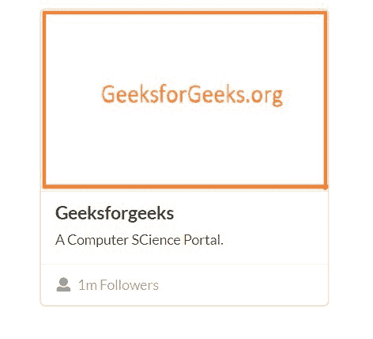
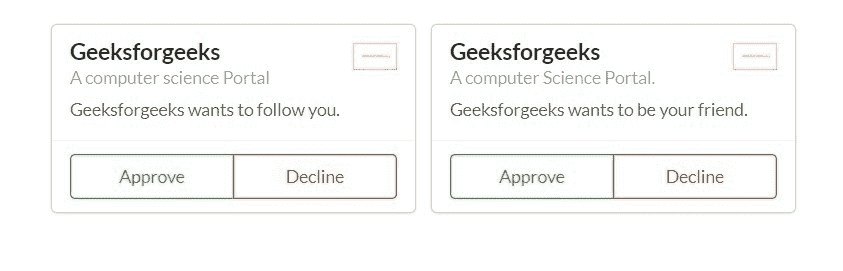
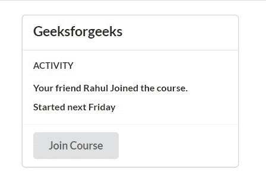
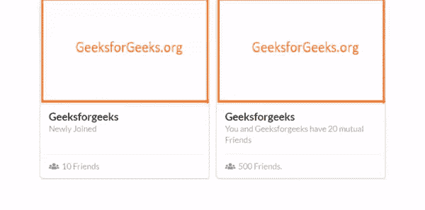
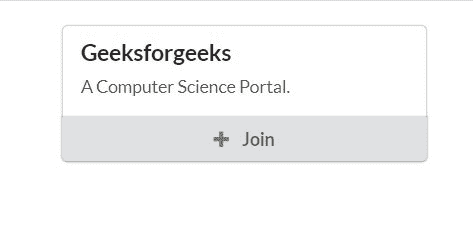
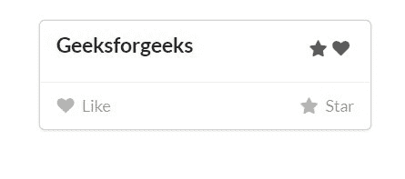

# 语义-界面|卡片

> 原文:[https://www.geeksforgeeks.org/semantic-ui-cards/](https://www.geeksforgeeks.org/semantic-ui-cards/)

语义 UI 是一个开源框架，它使用 CSS 和 jQuery 来构建出色的用户界面。它和引导程序一样，有很大的不同元素，可以让你的网站看起来更加惊艳。它使用一个类向元素添加 CSS。

卡片用于显示类似于扑克牌的内容。

**示例 1:** 本示例使用 Semantic-ui 创建一张简单的卡片。

## 超文本标记语言

```
<!DOCTYPE html>
  <html>
      <head>
          <title>Semantic UI</title>
          <link href=
"https://cdnjs.cloudflare.com/ajax/libs/semantic-ui/2.4.1/semantic.min.css"
                rel="stylesheet" />        
      </head>
      <body>
          <div class="ui container"> 
            <div class="ui card">
              <div class="image">
                
              </div>
              <div class="content">
                <a class="header">Geeksforgeeks</a>
                <div class="description">
                  A Computer SCience Portal.
                </div>
              </div>
              <div class="extra content">
                <a>
                  <i class="user icon"></i>
                  1m Followers
                </a>
              </div>
            </div>       
          </div>
          <script src=
"https://cdnjs.cloudflare.com/ajax/libs/semantic-ui/2.4.1/semantic.min.js">
          </script> 
      </body>
  </html>
```

**输出:**



**例 2:**

本示例使用语义用户界面创建一组卡片。

## 超文本标记语言

```
<!DOCTYPE html>
  <html>
      <head>
          <title>Semantic UI</title>
          <link href=
"https://cdnjs.cloudflare.com/ajax/libs/semantic-ui/2.4.1/semantic.min.css"
                rel="stylesheet" />        
      </head>
      <body>
          <div style="margin-top: 20px" class="ui container"> 
            <div class="ui cards">
              <div class="card">
                <div class="content">
                  
                  <div class="header">
                    Geeksforgeeks
                  </div>
                  <div class="meta">
                    A computer science Portal
                  </div>
                  <div class="description">
                    Geeksforgeeks wants to follow you.
                  </div>
                </div>
                <div class="extra content">
                  <div class="ui two buttons">
                    <div class="ui basic green button">Approve</div>
                    <div class="ui basic red button">Decline</div>
                  </div>
                </div>
              </div>
              <div class="card">
                <div class="content">
                  
                  <div class="header">
                    Geeksforgeeks
                  </div>
                  <div class="meta">
                   A computer Science Portal.
                  </div>
                  <div class="description">
                    Geeksforgeeks wants to be your friend.
                  </div>
                </div>
                <div class="extra content">
                  <div class="ui two buttons">
                    <div class="ui basic green button">Approve</div>
                    <div class="ui basic red button">Decline</div>
                  </div>
                </div>
              </div>
            </div>      
          </div>
          <script src=
"https://cdnjs.cloudflare.com/ajax/libs/semantic-ui/2.4.1/semantic.min.js">
          </script> 
    </body>
</html>
```

**输出:**



**示例 3:** 本示例使用语义用户界面创建一张包含某个按钮的卡片。

## 超文本标记语言

```
<!DOCTYPE html>
  <html>
      <head>
          <title>Semantic UI</title>
          <link href=
"https://cdnjs.cloudflare.com/ajax/libs/semantic-ui/2.4.1/semantic.min.css"
                rel="stylesheet" />        
      </head>
      <body>
          <div style="margin-top: 20px" class="ui container"> 
            <div class="ui card">
              <div class="content">
                <div class="header">Geeksforgeeks</div>
              </div>
              <div class="content">
                <h4 class="ui sub header">Activity</h4>
                <div class="ui small feed">
                  <div class="event">
                    <div class="content">
                      <div class="summary">
                         Your friend Rahul Joined the course.
                      </div>
                    </div>
                  </div>
                  <div class="event">
                    <div class="content">
                      <div class="summary">
                         Started next Friday
                      </div>
                    </div>
                  </div>
                </div>
              </div>
              <div class="extra content">
                <button class="ui button">
                     Join Course
                </button>
              </div>
            </div>      
          </div>
          <script src=
"https://cdnjs.cloudflare.com/ajax/libs/semantic-ui/2.4.1/semantic.min.js">
          </script> 
      </body>
  </html>
```

**输出:**



**悬停效果的图像卡:**为此，需要导入 jQuery 库。

**jQuery Code**

```
$('.special.cards .image').dimmer({
   on: 'hover'
});
```

**完整代码:**

## 超文本标记语言

```
<!DOCTYPE html>
<html>
    <head>
        <title>Semantic UI</title>
        <link href=
"https://cdnjs.cloudflare.com/ajax/libs/semantic-ui/2.4.1/semantic.min.css"
             rel="stylesheet" />         
    </head>
    <body>
        <div style="margin-top: 20px;" class="ui container">
          <div class="ui special cards">
            <div class="card">
              <div class="blurring dimmable image">
                <div class="ui dimmer">
                  <div class="content">
                    <div class="center">
                      <div class="ui inverted button">
                          Add Friend
                      </div>
                    </div>
                  </div>
                </div>
                
              </div>
              <div class="content">
                <a class="header">Geeksforgeeks</a>
                <div class="meta">
                  <span class="date">Newly Joined</span>
                </div>
              </div>
              <div class="extra content">
                <a>
                  <i class="users icon"></i>
                  10 Friends
                </a>
              </div>
            </div>
            <div class="card">
              <div class="blurring dimmable image">
                <div class="ui inverted dimmer">
                  <div class="content">
                    <div class="center">
                      <div class="ui primary button">
                          Add Friend
                      </div>
                    </div>
                  </div>
                </div>
                
              </div>
              <div class="content">
                <a class="header">Geeksforgeeks</a>
                <div class="meta">
                  <span class="date">
                   You and Geeksforgeeks have 20 mutual Friends
                  </span>
                </div>
              </div>
              <div class="extra content">
                <a>
                  <i class="users icon"></i>
                  500 Friends.
                </a>
              </div>
            </div>
          </div>
        </div>
        <script src=
"https://code.jquery.com/jquery-3.1.1.min.js"
               integrity=
"sha256-hVVnYaiADRTO2PzUGmuLJr8BLUSjGIZsDYGmIJLv2b8="
               crossorigin="anonymous">
        </script>
        <script src=
"https://cdnjs.cloudflare.com/ajax/libs/semantic-ui/2.4.1/semantic.min.js">
         </script>
        <script>
          $('.special.cards .image').dimmer({
            on: 'hover'
          });     
        </script>
    </body>
</html>
```

**输出:**



**示例 5:** 本示例使用语义用户界面创建一张包含某个按钮的卡片。

## 超文本标记语言

```
<!DOCTYPE html>
  <html>
      <head>
          <title>Semantic UI</title>
          <link href=
"https://cdnjs.cloudflare.com/ajax/libs/semantic-ui/2.4.1/semantic.min.css"
               rel="stylesheet" />        
      </head>
      <body>
          <div style="margin-top: 20px" class="ui container"> 
            <div class="ui cards">
              <div class="card">
                <div class="content">
                  <div class="header">Geeksforgeeks</div>
                  <div class="description">
                    A Computer Science Portal.
                  </div>
                </div>
                <div class="ui bottom attached button">
                  <i class="add icon"></i>
                  Join
                </div>
              </div>      
          </div>
          <script src=
"https://cdnjs.cloudflare.com/ajax/libs/semantic-ui/2.4.1/semantic.min.js">
         </script> 
      </body>
  </html>
```

**输出:**



**示例 6:** 本示例使用语义界面创建审批卡。

## 超文本标记语言

```
<!DOCTYPE html>
  <html>
      <head>
          <title>Semantic UI</title>
          <link href=
"https://cdnjs.cloudflare.com/ajax/libs/semantic-ui/2.4.1/semantic.min.css"
rel="stylesheet" />        
      </head>
      <body>
          <div style="margin-top: 20px" class="ui container"> 
            <div class="ui card">
              <div class="content">
                <i class="right floated like icon"></i>
                <i class="right floated star icon"></i>
                <div class="header">Geeksforgeeks</div>
                <div class="description">

<p></p>

                </div>
              </div>
              <div class="extra content">
                <span class="left floated like">
                  <i class="like icon"></i>
                  Like
                </span>
                <span class="right floated star">
                  <i class="star icon"></i>
                  Star
                </span>
              </div>
            </div>     
          </div>
          <script src=
"https://cdnjs.cloudflare.com/ajax/libs/semantic-ui/2.4.1/semantic.min.js">
         </script> 
      </body>
  </html>
```

**输出:**



可以从语义-UI 中尝试卡片中不同的东西。