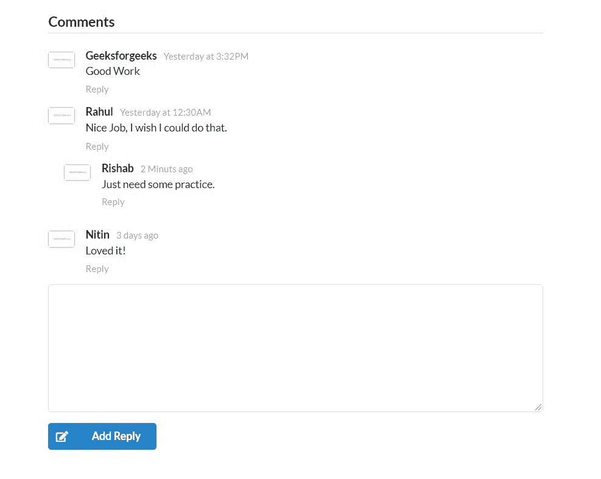

# 语义-UI |评论

> 原文:[https://www.geeksforgeeks.org/semantic-ui-comment/](https://www.geeksforgeeks.org/semantic-ui-comment/)

语义 UI 是一个开源框架，它使用 CSS 和 jQuery 来构建出色的用户界面。它和引导程序一样，有很大的不同元素，可以让你的网站看起来更加惊艳。它使用一个类向元素添加 CSS。
评论就像一个论坛，可以给你反馈。
**示例:**本示例使用语义界面创建注释部分。

## 超文本标记语言

```
<!DOCTYPE html>
<html>

<head>
    <title>Semantic UI</title>
    <link href=
"https://cdnjs.cloudflare.com/ajax/libs/semantic-ui/2.4.1/semantic.min.css"
            rel="stylesheet" />

    <script src=
"https://cdnjs.cloudflare.com/ajax/libs/semantic-ui/2.4.1/semantic.min.js">
    </script>
</head>

<body>
    <div style="margin-top: 20px" class="ui container">
        <div class="ui comments">
            <h3 class="ui dividing header">Comments</h3>
            <div class="comment">
                <a class="avatar">
                    
                </a>
                <div class="content">
                    <a class="author">Geeksforgeeks</a>
                    <div class="metadata">
                        <span class="date">Yesterday at 3:32PM</span>
                    </div>
                    <div class="text">
                        Good Work
                    </div>
                    <div class="actions">
                        <a class="reply">Reply</a>
                    </div>
                </div>
            </div>
            <div class="comment">
                <a class="avatar">
                    
                </a>
                <div class="content">
                    <a class="author">Rahul</a>
                    <div class="metadata">
                        <span class="date">Yesterday at 12:30AM</span>
                    </div>
                    <div class="text">

<p>Nice Job, I wish I could do that.</p>

                    </div>
                    <div class="actions">
                        <a class="reply">Reply</a>
                    </div>
                </div>
                <div class="comments">
                    <div class="comment">
                        <a class="avatar">
                            
                        </a>
                        <div class="content">
                            <a class="author">Rishab</a>
                            <div class="metadata">
                                <span class="date">2 Minutes ago</span>
                            </div>
                            <div class="text">
                                Just need some practice.
                            </div>
                            <div class="actions">
                                <a class="reply">Reply</a>
                            </div>
                        </div>
                    </div>
                </div>
            </div>
            <div class="comment">
                <a class="avatar">
                    
                </a>
                <div class="content">
                    <a class="author">Nitin</a>
                    <div class="metadata">
                        <span class="date">3 days ago</span>
                    </div>
                    <div class="text">
                        Loved it!
                    </div>
                    <div class="actions">
                        <a class="reply">Reply</a>
                    </div>
                </div>
            </div>
            <form class="ui reply form">
                <div class="field">
                    <textarea spellcheck="false"></textarea>
                </div>
                <div class="ui blue labeled submit icon button">
                    <i class="icon edit"></i> Add Reply
                </div>
            </form>
        </div>
    </div>
</body>

</html>
```

**输出:**

