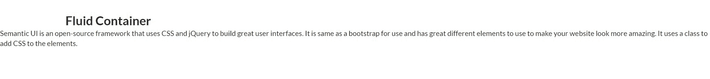
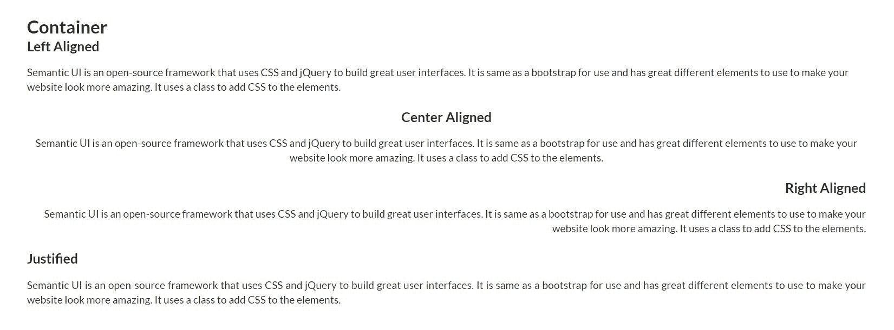

# 语义-UI |容器

> 原文:[https://www.geeksforgeeks.org/semantic-ui-container/](https://www.geeksforgeeks.org/semantic-ui-container/)

语义用户界面开源框架提供了一个容器，有助于将内容限制在最大宽度。该框架使用 jQuery 和 CSS 来创建交互式用户界面。它与 bootstrap 的用法非常相似，并且有不同的元素来创建任何网站的页面结构。

**示例:**以下示例显示了标准容器。

```
<!DOCTYPE html>
<html>

<head>
    <title>Semantic UI</title>
    <link href=
"https://cdnjs.cloudflare.com/ajax/libs/semantic-ui/2.4.1/semantic.min.css" 
    rel="stylesheet" />
</head>

<body>
    <div style="margin-top: 100px" 
        class="ui container">

        <h2>Container</h2>
        <div class="ui container">
            <p>
                Semantic UI is an open-source 
                framework that uses CSS and 
                jQuery to build great user 
                interfaces. It is same as a 
                bootstrap for use and has 
                great different elements to
                use to make your website look
                more amazing. It uses a class
                to add CSS to the elements.
            </p>
        </div>
    </div>

    <script src=
"https://code.jquery.com/jquery-3.1.1.min.js"
        integrity=
"sha256-hVVnYaiADRTO2PzUGmuLJr8BLUSjGIZsDYGmIJLv2b8=" 
        crossorigin="anonymous">
    </script>

    <script src=
"https://cdnjs.cloudflare.com/ajax/libs/semantic-ui/2.4.1/semantic.min.js">
    </script>
</body>

</html>
```

**输出:**


**示例:**以下示例显示了一个文本容器。

```
<!DOCTYPE html>
<html>

<head>
    <title>Semantic UI</title>
    <link href=
"https://cdnjs.cloudflare.com/ajax/libs/semantic-ui/2.4.1/semantic.min.css"
        rel="stylesheet" />
</head>

<body>
    <div style="margin-top: 100px" 
        class="ui container">

        <h2>Text Container</h2>
        <div class="ui text container">
            <p>
                Semantic UI is an open-source 
                framework that uses CSS and 
                jQuery to build great user 
                interfaces. It is same as a 
                bootstrap for use and has 
                great different elements to 
                use to make your website look
                more amazing. It uses a class 
                to add CSS to the elements.
            </p>
        </div>
    </div>

    <script src=
"https://code.jquery.com/jquery-3.1.1.min.js"
        integrity=
"sha256-hVVnYaiADRTO2PzUGmuLJr8BLUSjGIZsDYGmIJLv2b8="
        crossorigin="anonymous">
    </script>

    <script src=
"https://cdnjs.cloudflare.com/ajax/libs/semantic-ui/2.4.1/semantic.min.js">
    </script>
</body>

</html>
```

**输出:**


**示例:**以下示例显示了容器的流体类型。

```
<!DOCTYPE html>
<html>

<head>
    <title>Semantic UI</title>
    <link href=
"https://cdnjs.cloudflare.com/ajax/libs/semantic-ui/2.4.1/semantic.min.css"
        rel="stylesheet" />
</head>

<body>
    <div style="margin-top: 100px" 
        class="ui container">

        <h2>Fluid Container</h2>
    </div>

    <div class="ui fluid container">
        <p>
            Semantic UI is an open-source 
            framework that uses CSS and 
            jQuery to build great user 
            interfaces. It is same as a 
            bootstrap for use and has 
            great different elements to 
            use to make your website look 
            more amazing. It uses a class 
            to add CSS to the elements.
        </p>
    </div>

    <script src=
"https://code.jquery.com/jquery-3.1.1.min.js"
        integrity=
"sha256-hVVnYaiADRTO2PzUGmuLJr8BLUSjGIZsDYGmIJLv2b8="
        crossorigin="anonymous">
    </script>

    <script src=
"https://cdnjs.cloudflare.com/ajax/libs/semantic-ui/2.4.1/semantic.min.js">
    </script>
</body>

</html>
```

**输出:**


**示例:**以下示例显示了对齐的容器。

```
<!DOCTYPE html>
<html>

<head>
    <title>Semantic UI</title>
    <link href=
"https://cdnjs.cloudflare.com/ajax/libs/semantic-ui/2.4.1/semantic.min.css"
        rel="stylesheet" />
</head>

<body>
    <div style="margin-top: 100px" 
        class="ui container">
        <h2>Container</h2>
    </div>

    <div class="ui left aligned container">
        <h3>Left Aligned</h3>
        <p>
            Semantic UI is an open-source framework 
            that uses CSS and jQuery to build great
            user interfaces. It is same as a bootstrap
            for use and has great different elements 
            to use to make your website look more 
            amazing. It uses a class to add CSS
            to the elements.
        </p>
    </div>
    <br>
    <div class="ui center aligned container">
        <h3>Center Aligned</h3>
        <p>
            Semantic UI is an open-source framework 
            that uses CSS and jQuery to build great
            user interfaces. It is same as a bootstrap
            for use and has great different elements 
            to use to make your website look more 
            amazing. It uses a class to add CSS
            to the elements.
        </p>
    </div>
    <br>
    <div class="ui right aligned container">
        <h3>Right Aligned</h3>
        <p>
            Semantic UI is an open-source framework 
            that uses CSS and jQuery to build great
            user interfaces. It is same as a bootstrap
            for use and has great different elements 
            to use to make your website look more 
            amazing. It uses a class to add CSS
            to the elements.
        </p>
    </div>
    <br>
    <div class="ui justified container">
        <h3>Justified</h3>
        <p>
            Semantic UI is an open-source framework 
            that uses CSS and jQuery to build great
            user interfaces. It is same as a bootstrap
            for use and has great different elements 
            to use to make your website look more 
            amazing. It uses a class to add CSS
            to the elements.
        </p>
    </div>
    <script src=
"https://code.jquery.com/jquery-3.1.1.min.js"
        integrity=
"sha256-hVVnYaiADRTO2PzUGmuLJr8BLUSjGIZsDYGmIJLv2b8="
        crossorigin="anonymous">
    </script>

    <script src=
"https://cdnjs.cloudflare.com/ajax/libs/semantic-ui/2.4.1/semantic.min.js">
    </script>
</body>

</html>
```

**输出:**
