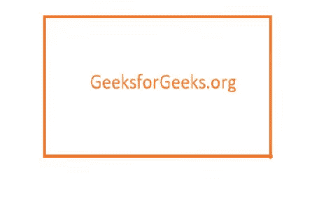
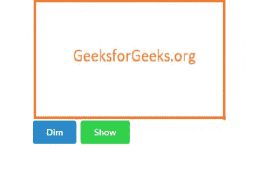
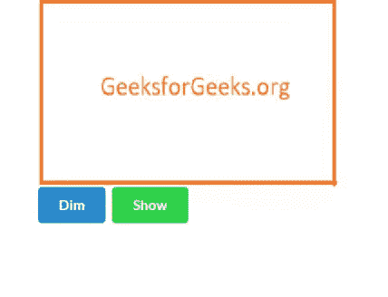
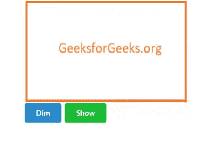

# 语义-UI |调光器

> 原文:[https://www.geeksforgeeks.org/semantic-ui-dimmer/](https://www.geeksforgeeks.org/semantic-ui-dimmer/)

语义 UI 是一个开源框架，它使用 CSS 和 jQuery 来构建出色的用户界面。它和引导程序一样，有很大的不同元素，可以让你的网站看起来更加惊艳。它使用一个类向元素添加 CSS。

调光器会隐藏干扰，将注意力集中在特定内容上，这样会使其变暗。

**例 1:**

本示例显示悬停时的变暗效果。

为此，您需要 jQuery 代码。

```
$('.image').dimmer({
    on: 'hover'
});

```

**完整代码:**

```
<!DOCTYPE html>
<html>

<head>
    <title>Semantic UI</title>
    <link href=
"https://cdnjs.cloudflare.com/ajax/libs/semantic-ui/2.4.1/semantic.min.css"
        rel="stylesheet" />

    <script src="https://code.jquery.com/jquery-3.1.1.min.js"
        integrity="sha256-hVVnYaiADRTO2PzUGmuLJr8BLUSjGIZsDYGmIJLv2b8="
        crossorigin="anonymous">
    </script>

    <script src=
"https://cdnjs.cloudflare.com/ajax/libs/semantic-ui/2.4.1/semantic.min.js">
    </script>
</head>

<body>
    <div style="margin-top: 20px" class="ui container">
        <div class="ui medium image">
            <div class="ui dimmer">
                <div class="content">
                    <h2 class="ui inverted header">
                        Geeksforgeeks
                    </h2>
                    <a href="https://geeksforgeeks.org" 
                        class="ui primary button">
                        Go on site
                    </a>
                    <div class="ui button">View</div>
                </div>
            </div>
            
        </div>
    </div>

    <script>
        $('.image').dimmer({
            on: 'hover'
        });
    </script>
</body>

</html>
```

**输出:**


**例 2:**

本示例显示按钮点击时的变暗效果。

**jQuery Code:**

```
$('.dim').click(function() {$('.image').dimmer('show')});
$('.show').click(function() {$('.image').dimmer('hide')});

```

`dim`和`show`是两个按钮的类。

**完整代码:**

```
<!DOCTYPE html>
<html>

<head>
    <title>Semantic UI</title>
    <link href="https://cdnjs.cloudflare.com/ajax/libs/semantic-ui/2.4.1/semantic.min.css" rel="stylesheet" />

    <script src="https://code.jquery.com/jquery-3.1.1.min.js"
        integrity="sha256-hVVnYaiADRTO2PzUGmuLJr8BLUSjGIZsDYGmIJLv2b8="
        crossorigin="anonymous">
    </script>

    <script src=
"https://cdnjs.cloudflare.com/ajax/libs/semantic-ui/2.4.1/semantic.min.js">
    </script>
</head>

<body>
    <div style="margin-top: 20px" class="ui container">
        <div class="ui medium image">
            <div class="ui dimmer">
                <div class="content">
                    <h2 class="ui inverted header">
                        Geeksforgeeks
                    </h2>
                    <a href="https://geeksforgeeks.org"
                        class="ui primary button">
                        Go on site
                    </a>
                    <div class="ui button">View</div>
                </div>
            </div>
            
        </div>
        <br>
        <button class="ui dim primary button">
            Dim
        </button>

        <button class="ui show green button">
            Show
        </button>
    </div>

    <script>
        $('.dim').click(function () 
            { $('.image').dimmer('show') });

        $('.show').click(function () 
            { $('.image').dimmer('hide') });
    </script>
</body>

</html>
```

**输出:**


**例 3:**

本示例显示模糊调光效果。

```
<!DOCTYPE html>
<html>

<head>
    <title>Semantic UI</title>
    <link href=
"https://cdnjs.cloudflare.com/ajax/libs/semantic-ui/2.4.1/semantic.min.css"
        rel="stylesheet" />

    <script src="https://code.jquery.com/jquery-3.1.1.min.js"
        integrity="sha256-hVVnYaiADRTO2PzUGmuLJr8BLUSjGIZsDYGmIJLv2b8="
        crossorigin="anonymous">
    </script>

    <script src=
"https://cdnjs.cloudflare.com/ajax/libs/semantic-ui/2.4.1/semantic.min.js">
    </script>
</head>

<body>
    <div style="margin-top: 20px" class="ui container">
        <div class="ui blurring medium image">
            <div class="ui dimmer">
                <div class="content">
                    <h2 class="ui inverted header">
                        Geeksforgeeks
                    </h2>
                    <a href="https://geeksforgeeks.org" 
                        class="ui primary button">
                        Go on site
                    </a>

                    <div class="ui button">View</div>
                </div>
            </div>
            
        </div>
        <br>
        <button class="ui dim primary button">
            Dim
        </button>
        <button class="ui show green button">
            Show
        </button>
    </div>

    <script>
        $('.dim').click(function () 
            { $('.image').dimmer('show') });

        $('.show').click(function () 
            { $('.image').dimmer('hide') });
    </script>
</body>

</html>
```

**输出:**


**例 4:**

本示例创建了反转调光器效果。

```
<!DOCTYPE html>
<html>

<head>
    <title>Semantic UI</title>

    <link href=
"https://cdnjs.cloudflare.com/ajax/libs/semantic-ui/2.4.1/semantic.min.css"
    rel="stylesheet" />

    <script src="https://code.jquery.com/jquery-3.1.1.min.js"
        integrity="sha256-hVVnYaiADRTO2PzUGmuLJr8BLUSjGIZsDYGmIJLv2b8="
        crossorigin="anonymous">
    </script>

    <script src=
"https://cdnjs.cloudflare.com/ajax/libs/semantic-ui/2.4.1/semantic.min.js">
    </script>
</head>

<body>
    <div style="margin-top: 20px" class="ui container">
        <div class="ui medium image">
            <div class="ui inverted dimmer">
                <div class="content">
                    <h2 class="ui inverted header">
                        Geeksforgeeks
                    </h2>

                    <a href="https://geeksforgeeks.org"
                        class="ui primary button">
                        Go on site
                    </a>
                    <div class="ui button">View</div>
                </div>
            </div>
            
        </div>
        <br>
        <button class="ui dim primary button">
            Dim
        </button>
        <button class="ui show green button">
            Show
        </button>
    </div>

    <script>
        $('.dim').click(function () 
            { $('.image').dimmer('show') });
        $('.show').click(function () 
            { $('.image').dimmer('hide') });
    </script>
</body>

</html>
```

输出:
