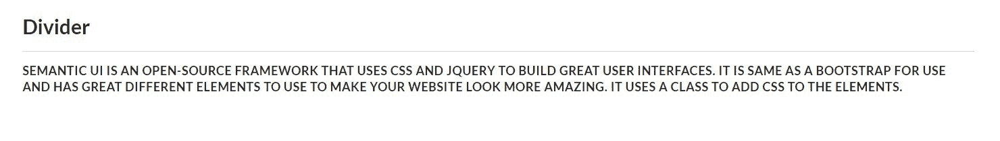
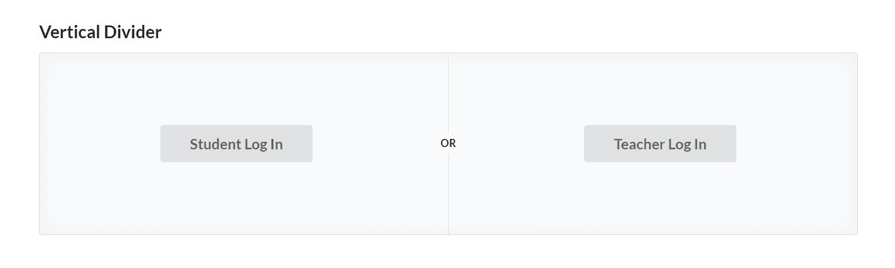
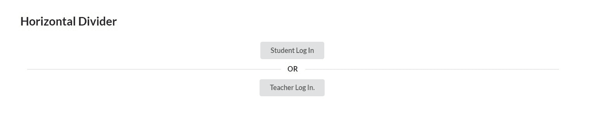
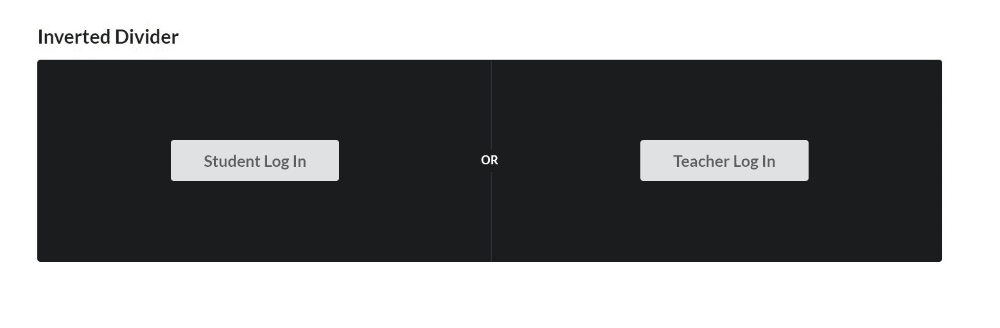

# 语义-用户界面|分割线

> 原文:[https://www.geeksforgeeks.org/semantic-ui-divider/](https://www.geeksforgeeks.org/semantic-ui-divider/)

**语义 UI** 是一个开源框架，可用于使用 CSS 和 jQuery 构建美观灵活的用户界面。这与**自举**非常相似，有不同的网站创建元素。它主要使用类为 HTML 的不同元素添加样式。**分割器**有助于在视觉上将屏幕内容分组。

**示例:**

```html
<!DOCTYPE html>
<html>

<head>
    <title>Semantic UI</title>
    <link href=
"https://cdnjs.cloudflare.com/ajax/libs/semantic-ui/2.4.1/semantic.min.css"
        rel="stylesheet" />
</head>

<body>
    <div style="margin-top: 100px"  
            class="ui container">
        <h2>Divider</h2>
        <div class="ui divider">
            <br>
            <p>
                Semantic UI is an open-source 
                that uses CSS and jQuery to
                build great user interfaces.
                It is same as a bootstrap for 
                use and has great different 
                elements to use to make your 
                website look more amazing.
                It uses a class to add CSS 
                to the elements.
            </p>
        </div>
    </div>

    <script src=
"https://code.jquery.com/jquery-3.1.1.min.js"
        integrity=
"sha256-hVVnYaiADRTO2PzUGmuLJr8BLUSjGIZsDYGmIJLv2b8="
        crossorigin="anonymous">
    </script>

    <script src=
"https://cdnjs.cloudflare.com/ajax/libs/semantic-ui/2.4.1/semantic.min.js">
    </script>

</body>

</html>
```

**输出**


**示例:**以下示例演示了垂直分割线。

```html
<!DOCTYPE html>
<html>

<head>
    <title>Semantic UI</title>
    <link href=
"https://cdnjs.cloudflare.com/ajax/libs/semantic-ui/2.4.1/semantic.min.css"
        rel="stylesheet" />
</head>

<body>
    <div style="margin-top: 100px" class="ui container">
        <h2>Vertical Divider</h2>
        <div class="ui placeholder segment">
            <div class="ui two column very 
                    relaxed stackable grid">
                <div class="middle aligned column">
                    <div class="ui huge button">
                        Student Log In
                    </div>
                </div>
                <div class="middle aligned column">
                    <div class="ui huge button">
                        Teacher Log In
                    </div>
                </div>
            </div>
            <div class="ui vertical divider">
                Or
            </div>
        </div>
    </div>

    <script src=
"https://code.jquery.com/jquery-3.1.1.min.js"
        integrity=
"sha256-hVVnYaiADRTO2PzUGmuLJr8BLUSjGIZsDYGmIJLv2b8="
        crossorigin="anonymous">
    </script>

    <script src=
"https://cdnjs.cloudflare.com/ajax/libs/semantic-ui/2.4.1/semantic.min.js">
    </script>
</body>

</html>
```

**输出:**


示例:以下示例演示了水平分割线。

```html
<!DOCTYPE html>
<html>

<head>
    <title>Semantic UI</title>
    <link href=
"https://cdnjs.cloudflare.com/ajax/libs/semantic-ui/2.4.1/semantic.min.css"
        rel="stylesheet" />
</head>

<body>
    <div style="margin-top: 100px" class="ui container">
        <h2>Horizontal Divider</h2>
        <div class="ui center aligned basic segment">
            <div class="ui button">
                Student Log In
            </div>
            <div class="ui horizontal divider">
                Or
            </div>
            <div class="ui button">
                Teacher Log In.
            </div>
        </div>
    </div>

    <script src="https://code.jquery.com/jquery-3.1.1.min.js"
        integrity=
"sha256-hVVnYaiADRTO2PzUGmuLJr8BLUSjGIZsDYGmIJLv2b8=" 
            crossorigin="anonymous">
    </script>

    <script src=
"https://cdnjs.cloudflare.com/ajax/libs/semantic-ui/2.4.1/semantic.min.js">
    </script>
</body>

</html>
```

**输出:**


**示例:**以下示例演示了反向除法器。

```html
<!DOCTYPE html>
<html>

<head>
    <title>Semantic UI</title>
    <link href=
"https://cdnjs.cloudflare.com/ajax/libs/semantic-ui/2.4.1/semantic.min.css"
        rel="stylesheet" />
</head>

<body>
    <div style="margin-top: 100px" class="ui container">
        <h2>Inverted Divider</h2>
        <div class="ui placeholder inverted segment">
            <div class="ui two column very 
                    relaxed stackable grid">
                <div class="middle aligned column">
                    <div class="ui huge button">
                        Student Log In
                    </div>
                </div>
                <div class="middle aligned column">
                    <div class="ui huge button">
                        Teacher Log In
                    </div>
                </div>
            </div>
            <div class="ui inverted vertical divider">
                Or
            </div>
        </div>
    </div>

    <script src=
"https://code.jquery.com/jquery-3.1.1.min.js"
        integrity=
"sha256-hVVnYaiADRTO2PzUGmuLJr8BLUSjGIZsDYGmIJLv2b8=" 
        crossorigin="anonymous">
    </script>

    <script src
="https://cdnjs.cloudflare.com/ajax/libs/semantic-ui/2.4.1/semantic.min.js">
    </script>
</body>

</html>
```

**输出**
