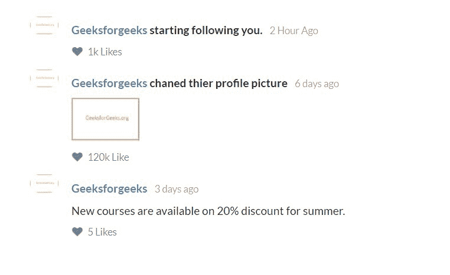
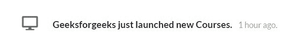

# 语义-用户界面|提要

> 原文:[https://www.geeksforgeeks.org/semantic-ui-feed/](https://www.geeksforgeeks.org/semantic-ui-feed/)

语义 UI 是一个开源框架，它使用 CSS 和 jQuery 来构建出色的用户界面。它和引导程序一样，有很大的不同元素，可以让你的网站看起来更加惊艳。它使用一个类向元素添加 CSS。

提要显示用户活动。例如关于脸书的新闻提要。

**示例 1:** 本示例使用语义用户界面创建提要内容。

```html
<!DOCTYPE html>
<html>

<head>
    <title>Semantic UI</title>
    <link href=
"https://cdnjs.cloudflare.com/ajax/libs/semantic-ui/2.4.1/semantic.min.css"
        rel="stylesheet" />

    <script src=
"https://cdnjs.cloudflare.com/ajax/libs/semantic-ui/2.4.1/semantic.min.js">
    </script>
</head>

<body>
    <div style="margin-top: 20px" class="ui container">
        <div class="ui feed">
            <div class="event">
                <div class="label">
                    
                </div>
                <div class="content">
                    <div class="summary">
                        <a class="user">
                            Geeksforgeeks
                        </a> starting following you.
                        <div class="date">
                            2 Hour Ago
                        </div>
                    </div>
                    <div class="meta">
                        <a class="like">
                            <i class="like icon"></i> 1k Likes
                        </a>
                    </div>
                </div>
            </div>
            <div class="event">
                <div class="label">
                    
                </div>
                <div class="content">
                    <div class="summary">
                        <a>Geeksforgeeks</a> changed </br>
                        thier profile picture
                        <div class="date">
                            6 days ago
                        </div>
                    </div>
                    <div class="extra images">
                        <a></a>
                    </div>
                    <div class="meta">
                        <a class="like">
                            <i class="like icon"></i> 120k Like
                        </a>
                    </div>
                </div>
            </div>
            <div class="event">
                <div class="label">
                    
                </div>
                <div class="content">
                    <div class="summary">
                        <a>Geeksforgeeks</a>
                        <div class="date">
                            3 days ago
                        </div>
                    </div>
                    <div class="extra text">
                        New courses are available on</br> 
                        20% discount for summer.
                    </div>
                    <div class="meta">
                        <a class="like">
                            <i class="like icon"></i> 5 Likes
                        </a>
                    </div>
                </div>
            </div>
        </div>
    </div>
</body>

</html>
```

**输出:**


**示例 2:** 本示例使用语义用户界面创建带有图标的提要内容。

```html
<!DOCTYPE html>
<html>

<head>
    <title>Semantic UI</title>
    <link href=
"https://cdnjs.cloudflare.com/ajax/libs/semantic-ui/2.4.1/semantic.min.css"
        rel="stylesheet" />

    <script src=
"https://cdnjs.cloudflare.com/ajax/libs/semantic-ui/2.4.1/semantic.min.js">
    </script>
</head>

<body>
    <div style="margin-top: 20px" 
        class="ui container">
        <div class="ui feed">
            <div class="event">
                <div class="label">
                    <i class="computer icon"></i>
                </div>
                <div class="content">
                    <div class="summary">
                        Geeksforgeeks just 
                        launched new Courses.
                        <div class="date">
                            1 hour ago.
                        </div>
                    </div>
                </div>
            </div>
        </div>
    </div>
</body>

</html>
```

输出:
