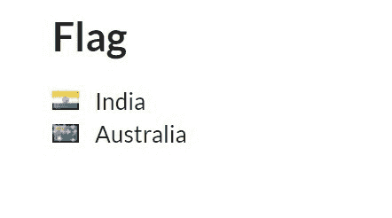

# 语义-UI |标志

> 原文:[https://www.geeksforgeeks.org/semantic-ui-flag/](https://www.geeksforgeeks.org/semantic-ui-flag/)

语义 UI 开源框架提供了用于显示不同国家旗帜的类。该框架非常类似于引导程序的使用，并且有许多元素可以为网站创建令人惊叹的交互界面。类被添加到用于添加样式的元素中。

**示例:**下面的示例展示了如何为 flag 添加类来显示一个国家的国旗。

```
<!DOCTYPE html>
<html>

<head>
    <title>Semantic UI</title>
    <link href=
"https://cdnjs.cloudflare.com/ajax/libs/semantic-ui/2.4.1/semantic.min.css"
        rel="stylesheet" />
</head>

<body>
    <div style="margin-top: 100px" 
        class="ui container">

        <h2>Flag</h2>
        <i class="in flag"></i>
        India
        <br>
        <i class="au flag"></i>
        Australia
        <br>
    </div>
    <script src=
"https://code.jquery.com/jquery-3.1.1.min.js"
        integrity=
"sha256-hVVnYaiADRTO2PzUGmuLJr8BLUSjGIZsDYGmIJLv2b8="
        crossorigin="anonymous">
    </script>

    <script src=
"https://cdnjs.cloudflare.com/ajax/libs/semantic-ui/2.4.1/semantic.min.js">
    </script>
</body>

</html>
```

**输出:**


少数几个用班级展示国旗的国家名单。

*   安道尔:ad
*   美国:ae
*   阿富汗:结束
*   古:ag
*   安圭拉:噢
*   阿尔巴尼亚:al
*   亚美尼亚:上午
*   荷属安的列斯群岛:安
*   安哥拉:ao
*   阿根廷:空气
*   美属萨摩亚:as
*   奥地利
*   澳大利亚:非盟
*   阿鲁巴:aw
*   奥兰群岛:斧头
*   阿塞拜疆:阿兹
*   波斯尼亚语 ： ba
*   巴巴多斯:bb
*   孟加拉国:bd
*   比利时:是
*   布基纳法索:比利时法郎
*   保加利亚:bg
*   巴林:巴林
*   布隆迪:bi
*   贝宁:bj
*   百慕大:百慕大群岛
*   文莱:bn
*   玻利维亚:博
*   巴西:br
*   巴哈马:bs
*   不丹:bt
*   布韦岛:bv
*   博茨瓦纳:bw
*   白俄罗斯:由
*   伯利兹:bz
*   加拿大:加拿大
*   科科斯群岛:cc
*   刚果:cd
*   中非共和国:比照
*   刚果布拉柴维尔:cg
*   瑞士:瑞士
*   间隙标注:ci
*   库克群岛:库克群岛
*   智利:cl
*   喀麦隆:厘米
*   中国:中国
*   哥伦比亚:co
*   哥斯达黎加:cr
*   塞尔维亚:cs
*   古巴:cu
*   佛得角:简历
*   圣诞岛:cx
*   塞浦路斯:塞浦路斯
*   捷克共和国
*   德国
*   吉布提:dj
*   丹麦:丹麦克朗
*   多米尼克:dm
*   多米尼加共和国:do
*   阿尔及利亚:dz
*   厄瓜多尔:欧共体
*   爱沙尼亚:ee
*   埃及
*   西撒哈拉:嗯
*   厄立特里亚:他
*   西班牙:是的
*   埃塞俄比亚:et
*   欧洲联盟:欧盟
*   芬兰:芬兰
*   斐济:斐济
*   福克兰群岛:fk
*   密克罗尼西亚:调频
*   法罗群岛:fo
*   法国:fr
*   加蓬:ga
*   英国:英国
*   英国:英国
*   苏格兰:gb sct
*   威尔士:gb wls
*   格林纳达:gd
*   乔治亚:通用电气
*   法属圭亚那:gf
*   加纳:gh
*   直布罗陀:gi
*   格陵兰岛
*   冈比亚:gm
*   几内亚:gn
*   瓜德罗普:全科医生
*   赤道几内亚:gq
*   希腊:gr
*   三明治群岛
*   危地马拉:gt
*   关岛 ： gu
*   几内亚比绍:千兆瓦
*   圭亚那:gy
*   香港:香港
*   听说岛:嗯
*   洪都拉斯:hn
*   克罗地亚:人权
*   海地:ht
*   匈牙利:胡
*   印度尼西亚 ： id
*   爱尔兰
*   以色列 ：
*   印度:在
*   印度洋领土:io
*   伊拉克:智商
*   伊朗 ： 是
*   冰岛:是
*   意大利:它
*   牙买加:jm
*   乔
*   日本:日本
*   肯尼亚:肯尼亚
*   吉尔吉斯斯坦:公斤
*   柬埔寨:柬埔寨
*   基里巴斯 ： 哪个
*   科摩罗:公里
*   圣基茨和尼维斯:千牛
*   朝鲜:kp
*   韩国:韩元
*   科威特:千瓦
*   开曼群岛:肯塔基州
*   哈萨克斯坦:kz
*   老挝:拉
*   黎巴嫩:磅
*   圣卢西亚:lc
*   列支敦士登:李
*   斯里兰卡:lk
*   利比里亚:卢民主力量
*   莱索托:ls
*   立陶宛:lt
*   卢森堡:lu
*   拉脱维亚:lv
*   利比亚:利比亚
*   摩洛哥:硕士
*   摩纳哥:mc
*   摩尔多瓦:医学博士
*   黑山:我
*   马达加斯加:毫克
*   马绍尔群岛:mh
*   马其顿:mk
*   马里:ml
*   缅甸:嗯
*   蒙古:mn
*   澳门:mo
*   北马里亚纳群岛:议员
*   马提尼克岛:mq
*   毛里塔尼亚
*   蒙特塞拉特:女士
*   男:mt
*   毛里求斯:毛里求斯
*   马尔代夫:mv
*   马拉维:兆瓦
*   墨西哥:墨西哥
*   马来西亚:我的
*   莫桑比克:mz
*   纳米比亚:纳
*   新喀里多尼亚
*   尼日尔:没有
*   诺福克岛:nf
*   尼日利亚:ng
*   尼加拉瓜:没有
*   荷兰:荷兰
*   挪威:没有
*   尼泊尔:尼泊尔
*   瑙鲁:第#号
*   纽埃:怒
*   新西兰:新西兰
*   阿曼 ： 至
*   巴拿马:宾夕法尼亚州
*   秘鲁:pe
*   法属波利尼西亚:pf
*   新几内亚:pg
*   菲律宾:博士
*   巴基斯坦:pk
*   波兰:pl
*   圣皮埃尔:下午
*   皮特凯恩岛:pn
*   波多黎各:公共关系
*   巴勒斯坦:ps
*   葡萄牙:pt
*   帕劳:pw
*   巴拉圭:py
*   卡塔尔:问答
*   重逢:re
*   罗马尼亚:ro
*   塞尔维亚:塞尔维亚
*   俄罗斯:俄罗斯
*   卢旺达:rw
*   沙特阿拉伯:南非
*   所罗门群岛:某人
*   塞舌尔:sc
*   苏丹:sd
*   瑞典:东南
*   新加坡:sg
*   圣赫勒拿:sh
*   斯洛文尼亚:si
*   扬马延:sj 斯瓦尔巴
*   斯洛伐克:sk
*   塞拉利昂
*   圣马力诺:sm
*   塞内加尔:锡
*   索马里:所以
*   苏里南:苏里南
*   圣多美 ： st
*   萨尔瓦多:sv
*   叙利亚： 叙利亚
*   斯威士兰:深圳
*   凯科斯群岛:tc
*   乍得:td
*   法国属地:tf
*   多哥:tg
*   泰国:第
*   塔吉克斯坦:tj
*   托克劳:传统知识
*   东帝汶:东帝汶
*   土库曼斯坦:tm
*   突尼斯:tn
*   汤加:至
*   土耳其:tr
*   特立尼达:tt
*   图瓦卢:电视
*   台湾:tw
*   坦桑尼亚:tz
*   乌克兰:非盟
*   乌干达:ug
*   美国小岛屿:嗯
*   美国:美国
*   乌拉圭:哇
*   乌兹别克斯坦 ： 至
*   梵蒂冈城:去
*   圣文森特:你
*   委内瑞拉:去
*   英属维尔京群岛:vg
*   美属维尔京群岛:六
*   越南:越南
*   瓦努阿图:看到了
*   沃利斯和富图纳:wf
*   萨摩亚:ws
*   也门:是的
*   梅内特:yt
*   南非:za
*   赞比亚:津巴布韦
*   津巴布韦:津巴布韦