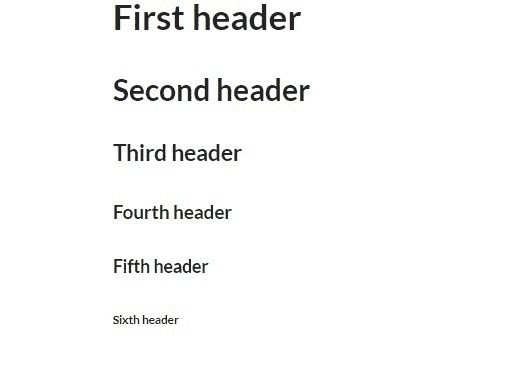
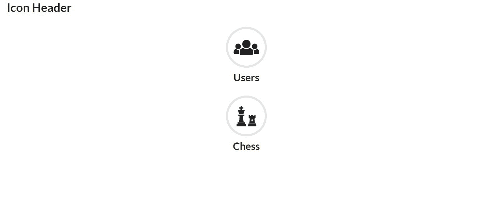
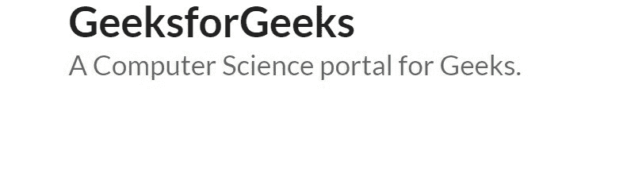
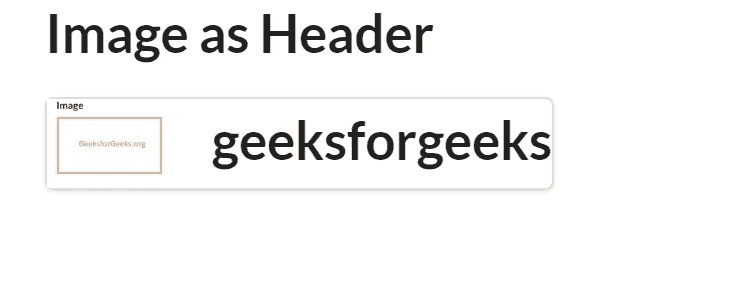
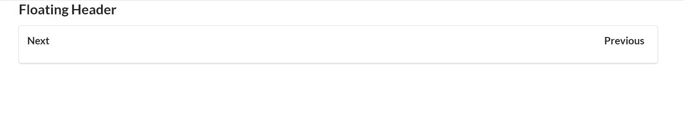

# 语义-界面|表头

> 原文:[https://www.geeksforgeeks.org/semantic-ui-header/](https://www.geeksforgeeks.org/semantic-ui-header/)

**语义 UI** 是一个开源框架，使用 [**CSS**](https://www.geeksforgeeks.org/css-tutorials/) 和 [**jQuery**](https://www.geeksforgeeks.org/jquery-tutorials/) 来构建出色的用户界面。它和一个 [**自举**](https://www.geeksforgeeks.org/bootstrap-tutorials/) 一样好用，有很大的不同元素可以用来让你的网站看起来更惊艳。它使用一个类向元素添加 CSS。语义用户界面有非常酷的标题，它们可以用于文本、图标等等。让我们看一些语义用户界面标题的例子。

**示例 1:** 在本例中，我们将看到不同种类的页眉。

```html
<!DOCTYPE html>
<html>
    <head>
        <title>Semantic UI</title>
        <link href=
"https://cdnjs.cloudflare.com/ajax/libs/semantic-ui/2.4.1/semantic.min.css" 
              rel="stylesheet" />
    </head>
    <body>
        <div class="ui container">
            <h1 class="ui header">First header</h1>
            <h2 class="ui header">Second header</h2>
            <h3 class="ui header">Third header</h3>
            <h4 class="ui header">Fourth header</h4>
            <h5 class="ui header">Fifth header</h5>
            <h6 class="ui header">Sixth header</h6>
        </div>
        <script src=
"https://cdnjs.cloudflare.com/ajax/libs/semantic-ui/2.4.1/semantic.min.js">
        </script>
    </body>
</html>
```

**输出:**



**示例 2:** 在本例中，我们将看到图标作为标题。

```html
<!DOCTYPE html>
<html>
    <head>
        <title>Semantic UI</title>
        <link href=
"https://cdnjs.cloudflare.com/ajax/libs/semantic-ui/2.4.1/semantic.min.css"
              rel="stylesheet" />
    </head>
    <body>
        <div class="ui container">
            <h1>Icon Header</h1>
            <h2 class="ui center aligned icon header">
                <i class="circular users icon"></i>
                Users
            </h2>
            <h2 class="ui center aligned icon header">
                <i class="circular chess icon"></i>
                Chess
            </h2>
        </div>
        <script src=
"https://cdnjs.cloudflare.com/ajax/libs/semantic-ui/2.4.1/semantic.min.js">
        </script>
    </body>
</html>
```

**输出:**


**示例 3:** 在本例中，我们将看到带有描述的标题

。

```html
<!DOCTYPE html>
<html>
    <head>
        <title>Semantic UI</title>
        <link href=
"https://cdnjs.cloudflare.com/ajax/libs/semantic-ui/2.4.1/semantic.min.css"
              rel="stylesheet" />
    </head>
    <body>
        <div class="ui container">
            <h2 class="ui header">
                GeeksforGeeks
                <div class="sub header">
                  A Computer Science portal for Geeks.
                </div>
            </h2>
        </div>
        <script src=
"https://cdnjs.cloudflare.com/ajax/libs/semantic-ui/2.4.1/semantic.min.js">
        </script>
    </body>
</html>
```

**输出:**


**示例 4:** 在本例中，我们将看到带有图像的标题。

```html
<!DOCTYPE html>
<html>
    <head>
        <title>Semantic UI</title>
        <link href=
"https://cdnjs.cloudflare.com/ajax/libs/semantic-ui/2.4.1/semantic.min.css" 
              rel="stylesheet" />
    </head>
    <body>
        <div class="ui container">
            <h2>Image as Header</h2>
            <div class="ui compact menu">
                <h2 class="ui header">
                    
                    <div class="content">
                        geeksforgeeks
                    </div>
                </h2>
            </div>
        </div>
        <script src=
"https://cdnjs.cloudflare.com/ajax/libs/semantic-ui/2.4.1/semantic.min.js">
        </script>
    </body>
</html>
```

**输出:**


**示例 5:** 在本例中，我们将看到带有图标的标题。

```html
<!DOCTYPE html>
<html>
    <head>
        <title>Semantic UI</title>
        <link href=
"https://cdnjs.cloudflare.com/ajax/libs/semantic-ui/2.4.1/semantic.min.css"
              rel="stylesheet" />
    </head>
    <body>
        <div class="ui container">
            <h2>Header with Icon</h2>
            <h2 class="ui header">
                <i class="users icon"></i>
                <div class="content">
                     Friend List
                    <div class="sub header">
                     Only Private ones.
                    </div>
                </div>
            </h2>
        </div>
        <script src=
"https://cdnjs.cloudflare.com/ajax/libs/semantic-ui/2.4.1/semantic.min.js">
        </script>
    </body>
</html>
```

**输出:**


**示例 6:** 在本例中，我们将看到块标题。

```html
<!DOCTYPE html>
<html>
    <head>
        <title>Semantic UI</title>
        <link href=
"https://cdnjs.cloudflare.com/ajax/libs/semantic-ui/2.4.1/semantic.min.css"
              rel="stylesheet" />
    </head>
    <body>
        <div class="ui container">
            <h2>Block Header</h2>
            <h3 class="ui block header">
                Geeksforgeeks
            </h3>
            Learn anything related to computer Science.
        </div>
        <script src=
"https://cdnjs.cloudflare.com/ajax/libs/semantic-ui/2.4.1/semantic.min.js">
        </script>
    </body>
</html>
```

**输出:**


**例 7:** 在本例中，我们将看到浮动表头。

```html
<!DOCTYPE html>
<html>
    <head>
        <title>Semantic UI</title>
        <link href=
"https://cdnjs.cloudflare.com/ajax/libs/semantic-ui/2.4.1/semantic.min.css"
              rel="stylesheet" />
    </head>
    <body>
        <div class="ui container">
            <h2>Floating Header</h2>
            <div class="ui clearing segment">
                <h3 class="ui right floated header">
                    Previous
                </h3>
                <h3 class="ui left floated header">
                    Next
                </h3>
            </div>
        </div>
        <script src=
"https://cdnjs.cloudflare.com/ajax/libs/semantic-ui/2.4.1/semantic.min.js">
        </script>
    </body>
</html>
```

**输出:**


**注意:**你也可以通过给你的段位和表头添加类反转来反转表头。您可以通过单击 IDE 上的运行直接运行这些示例。