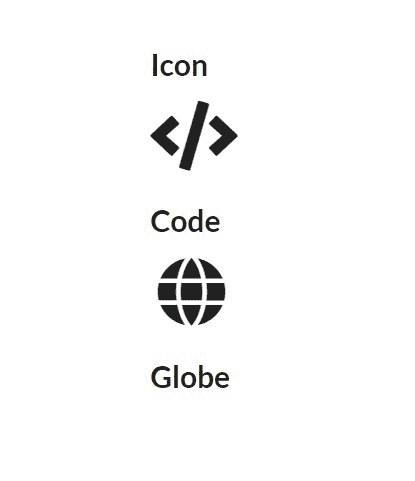
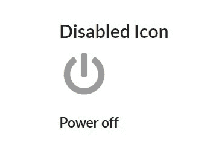
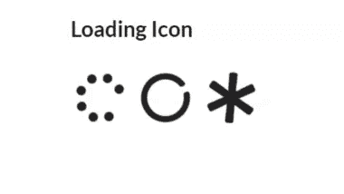
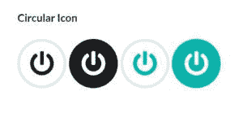
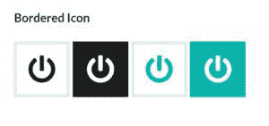
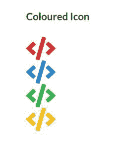
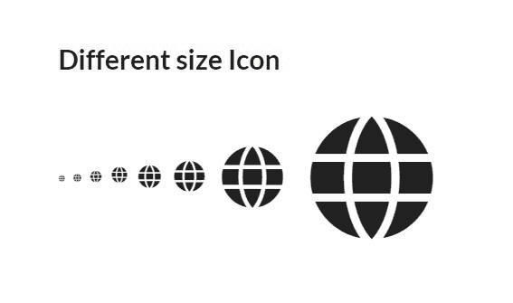

# 语义-界面|图标

> 原文:[https://www.geeksforgeeks.org/semantic-ui-icon/](https://www.geeksforgeeks.org/semantic-ui-icon/)

语义 UI 开源框架使用 CSS 和 jQuery 给出了图标或字形，用于显示与某些元素相关的图片，jQuery 用于创建出色的用户界面。它非常类似于引导使用，使网站更令人惊叹。它使用类向 HTML 元素或控件添加样式。

**示例:**

```
<!DOCTYPE html>
<html>

<head>
    <title>Semantic UI</title>
    <link href=
"https://cdnjs.cloudflare.com/ajax/libs/semantic-ui/2.4.1/semantic.min.css"
        rel="stylesheet" />
</head>

<body>
    <div style="margin-top: 100px" 
        class="ui container">
        <h2>Icon</h2>
        <i class="code huge icon"></i>
        <h2>Code</h2>
        <i class="globe huge icon"></i>
        <h2>Globe</h2>
    </div>

    <script src=
"https://code.jquery.com/jquery-3.1.1.min.js"
        integrity=
"sha256-hVVnYaiADRTO2PzUGmuLJr8BLUSjGIZsDYGmIJLv2b8="
        crossorigin="anonymous">
    </script>

    <script src=
"https://cdnjs.cloudflare.com/ajax/libs/semantic-ui/2.4.1/semantic.min.js">
    </script>
</body>

</html>
```

**输出:**


**示例:**以下示例显示了禁用的图标。

```
<!DOCTYPE html>
<html>

<head>
    <title>Semantic UI</title>
    <link href=
"https://cdnjs.cloudflare.com/ajax/libs/semantic-ui/2.4.1/semantic.min.css"
        rel="stylesheet" />
</head>

<body>
    <div style="margin-top: 100px" 
        class="ui container">
        <h2> Disabled Icon</h2>
        <i class="disabled power off 
            huge icon"></i> <br>
        <h3>Power off</h3>
    </div>

    <script src=
"https://code.jquery.com/jquery-3.1.1.min.js"
        integrity=
"sha256-hVVnYaiADRTO2PzUGmuLJr8BLUSjGIZsDYGmIJLv2b8="
        crossorigin="anonymous">
    </script>

    <script src=
"https://cdnjs.cloudflare.com/ajax/libs/semantic-ui/2.4.1/semantic.min.js">
    </script>
</body>

</html>
```

**输出:**


**示例:**以下示例显示加载图标。

```
<!DOCTYPE html>
<html>

<head>
    <title>Semantic UI</title>
    <link href=
"https://cdnjs.cloudflare.com/ajax/libs/semantic-ui/2.4.1/semantic.min.css"
        rel="stylesheet" />
</head>

<body>
    <div style="margin-top: 100px" 
        class="ui container">
        <h2> Loading Icon</h2>
        <br>
        <i class="spinner loading huge icon"></i>
        <i class="notched circle loading huge icon"></i>
        <i class="asterisk loading huge icon"></i>
    </div>

    <script src=
"https://code.jquery.com/jquery-3.1.1.min.js"
        integrity=
"sha256-hVVnYaiADRTO2PzUGmuLJr8BLUSjGIZsDYGmIJLv2b8="
        crossorigin="anonymous">
    </script>

    <script src=
"https://cdnjs.cloudflare.com/ajax/libs/semantic-ui/2.4.1/semantic.min.js">
    </script>
</body>

</html>
```

**输出:**


**示例:**以下示例显示了圆形图标。

```
<!DOCTYPE html>
<html>

<head>
    <title>Semantic UI</title>
    <link href=
"https://cdnjs.cloudflare.com/ajax/libs/semantic-ui/2.4.1/semantic.min.css"
        rel="stylesheet" />
</head>

<body>
    <div style="margin-top: 100px" 
        class="ui container">

        <h2> Circular Icon</h2>
        <br>
        <i class="circular  power off huge icon"></i>
        <i class="circular inverted power off huge icon"></i>
        <i class="circular teal power off huge icon"></i>
        <i class="circular inverted teal power off huge icon"></i>
    </div>
    <script src=
"https://code.jquery.com/jquery-3.1.1.min.js"
        integrity=
"sha256-hVVnYaiADRTO2PzUGmuLJr8BLUSjGIZsDYGmIJLv2b8="
        crossorigin="anonymous">
    </script>

    <script src=
"https://cdnjs.cloudflare.com/ajax/libs/semantic-ui/2.4.1/semantic.min.js">
    </script>
</body>

</html>
```

**输出:**


**示例:**以下示例显示了带边框图标。

```
<!DOCTYPE html>
<html>

<head>
    <title>Semantic UI</title>
    <link href=
"https://cdnjs.cloudflare.com/ajax/libs/semantic-ui/2.4.1/semantic.min.css"
        rel="stylesheet" />
</head>

<body>
    <div style="margin-top: 100px" 
        class="ui container">
        <h2> Bordered Icon</h2>
        <br>
        <i class="bordered  power off huge icon"></i>
        <i class="bordered inverted power off huge icon"></i>
        <i class="bordered teal power off huge icon"></i>
        <i class="bordered inverted teal power off huge icon"></i>
    </div>
    <script src=
"https://code.jquery.com/jquery-3.1.1.min.js"
        integrity=
"sha256-hVVnYaiADRTO2PzUGmuLJr8BLUSjGIZsDYGmIJLv2b8="
        crossorigin="anonymous">
    </script>

    <script src=
"https://cdnjs.cloudflare.com/ajax/libs/semantic-ui/2.4.1/semantic.min.js">
    </script>
</body>

</html>
```

**输出**


**示例:**以下示例显示了彩色图标。

```
<!DOCTYPE html>
<html>

<head>
    <title>Semantic UI</title>
    <link href=
"https://cdnjs.cloudflare.com/ajax/libs/semantic-ui/2.4.1/semantic.min.css"
        rel="stylesheet" />
</head>

<body>
    <div style="margin-top: 100px" 
        class="ui container">

        <h2> Coloured Icon</h2>
        <br>
        <i class=" red code huge icon"></i><br>
        <i class=" blue code huge icon"></i><br>
        <i class=" green code huge icon"></i><br>
        <i class=" yellow code huge icon"></i><Br>
    </div>
    <script src=
"https://code.jquery.com/jquery-3.1.1.min.js"
        integrity=
"sha256-hVVnYaiADRTO2PzUGmuLJr8BLUSjGIZsDYGmIJLv2b8="
        crossorigin="anonymous">
    </script>

    <script src=
"https://cdnjs.cloudflare.com/ajax/libs/semantic-ui/2.4.1/semantic.min.js">
    </script>
</body>

</html>
```

**输出:**


**示例:**以下示例显示了不同大小的图标。

```
<!DOCTYPE html>
<html>

<head>
    <title>Semantic UI</title>
    <link href=
"https://cdnjs.cloudflare.com/ajax/libs/semantic-ui/2.4.1/semantic.min.css"
        rel="stylesheet" />
</head>

<body>
    <div style="margin-top: 100px" 
            class="ui container">
        <h2> Different size Icon</h2>
        <br>
        <i class="mini globe icon"></i>
        <i class="tiny globe icon"></i>
        <i class="small globe icon"></i>
        <i class="globe icon"></i>
        <i class="large globe icon"></i>
        <i class="big globe icon"></i>
        <i class="huge globe icon"></i>
        <i class="massive globe icon"></i>
    </div>

    <script src=
"https://code.jquery.com/jquery-3.1.1.min.js"
        integrity=
"sha256- hVVnYaiADRTO2PzUGmuLJr8BLUSjGIZsDYGmIJLv2b8="
        crossorigin="anonymous">
    </script>

    <script src=
"https://cdnjs.cloudflare.com/ajax/libs/semantic-ui/2.4.1/semantic.min.js">
    </script>
</body>

</html>
```

**输出:**
