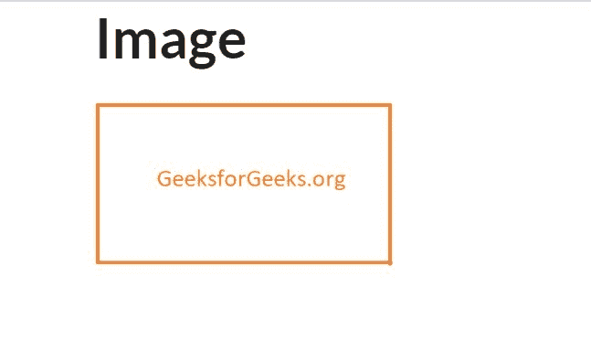
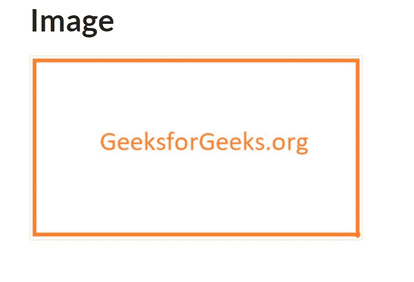
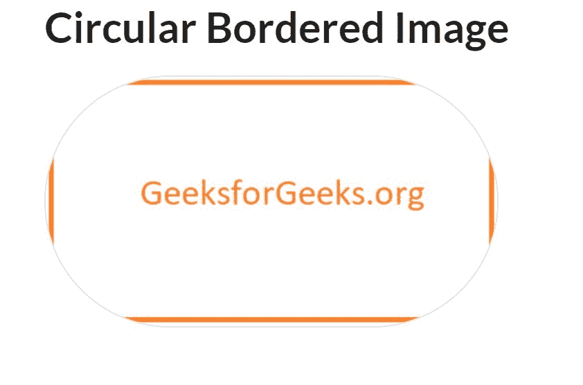
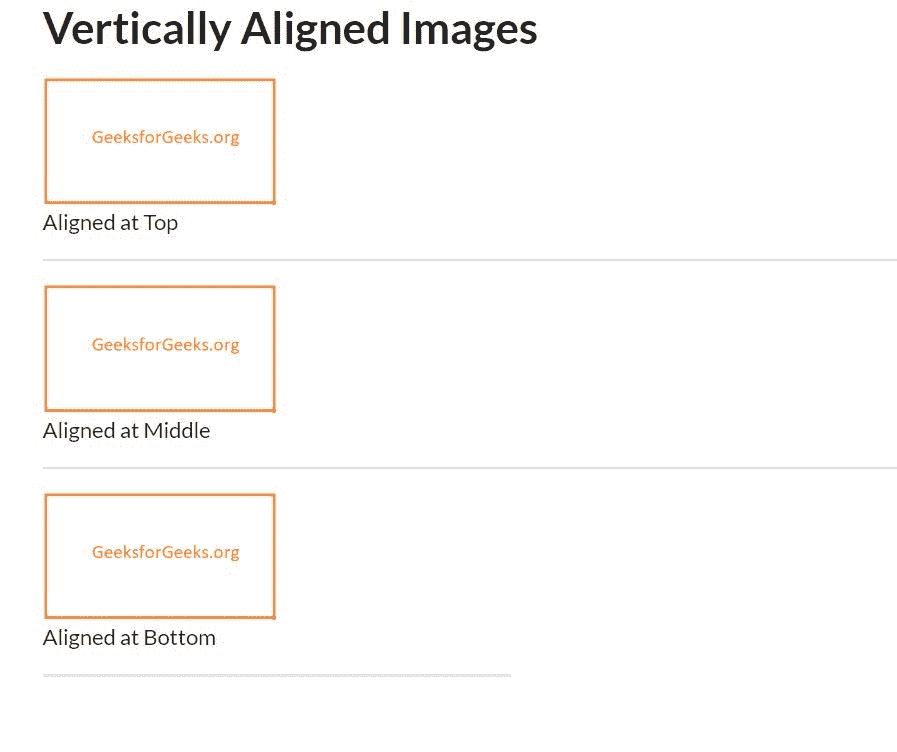

# 语义-用户界面|图像

> 原文:[https://www.geeksforgeeks.org/semantic-ui-images/](https://www.geeksforgeeks.org/semantic-ui-images/)

语义 UI 是一个开源框架，它使用 CSS 和 jQuery 来构建出色的用户界面。它和引导程序一样，有很大的不同元素，可以让你的网站看起来更加惊艳。它使用一个类向元素添加 CSS。
在我们的网络应用中，有不同风格的使用语义 ui 来放置图像，以使网站看起来更棒。你可以放一张图片或者一个 SVG。
我们来看一些如何使用语义 ui 放置图像的例子。

**示例:**本示例使用语义 ui 显示一个简单的图像。

## 超文本标记语言

```
<!DOCTYPE html>
<html>

<head>
    <title>Semantic UI</title>
    <link href=
"https://cdnjs.cloudflare.com/ajax/libs/semantic-ui/2.4.1/semantic.min.css"
        rel="stylesheet" />

    <script src=
"https://cdnjs.cloudflare.com/ajax/libs/semantic-ui/2.4.1/semantic.min.js">
    </script>
</head>

<body>
    <div class="ui container">
        <h1>Image</h1>
        
    </div>
</body>

</html>
```

**输出:**



**示例:**本示例向图像添加边框。

## 超文本标记语言

```
<!DOCTYPE html>
<html>
    <head>
        <title>Semantic UI</title>
        <link href=
"https://cdnjs.cloudflare.com/ajax/libs/semantic-ui/2.4.1/semantic.min.css"
              rel="stylesheet" />
    </head>

    <body>
        <div class="ui container">
            <h1>Bordered Image</h1>
            
        </div>
        <script src=
"https://cdnjs.cloudflare.com/ajax/libs/semantic-ui/2.4.1/semantic.min.js">
      </script>
    </body>
</html>
```

**输出:**



通过在 IDE 中运行该示例，您可以准确地看到边框。

**示例:**本示例创建圆形图像。

## 超文本标记语言

```
<!DOCTYPE html>
<html>
    <head>
        <title>Semantic UI</title>
        <link href=
"https://cdnjs.cloudflare.com/ajax/libs/semantic-ui/2.4.1/semantic.min.css" 
              rel="stylesheet" />
    </head>

    <body>
        <div class="ui container">
            <h1>Circular Bordered Image</h1>
            
        </div>
        <script src=
"https://cdnjs.cloudflare.com/ajax/libs/semantic-ui/2.4.1/semantic.min.js">
      </script>
    </body>
</html>
```

**输出:**



**示例:**本示例创建垂直对齐的图像。

## 超文本标记语言

```
<!DOCTYPE html>
<html>
    <head>
        <title>Semantic UI</title>
        <link href=
"https://cdnjs.cloudflare.com/ajax/libs/semantic-ui/2.4.1/semantic.min.css" 
         rel="stylesheet" />
    </head>

    <body>
        <div class="ui container">
            <h1>Vertically Aligned Images</h1>
            
            <p>Aligned at Top</p>
            <div class="ui divider"></div>
            
            <p>Aligned at Middle</p>
            <div class="ui divider"></div>
            
            <p>Aligned at Bottom</p>
        </div>
        <script src=
"https://cdnjs.cloudflare.com/ajax/libs/semantic-ui/2.4.1/semantic.min.js">
      </script>
    </body>
</html>
```

**输出:**



注意:可以添加类 mini、mini、small、medium、large、massive 来改变大小。您可以通过单击“在集成开发环境上运行”来运行任何一个示例。