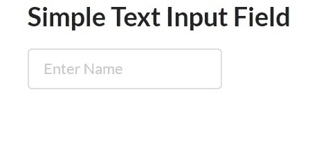
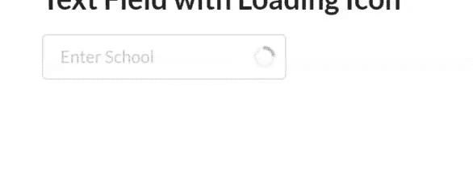
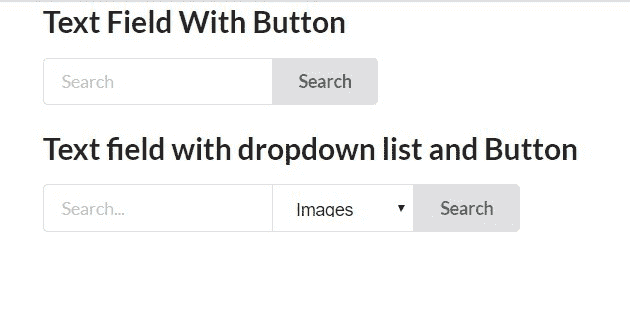
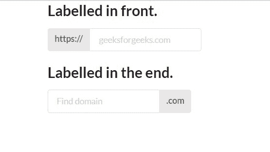

# 语义-界面|输入字段

> 原文:[https://www.geeksforgeeks.org/semantic-ui-input-field/](https://www.geeksforgeeks.org/semantic-ui-input-field/)

语义 UI 是一个开源框架，它使用 CSS 和 jQuery 来构建出色的用户界面。它和引导程序一样使用，有很大的不同元素来使你的网站看起来更令人惊讶。它使用一个类向元素添加 CSS。语义用户界面类可以应用于输入字段，根据需要修改和设计它们。

**示例 1:** 简单输入字段

## 超文本标记语言

```html
<!DOCTYPE html>
<html>
    <head>
        <title>Semantic UI</title>
        <link href=
"https://cdnjs.cloudflare.com/ajax/libs/semantic-ui/2.4.1/semantic.min.css"
              rel="stylesheet" />
    </head>
    <body>
        <div class="ui container">
            <h2>Simple Text Input Field</h2>
            <div class="ui input">
                <input type="text" placeholder="Enter Name">
            </div>
        </div>

        <script src=
"https://cdnjs.cloudflare.com/ajax/libs/semantic-ui/2.4.1/semantic.min.js">
      </script>
    </body>
</html>
```

**输出:**



**示例 2:** 显示数据加载的输入字段

## 超文本标记语言

```html
<!DOCTYPE html>
<html>
    <head>
        <title>Semantic UI</title>
        <link href=
"https://cdnjs.cloudflare.com/ajax/libs/semantic-ui/2.4.1/semantic.min.css"
              rel="stylesheet" />
    </head>

    <body>
        <div class="ui container">
            <h2>Text Field with Loading Icon</h2>
            <div class="ui icon input loading">
                <input type="text" placeholder="Enter School">
                <i class="search icon"></i>
            </div>
        </div>
        <script src=
"https://cdnjs.cloudflare.com/ajax/libs/semantic-ui/2.4.1/semantic.min.js">
      </script>
    </body>
</html>
```

**输出:**



您可以添加类“ui 左侧图标输入加载”来显示左侧的加载图标。

**示例 3:** 动作输入字段

## 超文本标记语言

```html
<!DOCTYPE html>
<html>
    <head>
        <title>Semantic UI</title>
        <link href=
"https://cdnjs.cloudflare.com/ajax/libs/semantic-ui/2.4.1/semantic.min.css"
              rel="stylesheet" />
    </head>

    <body>
        <div class="ui container">
            <h2>Text Field With Button</h2>
            <div class="ui action input">
                <input type="text" placeholder="Search">
                <button class="ui button">Search</button>
            </div>
        </div>
        <br>
        <div class="ui container">
            <h2>Text field with dropdown list and Button</h2>
            <div class="ui action input">
                <input type="text" placeholder="Search...">
                <select class="ui compact selection dropdown">
                  <option value="web">Web</option>
                  <option selected="" value="images">Images</option>
                  <option value="videos">Videos</option>
                </select>
                <div class="ui button">Search</div>
            </div>
        </div>
        <script src=
"https://cdnjs.cloudflare.com/ajax/libs/semantic-ui/2.4.1/semantic.min.js">
      </script>
    </body>
</html>
```

**输出:**



**示例 4:** 标记的输入文件

## 超文本标记语言

```html
<!DOCTYPE html>
<html>
    <head>
        <title>Semantic UI</title>
        <link href=
"https://cdnjs.cloudflare.com/ajax/libs/semantic-ui/2.4.1/semantic.min.css"
              rel="stylesheet" />
    </head>

    <body>
        <div class="ui container">
            <h2>Labelled in front.</h2>
            <div class="ui labeled input">
                <div class="ui label">
                    https://
                </div>
                <input type="text" 
                       placeholder="geeksforgeeks.com">
            </div>
        </div>
        <br>
        <div class="ui container">
            <h2>Labelled in the end.</h2>
            <div class="ui right labeled input">
                <input type="text" placeholder="Find domain">
                <div class="ui dropdown label">
                  <div class="text">.com</div>
                </div>
            </div>
        </div>
        <script src=
"https://cdnjs.cloudflare.com/ajax/libs/semantic-ui/2.4.1/semantic.min.js">
      </script>
    </body>
</html>
```

**输出:**

