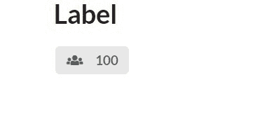
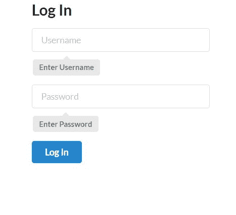
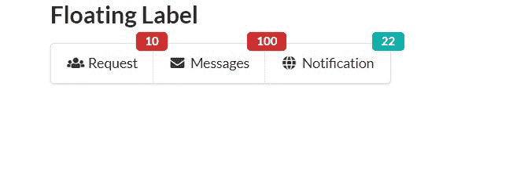

# 语义-用户界面|标签

> 原文:[https://www.geeksforgeeks.org/semantic-ui-label/](https://www.geeksforgeeks.org/semantic-ui-label/)

语义 UI 是一个开源框架，它使用 CSS 和 jQuery 来构建出色的用户界面。它和引导程序一样使用，有很大的不同元素来使你的网站看起来更令人惊讶。它使用一个类向元素添加 CSS。

标签对于让你的网站更加用户友好非常有用。

**示例 1:** 本示例创建一个简单的标签内容。

```
<!DOCTYPE html>
<html>

<head>
    <title>Semantic UI</title>
    <link href=
"https://cdnjs.cloudflare.com/ajax/libs/semantic-ui/2.4.1/semantic.min.css"
        rel="stylesheet" />

    <script src=
"https://cdnjs.cloudflare.com/ajax/libs/semantic-ui/2.4.1/semantic.min.js">
    </script>
</head>

<body>
    <div class="ui container">
        <h2>Label</h2>
        <div class="ui label">
            <i class="users icon"></i> 100
        </div>
    </div>
</body>

</html>
```

**输出:**


你可以使用任何图标，例如邮件或任何图标，你可以检查语义用户界面网站上的图标。

**示例 2:** 本示例为表单元素创建一个标签。

```
<!DOCTYPE html>
<html>

<head>
    <title>Semantic UI</title>
    <link href=
"https://cdnjs.cloudflare.com/ajax/libs/semantic-ui/2.4.1/semantic.min.css"
        rel="stylesheet" />

    <script src=
"https://cdnjs.cloudflare.com/ajax/libs/semantic-ui/2.4.1/semantic.min.js">
    </script>
</head>

<body>
    <div class="ui container">
        <h2>Log In</h2>
        <div class="ui form">
            <div class="four wide field">
                <input type="text" placeholder="Username">
                <div class="ui pointing label">
                    Enter Username
                </div>
            </div>
            <div class="four wide field">
                <input type="password" placeholder="Password">
                <div class="ui pointing label">
                    Enter Password
                </div>
            </div>
            <div class="field">
                <input class="ui primary button" 
                        type="submit" value="Log In">
            </div>
        </div>
    </div>
</body>

</html>
```

**输出:**


**示例 3:** 本示例创建一个浮动标签。

```
<!DOCTYPE html>
<html>

<head>
    <title>Semantic UI</title>
    <link href=
"https://cdnjs.cloudflare.com/ajax/libs/semantic-ui/2.4.1/semantic.min.css"
        rel="stylesheet" />

    <script src=
"https://cdnjs.cloudflare.com/ajax/libs/semantic-ui/2.4.1/semantic.min.js">
    </script>
</head>

<body>
    <div class="ui container">
        <h2>Floating Label</h2>
        <div class="ui compact menu">
            <a class="item">
                <i class="icon users"></i> Request
                <div class="floating ui red label">10</div>
            </a>
            <a class="item">
                <i class="icon mail"></i> Messages
                <div class="floating ui red label">100</div>
            </a>
            <a class="item">
                <i class="icon globe"></i> Notification
                <div class="floating ui teal label">22</div>
            </a>
        </div>
    </div>
</body>

</html>
```

**输出:**
