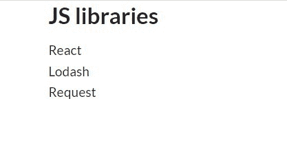
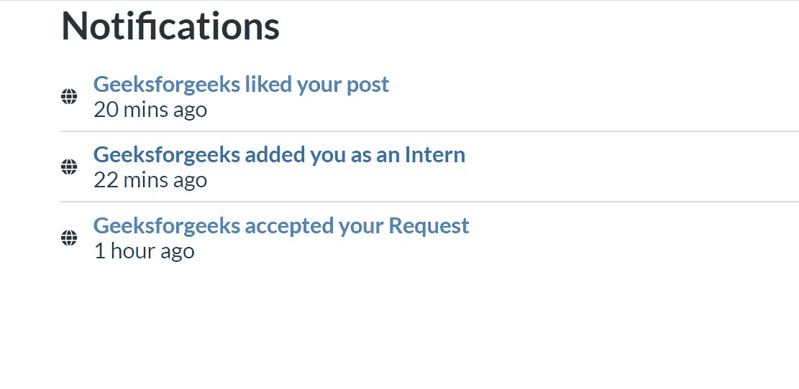
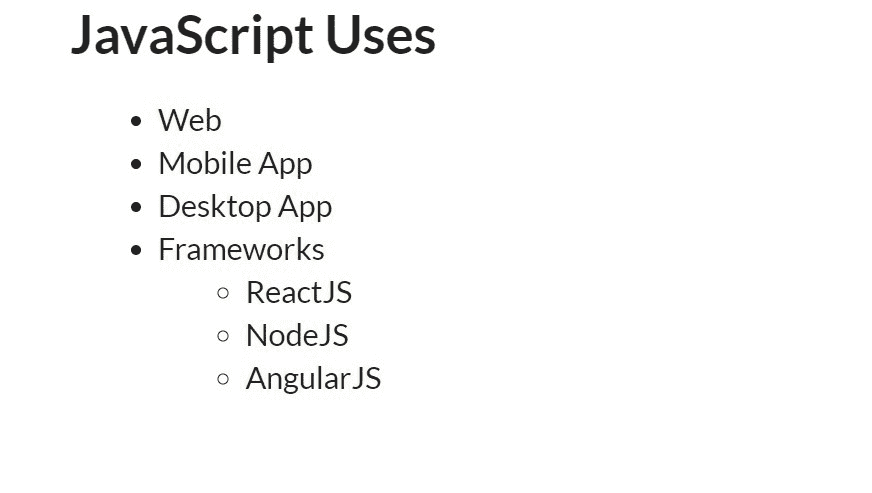
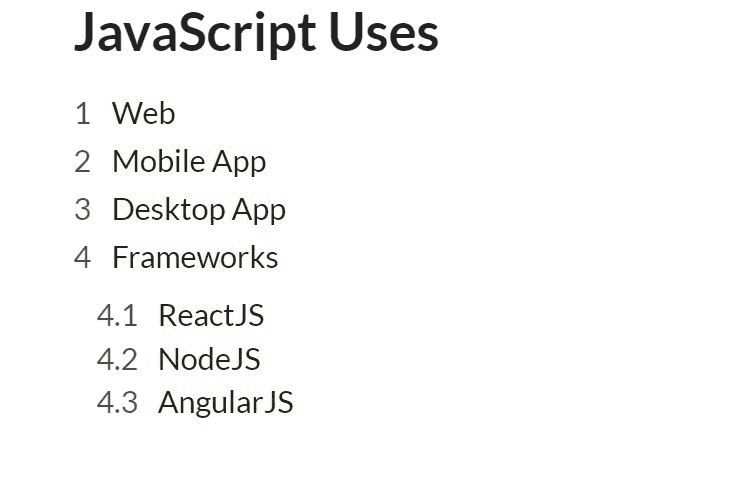
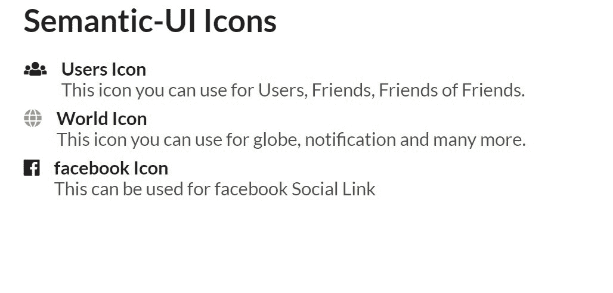
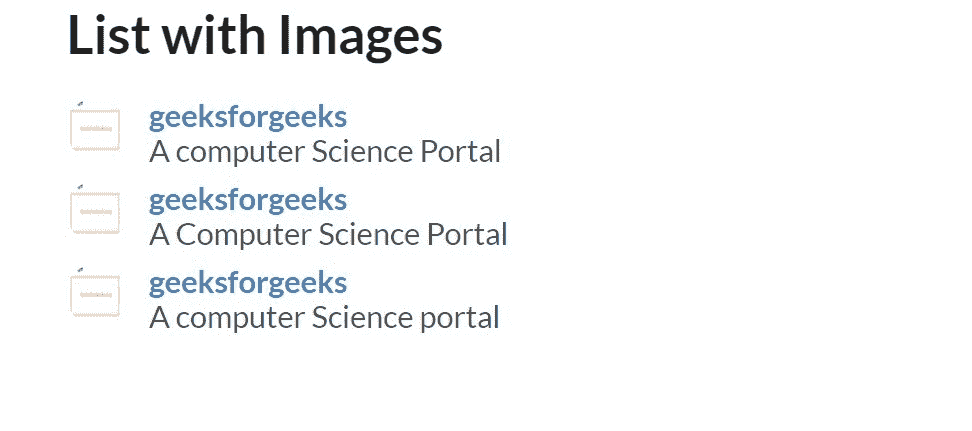
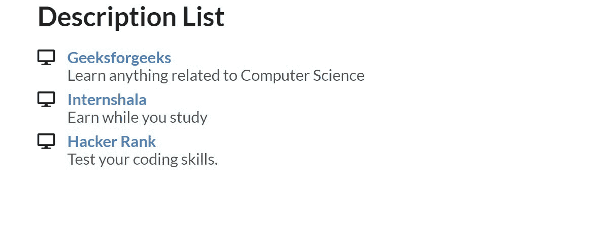
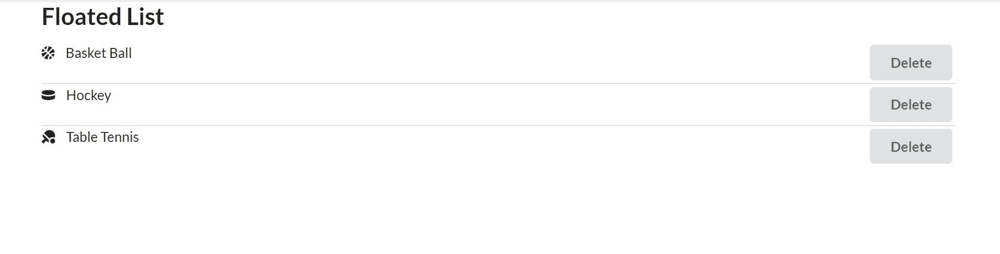

# 语义-界面|列表

> 原文:[https://www.geeksforgeeks.org/semantic-ui-list/](https://www.geeksforgeeks.org/semantic-ui-list/)

语义 UI 是一个开源框架，它使用 CSS 和 jQuery 来构建出色的用户界面。它和引导程序一样，有很大的不同元素，可以让你的网站看起来更加惊艳。它使用一个类向元素添加 CSS。该列表用于显示组相关数据，即同一类型下的数据。

下面给出了所有的例子。

**示例 1:** 在这个示例中，我们将看到一些使用 Semantic-ui 的列表的基本类型。

```
<!DOCTYPE html>
<html>
    <head>
        <title>Semantic UI</title>
        <link href=
"https://cdnjs.cloudflare.com/ajax/libs/semantic-ui/2.4.1/semantic.min.css" 
              rel="stylesheet" />
    </head>
    <body>
        <div class="ui container">
            <h2>JS libraries</h2>
            <div class="ui list">
                <div class="item">React</div>
                <div class="item">Lodash</div>
                <div class="item">Request</div>
            </div>
        </div>
        <script src=
"https://cdnjs.cloudflare.com/ajax/libs/semantic-ui/2.4.1/semantic.min.js">
        </script>
    </body>
</html>
```

**输出:**


**示例 2:** 在本例中，我们将使用图标来划分 List。

```
<!DOCTYPE html>
<html>
    <head>
        <title>Semantic UI</title>
        <link href=
"https://cdnjs.cloudflare.com/ajax/libs/semantic-ui/2.4.1/semantic.min.css" 
              rel="stylesheet" />
    </head>
    <body>
        <div class="ui container">
            <h2>Notifications</h2>
            <div class="ui relaxed divided list">
                <div class="item">
                    <i class="small world middle aligned icon"></i>
                    <div class="content">
                        <a class="header">
                           Geeksforgeeks liked your post
                        </a>
                        <div class="description">20 mins ago</div>
                    </div>
                </div>
                <div class="item">
                    <i class="small world middle aligned icon"></i>
                    <div class="content">
                        <a class="header">
                          Geeksforgeeks added you as an Intern
                        </a>
                        <div class="description">22 mins ago</div>
                    </div>
                </div>
                <div class="item">
                    <i class="small world middle aligned icon"></i>
                    <div class="content">
                        <a class="header">
                          Geeksforgeeks accepted your Request
                        </a>
                        <div class="description">1 hour ago</div>
                    </div>
                </div>
            </div>
        </div>
        <script src=
"https://cdnjs.cloudflare.com/ajax/libs/semantic-ui/2.4.1/semantic.min.js">
        </script>
    </body>
</html>
```

**输出**


**示例 3:** 在本例中，我们将看到个人详细信息列表。

```
<!DOCTYPE html>
<html>
    <head>
        <title>Semantic UI</title>
        <link href=
"https://cdnjs.cloudflare.com/ajax/libs/semantic-ui/2.4.1/semantic.min.css" 
              rel="stylesheet" />
    </head>
    <body>
        <div class="ui container">
            <h2>Geeksforgeeks</h2>
            <div class="ui list">
                <div class="item">
                    <i class="computer icon"></i>
                    <div class="content">
                        Geeksforgeeks
                    </div>
                </div>
                <div class="item">
                    <i class="marker icon"></i>
                    <div class="content">
                        Noida, UP
                    </div>
                </div>
                <div class="item">
                    <i class="mail icon"></i>
                    <div class="content">
                        <a href=
"mailto:carrier@geeksforgees.org">
                           carrier@geeksforgeeks.org
                        </a>
                    </div>
                </div>
                <div class="item">
                    <i class="linkify icon"></i>
                    <div class="content">
                        <a href=
"https://geeksforgeeks.org">geeksforgeeks.org</a>
                    </div>
                </div>
            </div>
        </div>
        <script src=
"https://cdnjs.cloudflare.com/ajax/libs/semantic-ui/2.4.1/semantic.min.js">
        </script>
    </body>
</html>
```

**输出**


**示例 4:** 在本例中，我们将看到项目符号列表。

```
<!DOCTYPE html>
<html>
    <head>
        <title>Semantic UI</title>
        <link href=
"https://cdnjs.cloudflare.com/ajax/libs/semantic-ui/2.4.1/semantic.min.css" 
              rel="stylesheet" />
    </head>
    <body>
        <div class="ui container">
            <h2>JavaScript Uses</h2>
            <ul>
                <li>Web</li>
                <li>Mobile App</li>
                <li>Desktop App</li>
                <li>
                    Frameworks
                    <ul>
                        <li>ReactJS</li>
                        <li>NodeJS</li>
                        <li>AngularJS</li>
                    </ul>
                </li>
            </ul>
        </div>
        <script src=
"https://cdnjs.cloudflare.com/ajax/libs/semantic-ui/2.4.1/semantic.min.js">
        </script>
    </body>
</html>
```

**输出**


**示例 5:** 在本例中，我们将创建有序列表。

```
<!DOCTYPE html>
<html>
    <head>
        <title>Semantic UI</title>
        <link href=
"https://cdnjs.cloudflare.com/ajax/libs/semantic-ui/2.4.1/semantic.min.css"
              rel="stylesheet" />
    </head>
    <body>
        <div class="ui container">
            <h2>JavaScript Uses</h2>
            <ol class="ui list">
                <li>Web</li>
                <li>Mobile App</li>
                <li>Desktop App</li>
                <li>
                    Frameworks
                    <ol>
                        <li>ReactJS</li>
                        <li>NodeJS</li>
                        <li>AngularJS</li>
                    </ol>
                </li>
            </ol>
        </div>
        <script src=
"https://cdnjs.cloudflare.com/ajax/libs/semantic-ui/2.4.1/semantic.min.js">
        </script>
    </body>
</html>
```

**输出**


**示例 6:** 在本例中，我们将创建带有图标的列表。

```
<!DOCTYPE html>
<html>
    <head>
        <title>Semantic UI</title>
        <link href=
"https://cdnjs.cloudflare.com/ajax/libs/semantic-ui/2.4.1/semantic.min.css" 
              rel="stylesheet" />
    </head>
    <body>
        <div class="ui container">
            <h2>Semantic-UI Icons</h2>
            <div class="ui list">
                <a class="item">
                    <i class="users icon"></i>
                    <div class="content">
                        <div class="header">Users Icon</div>
                        <div class="description">
                          This icon you can use for Users, Friends,
                          Friends of Friends.
                        </div>
                    </div>
                </a>
                <a class="item">
                    <i class="world icon"></i>
                    <div class="content">
                        <div class="header">World Icon</div>
                        <div class="description">
                         This icon you can use for globe, 
                         notification and many more.
                        </div>
                    </div>
                </a>
                <div class="item">
                    <i class="facebook icon"></i>
                    <div class="content">
                        <div class="header">facebook Icon</div>
                        <div class="description">
                         This can be used for facebook Social Link
                        </div>
                    </div>
                </div>
            </div>
        </div>
        <script src=
"https://cdnjs.cloudflare.com/ajax/libs/semantic-ui/2.4.1/semantic.min.js">
        </script>
    </body>
</html>
```

**输出**


**示例 7:** 在本例中，我们将使用图像创建列表。

```
<!DOCTYPE html>
<html>
    <head>
        <title>Semantic UI</title>
        <link href=
"https://cdnjs.cloudflare.com/ajax/libs/semantic-ui/2.4.1/semantic.min.css" 
              rel="stylesheet" />
    </head>
    <body>
        <div class="ui container">
            <h2>List with Images</h2>
            <div class="ui list">
                <div class="item">
                    
                    <div class="content">
                        <a class="header">geeksforgeeks</a>
                        <div class="description">
                         A computer Science Portal
                        </div>
                    </div>
                </div>
                <div class="item">
                    
                    <div class="content">
                        <a class="header">geeksforgeeks</a>
                        <div class="description">
                         A Computer Science Portal
                        </div>
                    </div>
                </div>
                <div class="item">
                    
                    <div class="content">
                        <a class="header">geeksforgeeks</a>
                        <div class="description">
                         A computer Science portal
                        </div>
                    </div>
                </div>
            </div>
        </div>
        <script src=
"https://cdnjs.cloudflare.com/ajax/libs/semantic-ui/2.4.1/semantic.min.js">
        </script>
    </body>
</html>
```

**输出**


**示例 8:** 在本例中，我们将创建描述列表。

```
<!DOCTYPE html>
<html>
    <head>
        <title>Semantic UI</title>
        <link href=
"https://cdnjs.cloudflare.com/ajax/libs/semantic-ui/2.4.1/semantic.min.css"  
              rel="stylesheet" />
    </head>
    <body>
        <div class="ui container">
            <h2>Description List</h2>
            <div class="ui list">
                <div class="item">
                    <i class="map computer icon"></i>
                    <div class="content">
                        <a class="header">Geeksforgeeks</a>
                        <div class="description">
                          Learn anything related to Computer Science 
                        </div>
                    </div>
                </div>
                <div class="item">
                    <i class="map computer icon"></i>
                    <div class="content">
                        <a class="header">Internshala</a>
                        <div class="description"> 
                         Earn while you study
                        </div>
                    </div>
                </div>
                <div class="item">
                    <i class="map computer icon"></i>
                    <div class="content">
                        <a class="header">Hacker Rank</a>
                        <div class="description">
                         Test your coding skills.
                       </div>
                    </div>
                </div>
            </div>
        </div>
        <script src=
"https://cdnjs.cloudflare.com/ajax/libs/semantic-ui/2.4.1/semantic.min.js">
        </script>
    </body>
</html>
```

**输出**


**示例 9:** 在本例中，我们将创建浮动列表。

```
<!DOCTYPE html>
<html>
    <head>
        <title>Semantic UI</title>
        <link href=
"https://cdnjs.cloudflare.com/ajax/libs/semantic-ui/2.4.1/semantic.min.css" 
              rel="stylesheet" />
    </head>
    <body>
        <div class="ui container">
            <h2>Floated List</h2>
            <div class="ui middle aligned divided list">
                <div class="item">
                    <div class="right floated content">
                        <div class="ui button">Delete</div>
                    </div>
                    <i class="basketball ball icon"></i>
                    <div class="content">
                        Basket Ball
                    </div>
                </div>
                <div class="item">
                    <div class="right floated content">
                        <div class="ui button">Delete</div>
                    </div>
                    <i class="hockey puck icon"></i>
                    <div class="content">
                        Hockey
                    </div>
                </div>
                <div class="item">
                    <div class="right floated content">
                        <div class="ui button">Delete</div>
                    </div>
                    <i class="table tennis icon"></i>
                    <div class="content">
                        Table Tennis
                    </div>
                </div>
            </div>
        </div>
        <script src=
"https://cdnjs.cloudflare.com/ajax/libs/semantic-ui/2.4.1/semantic.min.js">
        </script>
    </body>
</html>
```

**输出**
