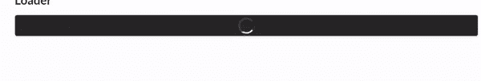
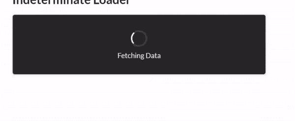
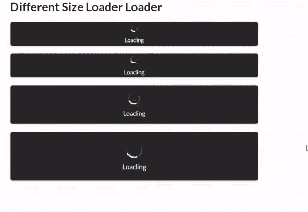

# 语义-界面|加载器

> 原文:[https://www.geeksforgeeks.org/semantic-ui-loader/](https://www.geeksforgeeks.org/semantic-ui-loader/)

**语义 UI** 是一个开源框架，使用 CSS 和 jQuery 来构建出色的用户界面。它和引导程序一样，有很大的不同元素，可以让你的网站看起来更加惊艳。它使用一个类向元素添加 CSS。

当您加载您的网站或使用异步加载并希望用户显示加载时，加载器会非常有用。

以下是一些装载机的示例:

**示例 1:** 在本例中，我们将创建一个简单的加载器。

```
<!DOCTYPE html>
<html>
    <head>
        <title>Semantic UI</title>
        <link href=
"https://cdnjs.cloudflare.com/ajax/libs/semantic-ui/2.4.1/semantic.min.css" 
              rel="stylesheet" />
    </head>
    <body>
        <div class="ui container">
            <h2>Loader</h2>
            <div class="ui segment">
                <p></p>
                <div class="ui active dimmer">
                    <div class="ui loader"></div>
                </div>
            </div>
        </div>
        <script src=
"https://cdnjs.cloudflare.com/ajax/libs/semantic-ui/2.4.1/semantic.min.js">
        </script>
    </body>
</html>
```

**输出:**


**示例 2:** 在本例中，我们将创建一个文本加载器。

```
<!DOCTYPE html>
<html>
    <head>
        <title>Semantic UI</title>
        <link href=
"https://cdnjs.cloudflare.com/ajax/libs/semantic-ui/2.4.1/semantic.min.css" 
              rel="stylesheet" />
    </head>
    <body>
        <div class="ui container">
            <h2>Text Loader</h2>
            <div style="height: 120px; width: 500px;" 
                 class="ui segment">
                <div class="ui active dimmer">
                    <div class="ui text loader">
                     Loading
                    </div>
                </div>
                <p></p>
            </div>
        </div>
        <script src=
"https://cdnjs.cloudflare.com/ajax/libs/semantic-ui/2.4.1/semantic.min.js">
        </script>
    </body>
</html>
```

**输出:**


**示例 3:** 这里我们将看到中间加载器(当您不知道需要多长时间时，可以使用它)。

```
<!DOCTYPE html>
<html>
    <head>
        <title>Semantic UI</title>
        <link href=
"https://cdnjs.cloudflare.com/ajax/libs/semantic-ui/2.4.1/semantic.min.css" 
              rel="stylesheet" />
    </head>
    <body>
        <div class="ui container">
            <h2>Indeterminate Loader</h2>
            <div style="height: 120px; width: 500px;" 
                 class="ui segment">
                <div class="ui active dimmer">
                    <div class="ui indeterminate text loader">
                         Fetching Data</div>
                </div>
                <p></p>
            </div>
        </div>
        <script src=
"https://cdnjs.cloudflare.com/ajax/libs/semantic-ui/2.4.1/semantic.min.js">
        </script>
    </body>
</html>
```

**输出:**


**示例 4:** 在本例中，我们将创建不同大小的加载器。

```
<!DOCTYPE html>
<html>
    <head>
        <title>Semantic UI</title>
        <link href=
"https://cdnjs.cloudflare.com/ajax/libs/semantic-ui/2.4.1/semantic.min.css" 
              rel="stylesheet" />
    </head>
    <body>
        <div class="ui container">
            <h2>Different Size Loader Loader</h2>
            <div style="height: 50px; width: 500px;" 
                 class="ui segment">
                <div class="ui active dimmer">
                    <div class="ui mini text loader">
                     Loading
                    </div>
                </div>
                <p></p>
            </div>
            <div style="height: 50px; width: 500px;" 
                 class="ui segment">
                <div class="ui active dimmer">
                    <div class="ui tiny text loader">
                      Loading
                    </div>
                </div>
                <p></p>
            </div>
            <div style="height: 80px; width: 500px;" 
                 class="ui segment">
                <div class="ui active dimmer">
                    <div class="ui small text loader">
                      Loading
                    </div>
                </div>
                <p></p>
            </div>
            <div style="height: 100px; width: 500px;" 
                 class="ui segment">
                <div class="ui active dimmer">
                    <div class="ui medium text loader">
                      Loading
                    </div>
                </div>
                <p></p>
                <p></p>
            </div>
        </div>
        <script src=
"https://cdnjs.cloudflare.com/ajax/libs/semantic-ui/2.4.1/semantic.min.js">
        </script>
    </body>
</html>
```

**输出:**


**注意:**你也可以使用其他大小类也喜欢大、巨、巨。