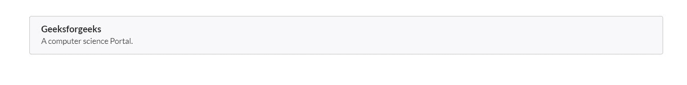
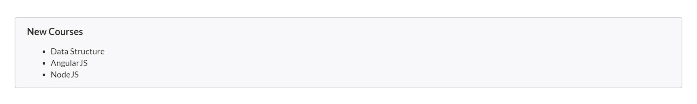
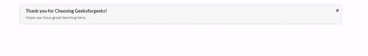

# 语义-界面|消息

> 原文:[https://www.geeksforgeeks.org/semantic-ui-message/](https://www.geeksforgeeks.org/semantic-ui-message/)

语义 UI 是一个开源框架，它使用 CSS 和 jQuery 来构建一个很棒的用户界面。它和引导程序一样，有很大的不同元素，可以让你的网站看起来更加惊艳。它使用一个类向元素添加 CSS。消息显示与某些内容相关的信息。

**例 1:**

```
<!DOCTYPE html>
<html>

<head>
    <title>Semantic UI</title>
    <link href=
"https://cdnjs.cloudflare.com/ajax/libs/semantic-ui/2.4.1/semantic.min.css"
        rel="stylesheet" />
</head>

<body>
    <div class="ui container">
        <div class="ui message">
            <div class="header">
                Geeksforgeeks
            </div>
            <p>A computer science Portal.</p>
        </div>
    </div>
    <script src=
"https://cdnjs.cloudflare.com/ajax/libs/semantic-ui/2.4.1/semantic.min.js">
    </script>
</body>

</html>
```

**输出:**


**示例 2:** 列表消息

```
<!DOCTYPE html>
<html>

<head>
    <title>Semantic UI</title>
    <link href=
"https://cdnjs.cloudflare.com/ajax/libs/semantic-ui/2.4.1/semantic.min.css"
        rel="stylesheet" />
</head>

<body>
    <div class="ui container">
        <div class="ui message">
            <div class="header">
                New Courses
            </div>
            <ul>
                <li>Data Structure</li>
                <li>AngularJS</li>
                <li>NodeJS</li>
            </ul>
        </div>
    </div>
    <script src=
"https://cdnjs.cloudflare.com/ajax/libs/semantic-ui/2.4.1/semantic.min.js">
    </script>
</body>

</html>
```

**输出:**


**示例 3:** 本示例创建一条可解除消息。这需要导入 jQuery 库。

**语法:**

```
$('.message .close').on('click', function() {
    $(this).closest('.message').transition('fade');
});

```

**完整代码:**

```
<!DOCTYPE html>
<html>

<head>
    <title>Semantic UI</title>
    <link href=
"https://cdnjs.cloudflare.com/ajax/libs/semantic-ui/2.4.1/semantic.min.css"
        rel="stylesheet" />

    <script src="https://code.jquery.com/jquery-3.1.1.min.js"
        integrity=
"sha256-hVVnYaiADRTO2PzUGmuLJr8BLUSjGIZsDYGmIJLv2b8="
        crossorigin="anonymous">
    </script>

    <script src=
"https://cdnjs.cloudflare.com/ajax/libs/semantic-ui/2.4.1/semantic.min.js">
    </script>
</head>

<body>
    <div class="ui container">
        <div class="ui message">
            <i class="close icon"></i>
            <div class="header">
                Thank you for Choosing Geeksforgeeks!
            </div>
            <p>Hope you have great learning here.</p>
        </div>
    </div>

    <script>
        $('.message .close').on('click', function () {
            $(this).closest('.message').transition('fade');
        });      
    </script>
</body>

</html>
```

**输出:**


**注:**

*   您可以添加类别信息、错误、成功、肯定和警告来更改消息的外观。例如:要显示警告消息:class='ui 警告消息'。
*   您可以编写任何颜色或大小的类来分别更改类的颜色或大小。