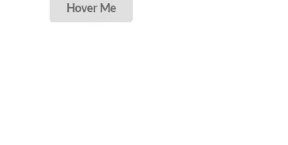
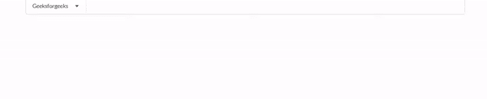
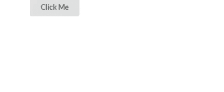
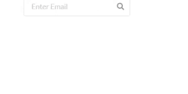
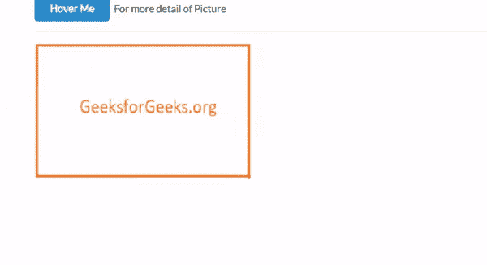

# 语义-界面|弹出

> 原文:[https://www.geeksforgeeks.org/semantic-ui-popup/](https://www.geeksforgeeks.org/semantic-ui-popup/)

语义 UI 是一个开源框架，它使用 CSS 和 jQuery 来构建出色的用户界面。它和引导程序一样，有很大的不同元素，可以让你的网站看起来更加惊艳。它使用一个类向元素添加 CSS。

Pop 用于在页面顶部显示一些内容。

**语法:** jQuery 代码

```html
$('.button').popup();

```

**示例 1:** 本示例在鼠标移动时显示弹出消息。

```html
<!DOCTYPE html>
<html>

<head>
    <title>Semantic UI</title>

    <link href=
"https://cdnjs.cloudflare.com/ajax/libs/semantic-ui/2.4.1/semantic.min.css"
        rel="stylesheet" />

    <script src="https://code.jquery.com/jquery-3.1.1.min.js" 
        integrity=
"sha256-hVVnYaiADRTO2PzUGmuLJr8BLUSjGIZsDYGmIJLv2b8=" 
        crossorigin="anonymous">
    </script>

    <script src=
"https://cdnjs.cloudflare.com/ajax/libs/semantic-ui/2.4.1/semantic.min.js">
    </script>
</head>

<body>
    <div style="margin-top: 20px" class="ui container">
        <div class="ui button" data-content=
            "You are learning Semantic-ui popup">
            Hover Me
        </div>
    </div>

    <script>
        $('.button').popup();
    </script>
</body>

</html>
```

**输出:**


如果我们没有在 popup()函数中指定属性，那么它会在悬停时弹出。

**例 2:**

本示例显示一个弹出菜单。

**jQuery code:**

```html
$('.menu .browse').popup({
   hoverable: true,
});

```

可悬停属性设置为 true 以悬停在弹出菜单上。如果我们不使用这个属性，它将是假的，并且不能悬停在弹出菜单上。

**完整代码:**

```html
<!DOCTYPE html>
<html>

<head>
    <title>Semantic UI</title>
    <link href=
"https://cdnjs.cloudflare.com/ajax/libs/semantic-ui/2.4.1/semantic.min.css"
            rel="stylesheet" />

    <script src="https://code.jquery.com/jquery-3.1.1.min.js"
        integrity="sha256-hVVnYaiADRTO2PzUGmuLJr8BLUSjGIZsDYGmIJLv2b8="
        crossorigin="anonymous">
    </script>

    <script src=
"https://cdnjs.cloudflare.com/ajax/libs/semantic-ui/2.4.1/semantic.min.js">
    </script>
</head>

<body>
    <div style="margin-top: 20px" class="ui container">
        <div class="ui menu">
            <a class="browse item">
                Geeksforgeeks
                <i class="dropdown icon"></i>
            </a>
            <div class="ui fluid popup bottom left transition hidden"
                style="top: 554.6px; left: 1px; bottom: auto; 
                                right: auto; width: 840.2px;">
                <div class="ui four column relaxed divided grid">
                    <div class="column">
                        <h4 class="ui header">Data Structure</h4>
                        <div class="ui link list">
                            <a class="item">Array</a>
                            <a class="item">LinkList</a>
                            <a class="item">Tree</a>
                        </div>
                    </div>
                    <div class="column">
                        <h4 class="ui header">Web</h4>
                        <div class="ui link list">
                            <a class="item">Angular</a>
                            <a class="item">React</a>
                            <a class="item">Node</a>
                        </div>
                    </div>
                    <div class="column">
                        <h4 class="ui header">Language</h4>
                        <div class="ui link list">
                            <a class="item">C++</a>
                            <a class="item">Python</a>
                            <a class="item">JavaScript</a>
                        </div>
                    </div>
                </div>
            </div>
        </div>
    </div>

    <script>
        $('.menu .browse').popup();
    </script>
</body>

</html>
```

**输出:**


**例 3:**

本示例在单击按钮后显示弹出消息。

**jQuery Code:**

```html
$('.button').popup({
   on: 'click'
});

```

**完整代码:**

```html
<!DOCTYPE html>
<html>

<head>
    <title>Semantic UI</title>

    <link href=
"https://cdnjs.cloudflare.com/ajax/libs/semantic-ui/2.4.1/semantic.min.css"
    rel="stylesheet" />

    <script src="https://code.jquery.com/jquery-3.1.1.min.js"
        integrity="sha256-hVVnYaiADRTO2PzUGmuLJr8BLUSjGIZsDYGmIJLv2b8="
        crossorigin="anonymous">
    </script>

    <script src=
"https://cdnjs.cloudflare.com/ajax/libs/semantic-ui/2.4.1/semantic.min.js">
    </script>
</head>

<body>
    <div style="margin-top: 20px" class="ui container">
        <div class="ui button" data-content=
            "You are learning Semantic-ui popup">
            Click Me
        </div>
    </div>

    <script>
        $('.button').popup({
            on: 'click'
        });
    </script>
</body>

</html>
```

输出:


**例 4:**

本示例在输入字段中显示弹出消息。

**jQuery Code:**

```html
$('input').popup({
   on: 'focus'
});

```

使用`on: 'focus'`是因为我们只想在用户关注输入字段时显示弹出窗口。

**完整代码:**

```html
<!DOCTYPE html>
<html>

<head>
    <title>Semantic UI</title>
    <link href=
"https://cdnjs.cloudflare.com/ajax/libs/semantic-ui/2.4.1/semantic.min.css"
        rel="stylesheet" />

    <script src="https://code.jquery.com/jquery-3.1.1.min.js"
        integrity="sha256-hVVnYaiADRTO2PzUGmuLJr8BLUSjGIZsDYGmIJLv2b8="
        crossorigin="anonymous">
    </script>

    <script src=
"https://cdnjs.cloudflare.com/ajax/libs/semantic-ui/2.4.1/semantic.min.js">
    </script>
</head>

<body>
    <div style="margin-top: 20px" class="ui container">
        <div class="ui icon input">
            <input type="text" placeholder="Enter Email"
                data-content=
"Enter the email of person whose account you want to search" />
            <i class="search icon"></i>
        </div>
    </div>

    <script>
        $('input').popup({
            on: 'focus'
        });
    </script>
</body>

</html>
```

**输出:**


**例 5:**

目标元素–在其他地方显示弹出窗口。

**jQuery Code:**

```html
$('.button').popup({
  position : 'right center',
  target   : '.image',
  title    : 'Geeksforgeeks',
  content  : 'A Computer Science Portal'
});

```

*   **位置:**您想要显示弹出窗口的位置。
*   **目标:**当悬停在按钮上时，您希望在哪个元素上显示弹出窗口。
*   **标题和内容:**弹出显示。

**完整代码:**

```html
<!DOCTYPE html>
<html>

<head>
    <title>Semantic UI</title>
    <link href=
"https://cdnjs.cloudflare.com/ajax/libs/semantic-ui/2.4.1/semantic.min.css"
        rel="stylesheet" />

    <script src="https://code.jquery.com/jquery-3.1.1.min.js"
        integrity="sha256-hVVnYaiADRTO2PzUGmuLJr8BLUSjGIZsDYGmIJLv2b8="
        crossorigin="anonymous">
    </script>

    <script src=
"https://cdnjs.cloudflare.com/ajax/libs/semantic-ui/2.4.1/semantic.min.js">
    </script>
</head>

<body>
    <div style="margin-top: 20px" class="ui container">
        <div class="ui primary button">Hover Me</div>
        For more detail of Picture
        <div class="ui divider"></div>
        
    </div>

    <script>
        $('.button').popup({
            position: 'right center',
            target: '.image',
            title: 'Geeksforgeeks',
            content: 'A Computer Science Portal'
        });
    </script>
</body>

</html>
```

**输出:**
