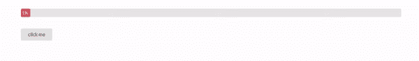
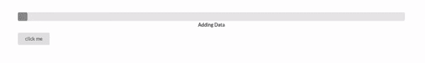
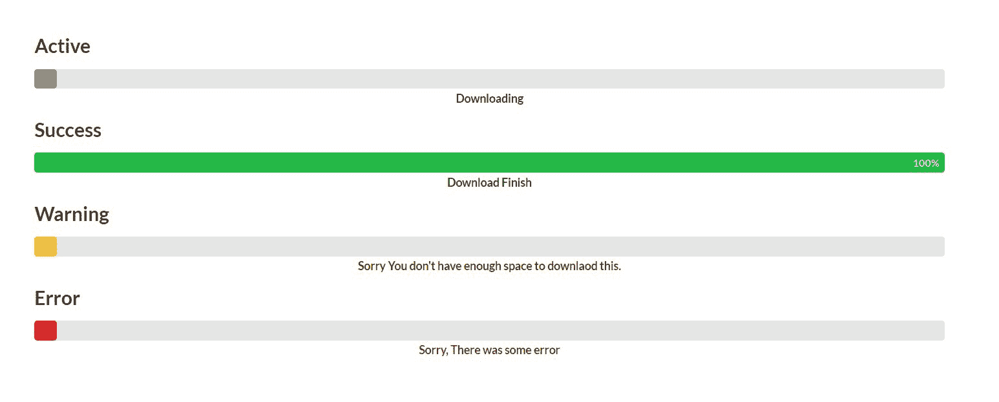

# 语义-UI |进度

> 原文:[https://www.geeksforgeeks.org/semantic-ui-progress/](https://www.geeksforgeeks.org/semantic-ui-progress/)

语义 UI 是一个开源框架，它使用 CSS 和 jQuery 来构建出色的用户界面。它和引导程序一样，有很大的不同元素，可以让你的网站看起来更加惊艳。它使用一个类向元素添加 CSS。

进度条显示任务的进度。让我们看一些例子。
**例:** jQuery 代码。

```
$('.ui.button').on('click', function() {
var
  $progress       = $('.ui.progress'),
  $button         = $(this),
  updateEvent
  ;
  clearInterval(window.fakeProgress)
  $progress.progress('reset');
  window.fakeProgress = setInterval(function() {
  $progress.progress('increment');
  $button.text( $progress.progress('get value') );
  if($progress.progress('is complete')) {
  clearInterval(window.fakeProgress)
  }
  }, 10);
   });
$('.ui.progress').progress({
  duration : 100,
  total    : 100,
  text     : {
   active: '{value} of {total} done'
 }
});
```

**完整代码:**

```
<!DOCTYPE html>
  <html>
      <head>
          <title>Semantic UI</title>
          <link href=
"https://cdnjs.cloudflare.com/ajax/libs/semantic-ui/2.4.1/semantic.min.css" 
                rel="stylesheet" />         
      </head>
      <body>
          <div style="margin-top: 20px"
               class="ui container">  
            <div class="ui indicating progress" 
                 data-value="1" 
                 data-total="100"
                 id="example5">
              <div class="bar">
                <div class="progress"></div>
              </div>
            </div>
            <div class="ui button">click me</div>
           </div> 
          <script src="https://code.jquery.com/jquery-3.1.1.min.js"
                  integrity=
"sha256-hVVnYaiADRTO2PzUGmuLJr8BLUSjGIZsDYGmIJLv2b8=" 
                  crossorigin="anonymous">
          </script>
          <script src=
"https://cdnjs.cloudflare.com/ajax/libs/semantic-ui/2.4.1/semantic.min.js">
          </script> 
          <script>
           $('.ui.button').on('click', function() {
        var
          $progress       = $('.ui.progress'),
          $button         = $(this),
          updateEvent
        ;
        clearInterval(window.fakeProgress)
        $progress.progress('reset');
        window.fakeProgress = setInterval(function() {
          $progress.progress('increment');
          $button.text( $progress.progress('get value') );
          if($progress.progress('is complete')) {
            clearInterval(window.fakeProgress)
          }
        }, 10);
      });
    $('.ui.progress').progress({
        duration : 100,
        total    : 100,
        text     : {
          active: '{value} of {total} done'
        }
      });
          </script>
      </body>
  </html>
```

**输出:**


**示例:**

```
<!DOCTYPE html>
  <html>
      <head>
          <title>Semantic UI</title>
          <link href=
"https://cdnjs.cloudflare.com/ajax/libs/semantic-ui/2.4.1/semantic.min.css" 
                rel="stylesheet" />         
      </head>
      <body>
          <div style="margin-top: 100px" 
               class="ui container">  
            <div class="ui indicating progress" 
                 data-value="1" 
                 data-total="10">

              <div class="bar">
                <div class="progress"></div>
              </div>
              <div class="label">Adding Data</div>
            </div>
            <div class="ui button">click me</div>
           </div> 
          <script src="https://code.jquery.com/jquery-3.1.1.min.js" 
                  integrity=
"sha256-hVVnYaiADRTO2PzUGmuLJr8BLUSjGIZsDYGmIJLv2b8=" 
                  crossorigin="anonymous">
          </script>

          <script src=
"https://cdnjs.cloudflare.com/ajax/libs/semantic-ui/2.4.1/semantic.min.js">
          </script> 
          <script>
           $('.ui.button').on('click', function() {
            $('.progress').progress('increment');
           });
          </script>
      </body>
  </html>
```

**输出:**


**示例:**

州

```
<!DOCTYPE html>
  <html>
      <head>
          <title>Semantic UI</title>
          <link href=
"https://cdnjs.cloudflare.com/ajax/libs/semantic-ui/2.4.1/semantic.min.css" 
                rel="stylesheet" />         
      </head>
      <body>
          <div style="margin-top: 100px" 
               class="ui container"> 
            <h2>Active</h2> 

            <div class="ui active progress" 
                 data-percent="74">

              <div class="bar">
                <div class="progress"></div>
              </div>
              <div class="label">Downloading</div>
            </div>
            <h2>Success</h2>
            <div class="ui progress success" 
                 data-value="20" 
                 data-total="20"
                 id="finish">

              <div class="bar">
                <div class="progress"></div>
              </div>
              <div class="label">Download Finish</div>
            </div>
            <h2>Warning</h2>
            <div class="ui progress warning">
              <div class="bar">
                <div class="progress"></div>
              </div>
              <div class="label">
Sorry You don't have enough space to download this.
             </div>
            </div>
            <h2>Error</h2>
            <div class="ui progress error">
              <div class="bar">
                <div class="progress"></div>
              </div>
              <div class="label">Sorry, There was some error</div>
            </div>
           </div> 
          <script src="https://code.jquery.com/jquery-3.1.1.min.js" 
                  integrity=
"sha256-hVVnYaiADRTO2PzUGmuLJr8BLUSjGIZsDYGmIJLv2b8=" 
                  crossorigin="anonymous">
          </script>
          <script src=
"https://cdnjs.cloudflare.com/ajax/libs/semantic-ui/2.4.1/semantic.min.js">
           </script> 
          <script>
            $('#finish').progress('increment')
          </script>
      </body>
  </html>
```

**输出:**
