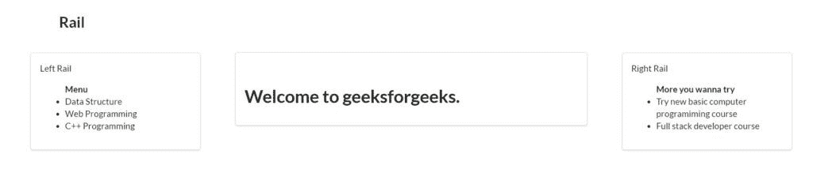
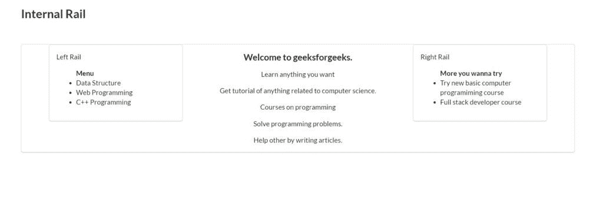
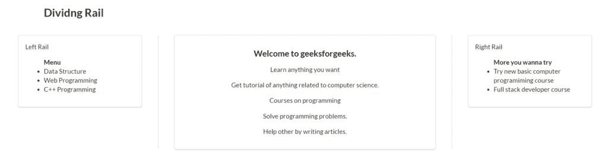
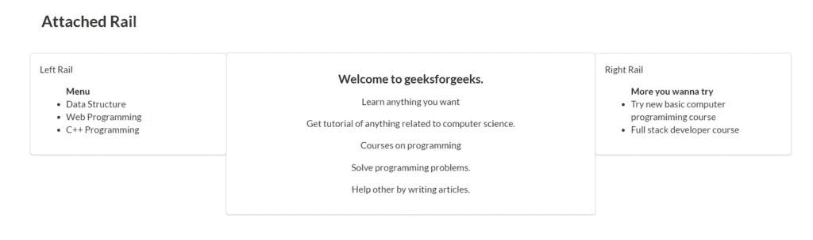

# 语义-界面|轨道

> 原文:[https://www.geeksforgeeks.org/semantic-ui-rail/](https://www.geeksforgeeks.org/semantic-ui-rail/)

语义 UI 开源框架提供 **Rail** ，有助于展示网站主视图边界之外的内容。当你的网站主视图在中间时，它大多在左边和右边。它与 bootstrap 的用法非常相似，并且有很多不同的元素可以用来让你的网站看起来更加惊艳。

**示例:**

## 超文本标记语言

```
<!DOCTYPE html>
<html>

<head>
    <title>Semantic UI</title>
    <link href=
"https://cdnjs.cloudflare.com/ajax/libs/semantic-ui/2.4.1/semantic.min.css"
        rel="stylesheet" />
</head>

<body>
    <div style="margin-top: 100px" 
            class="ui container">
        <h2>Rail</h2>
        <br>
        <div class="ui grid container">
            <div class="ui four wide column">

            </div>
            <div class="ui segment eight wide column">
                <div class="ui left rail">
                    <div class="ui segment">
                        Left Rail
                        <ul>
                            <strong>Menu</strong>
                            <li>Data Structure</li>
                            <li>Web Programming</li>
                            <li>C++ Programming</li>
                        </ul>
                    </div>
                </div>
                <div class="ui right rail">
                    <div class="ui segment">
                        Right Rail
                        <ul>
                            <strong>
                                More you wanna try
                            </strong>
                            <li>
                                Try new basic computer 
                                programiming course
                            </li>
                            <li>
                                Full stack 
                                developer course
                            </li>
                        </ul>
                    </div>
                </div>
                <h1>Welcome to geeksforgeeks.</h1>
            </div>
        </div>
    </div>
    <script src=
"https://code.jquery.com/jquery-3.1.1.min.js"
        integrity=
"sha256-hVVnYaiADRTO2PzUGmuLJr8BLUSjGIZsDYGmIJLv2b8="
        crossorigin="anonymous">
    </script>

    <script src=
"https://cdnjs.cloudflare.com/ajax/libs/semantic-ui/2.4.1/semantic.min.js">
    </script>
</body>

</html>
```

**Output:**


**示例:**以下示例显示了内部轨道。

## 超文本标记语言

```
<!DOCTYPE html>
<html>

<head>
    <title>Semantic UI</title>
    <link href=
"https://cdnjs.cloudflare.com/ajax/libs/semantic-ui/2.4.1/semantic.min.css"
        rel="stylesheet" />
</head>

<body>
    <div style="margin-top: 100px" class="ui container">
        <h2>Internal Rail</h2>
        <br>
        <div class="ui segment eight wide column">
            <div class="ui left internal rail">
                <div class="ui segment">
                    Left Rail
                    <ul>
                        <strong>Menu</strong>
                        <li>Data Structure</li>
                        <li>Web Programming</li>
                        <li>C++ Programming</li>
                    </ul>
                </div>
            </div>
            <div class="ui right internal rail">
                <div class="ui segment">
                    Right Rail
                    <ul>
                        <strong>More you wanna try</strong>
                        <li>
                            Try new basic computer 
                            programiming course
                        </li>
                        <li>Full stack developer course</li>
                    </ul>
                </div>
            </div>
            <center>
                <h3>Welcome to geeksforgeeks.</h3>
                <p>Learn anything you want</p>
                <p>Get tutorial of anything related 
                    to computer science.</p>
                <p>Courses on programming</p>
                <p>Solve programming problems.</p>
                <p>Help other by writing articles.</p>

            </center>
        </div>
    </div>

    <script src=
"https://code.jquery.com/jquery-3.1.1.min.js"
        integrity=
"sha256-hVVnYaiADRTO2PzUGmuLJr8BLUSjGIZsDYGmIJLv2b8="
        crossorigin="anonymous">
    </script>

    <script src=
"https://cdnjs.cloudflare.com/ajax/libs/semantic-ui/2.4.1/semantic.min.js">
    </script>
</body>

</html>
```

**Output:**


**示例:**以下示例显示了分隔轨。

## 超文本标记语言

```
<!DOCTYPE html>
<html>

<head>
    <title>Semantic UI</title>
    <link href=
"https://cdnjs.cloudflare.com/ajax/libs/semantic-ui/2.4.1/semantic.min.css"
        rel="stylesheet" />
</head>

<body>
    <div style="margin-top: 100px" class="ui container">
        <h2>Dividng Rail</h2>
        <br>
        <div class="ui grid container">
            <div class="ui four wide column">

            </div>
            <div class="ui segment eight wide column">
                <div class="ui left dividing rail">
                    <div class="ui segment">
                        Left Rail
                        <ul>
                            <strong>Menu</strong>
                            <li>Data Structure</li>
                            <li>Web Programming</li>
                            <li>C++ Programming</li>
                        </ul>
                    </div>
                </div>
                <div class="ui right dividing rail">
                    <div class="ui segment">
                        Right Rail
                        <ul>
                            <strong>
                                More you wanna try
                            </strong>
                            <li>Try new basic computer 
                                programiming course</li>
                            <li>Full stack developer course</li>
                        </ul>
                    </div>
                </div>
                <center>
                    <h3>Welcome to geeksforgeeks.</h3>
                    <p>Learn anything you want</p>
                    <p>Get tutorial of anything related 
                        to computer science.</p>
                    <p>Courses on programming</p>
                    <p>Solve programming problems.</p>
                    <p>Help other by writing articles.</p>

                </center>
            </div>
        </div>
    </div>
    <script src=
"https://code.jquery.com/jquery-3.1.1.min.js"
        integrity=
"sha256-hVVnYaiADRTO2PzUGmuLJr8BLUSjGIZsDYGmIJLv2b8="
        crossorigin="anonymous">
    </script>

    <script src=
"https://cdnjs.cloudflare.com/ajax/libs/semantic-ui/2.4.1/semantic.min.js">
    </script>
</body>

</html>
```

**Output:**


**示例:**以下示例显示了连接的导轨。

## 超文本标记语言

```
<!DOCTYPE html>
<html>

<head>
    <title>Semantic UI</title>
    <link href=
"https://cdnjs.cloudflare.com/ajax/libs/semantic-ui/2.4.1/semantic.min.css"
        rel="stylesheet" />
</head>

<body>
    <div style="margin-top: 100px" class="ui container">
        <h2>Attached Rail</h2>
        <br>
        <div class="ui grid container">
            <div class="ui four wide column">

            </div>
            <div class="ui segment eight wide column">
                <div class="ui left attached rail">
                    <div class="ui segment">
                        Left Rail
                        <ul>
                            <strong>Menu</strong>
                            <li>Data Structure</li>
                            <li>Web Programming</li>
                            <li>C++ Programming</li>
                        </ul>
                    </div>
                </div>
                <div class="ui right attached rail">
                    <div class="ui segment">
                        Right Rail
                        <ul>
                            <strong>
                                More you wanna try
                            </strong>
                            <li>Try new basic computer 
                                programiming course</li>
                            <li>Full stack developer course</li>
                        </ul>
                    </div>
                </div>
                <center>
                    <h3>Welcome to geeksforgeeks.</h3>
                    <p>Learn anything you want</p>
                    <p>Get tutorial of anything related 
                        to computer science.</p>
                    <p>Courses on programming</p>
                    <p>Solve programming problems.</p>
                    <p>Help other by writing articles.</p>
                </center>
            </div>
        </div>
    </div>

    <script src=
"https://code.jquery.com/jquery-3.1.1.min.js"
        integrity=
"sha256-hVVnYaiADRTO2PzUGmuLJr8BLUSjGIZsDYGmIJLv2b8="
        crossorigin="anonymous">
    </script>

    <script src=
"https://cdnjs.cloudflare.com/ajax/libs/semantic-ui/2.4.1/semantic.min.js">
    </script>
</body>

</html>
```

**Output:**


你可以使用小的、小的、大的、大的、大的类来改变铁轨的大小。