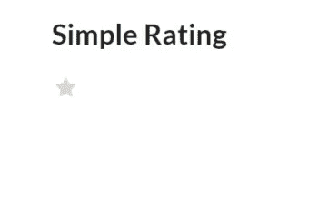
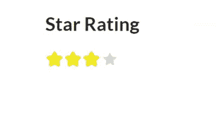
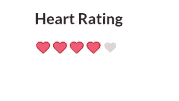
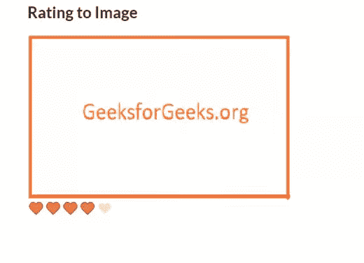

# 语义-界面|评分

> 原文:[https://www.geeksforgeeks.org/semantic-ui-rating/](https://www.geeksforgeeks.org/semantic-ui-rating/)

语义 UI 是一个开源框架，它使用 CSS 和 jQuery 来构建出色的用户界面。它和引导程序一样使用，有很大的不同元素来使你的网站看起来更令人惊讶。它使用一个类向元素添加 CSS。

评级显示了用户对给定内容的兴趣。

让我们看一些例子

**示例:**

简单评级

```
<!DOCTYPE html>
  <html>
      <head>
          <title>Semantic UI</title>
          <link href=
"https://cdnjs.cloudflare.com/ajax/libs/semantic-ui/2.4.1/semantic.min.css"
                 rel="stylesheet" />         
      </head>
      <body>
          <div style="margin-top: 100px" class="ui container"> 
            <h3>Simple Rating</h3>
            <div class="ui rating" data-max-rating="1"></div>
          </div>
           </div> 
          <script src=
"https://code.jquery.com/jquery-3.1.1.min.js"
                 integrity=
"sha256-hVVnYaiADRTO2PzUGmuLJr8BLUSjGIZsDYGmIJLv2b8=" 
                 crossorigin="anonymous">
           </script>
          <script src=
"https://cdnjs.cloudflare.com/ajax/libs/semantic-ui/2.4.1/semantic.min.js">
          </script> 
          <script>
            $('.rating').rating();
          </script>
      </body>
  </html>
```

data-max-rating 是您想要的最大评级。
**输出:**


**示例:**

星级评定

```
<!DOCTYPE html>
  <html>
      <head>
          <title>Semantic UI</title>
          <link href=
"https://cdnjs.cloudflare.com/ajax/libs/semantic-ui/2.4.1/semantic.min.css" 
                 rel="stylesheet" />         
      </head>
      <body>
          <div style="margin-top: 100px" 
               class="ui container"> 
            <h3>Star Rating</h3>

            <div class="ui star rating" data-rating="3">
             </div>
          </div>
           </div> 
          <script src="https://code.jquery.com/jquery-3.1.1.min.js" 
                  integrity=
"sha256-hVVnYaiADRTO2PzUGmuLJr8BLUSjGIZsDYGmIJLv2b8=" 
                  crossorigin="anonymous">
          </script>
          <script src=
"https://cdnjs.cloudflare.com/ajax/libs/semantic-ui/2.4.1/semantic.min.js">
          </script> 
          <script>
            $('.rating').rating();
          </script>
      </body>
  </html>
```

数据评级是您已经想要的评级。
**输出:**


**示例:**

心脏评级

```
<!DOCTYPE html>
  <html>
      <head>
          <title>Semantic UI</title>
          <link href=
"https://cdnjs.cloudflare.com/ajax/libs/semantic-ui/2.4.1/semantic.min.css"
               rel="stylesheet" />         
      </head>
      <body>
          <div style="margin-top: 100px"
               class="ui container"> 
            <h3>Heart Rating</h3>
            <div class="ui heart rating" 
                 data-rating="4" data-max-rating="5">
           </div>
          </div>
           </div> 
          <script src="https://code.jquery.com/jquery-3.1.1.min.js" 
                  integrity=
"sha256-hVVnYaiADRTO2PzUGmuLJr8BLUSjGIZsDYGmIJLv2b8=" 
                  crossorigin="anonymous"></script>
          <script src=
"https://cdnjs.cloudflare.com/ajax/libs/semantic-ui/2.4.1/semantic.min.js">
           </script> 
          <script>
            $('.rating').rating();
          </script>
      </body>
  </html>
```

**输出:**


**示例:**

```
<!DOCTYPE html>
  <html>
      <head>
          <title>Semantic UI</title>
          <link href=
"https://cdnjs.cloudflare.com/ajax/libs/semantic-ui/2.4.1/semantic.min.css" 
                rel="stylesheet" />         
      </head>
      <body>
          <div style="margin-top: 100px" class="ui container"> 
            <h3>Rating to Image</h3>
            

            <div class="ui heart rating" 
                 data-rating="4" data-max-rating="5">
            </div>
          </div>
           </div> 
          <script src="https://code.jquery.com/jquery-3.1.1.min.js"
                  integrity=
"sha256-hVVnYaiADRTO2PzUGmuLJr8BLUSjGIZsDYGmIJLv2b8="
                   crossorigin="anonymous"></script>
          <script src=
"https://cdnjs.cloudflare.com/ajax/libs/semantic-ui/2.4.1/semantic.min.js">
          </script> 
          <script>
            $('.rating').rating();
          </script>
      </body>
  </html>
```

**输出:**


**示例:**

不同尺寸等级

```
<!DOCTYPE html>
  <html>
      <head>
          <title>Semantic UI</title>
          <link href=
"https://cdnjs.cloudflare.com/ajax/libs/semantic-ui/2.4.1/semantic.min.css"
                rel="stylesheet" />         
      </head>
      <body>
          <div style="margin-top: 100px" class="ui container"> 
            <h3>Various size Rating</h3>
            <h4>Mini</h4>
            <div class="ui mini star rating"></div>
            <h4>Tiny</h4>
            <div class="ui tiny star rating"></div>
            <h4>Small</h4>
            <div class="ui small star rating"></div>
            <h4>Normal</h4>
            <div class="ui star rating"></div>
            <h4>Large</h4>
            <div class="ui large star rating"></div>
            <h4>Huge</h4>
            <div class="ui huge star rating"></div>
            <h4>Massive</h4>
            <div class="ui massive star rating"></div>
           </div> 
          <script src="https://code.jquery.com/jquery-3.1.1.min.js" 
                  integrity=
"sha256-hVVnYaiADRTO2PzUGmuLJr8BLUSjGIZsDYGmIJLv2b8="
                 crossorigin="anonymous"></script>
          <script src=
"https://cdnjs.cloudflare.com/ajax/libs/semantic-ui/2.4.1/semantic.min.js">
          </script> 
          <script>
            $('.rating').rating();
          </script>
      </body>
  </html>
```

**输出:**
