# 语义-用户界面|分段

> 原文:[https://www.geeksforgeeks.org/semantic-ui-segment/](https://www.geeksforgeeks.org/semantic-ui-segment/)

语义用户界面开源框架在网页上提供一个片段或部分，用于创建一组相关内容。它与 bootstrap 的用法非常相似，并且有不同的元素，使用 jQuery 和 CSS 作为接口可以让你的网站更加惊艳。对于元素的样式，它使用类。

**示例:**

```html
<!DOCTYPE html>
<html>

<head>
    <title>Semantic UI</title>
    <link href=
"https://cdnjs.cloudflare.com/ajax/libs/semantic-ui/2.4.1/semantic.min.css"
        rel="stylesheet" />
</head>

<body>
    <div style="margin-top: 100px" 
        class="ui container">

        <h2>Segment</h2>
        <br>
        <div class="ui segment">
            <center>
                <h3>Welcome to geeksforgeeks.</h3>
                <p>Learn anything you want</p>
                <p>
                    Get tutorial of anything 
                    related to computer science.
                </p>
                <p>Courses on programming</p>
                <p>Solve programming problems.</p>
                <p>Help other by writing articles.</p>
            </center>
        </div>
    </div>
    <script src=
"https://code.jquery.com/jquery-3.1.1.min.js"
        integrity=
"sha256-hVVnYaiADRTO2PzUGmuLJr8BLUSjGIZsDYGmIJLv2b8="
        crossorigin="anonymous">
    </script>

    <script src=
"https://cdnjs.cloudflare.com/ajax/libs/semantic-ui/2.4.1/semantic.min.js">
    </script>
</body>

</html>
```

**输出:**
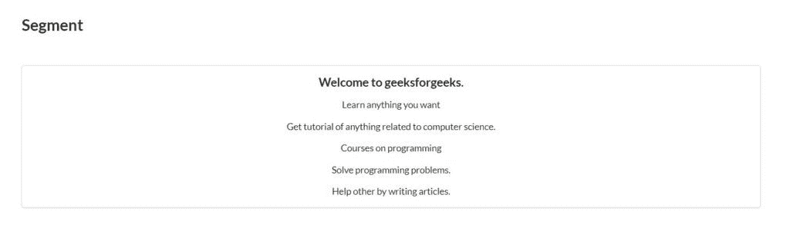

**示例:**该示例显示了占位符段。

```html
<!DOCTYPE html>
<html>

<head>
    <title>Semantic UI</title>
    <link href=
"https://cdnjs.cloudflare.com/ajax/libs/semantic-ui/2.4.1/semantic.min.css"
        rel="stylesheet" />
</head>

<body>
    <div style="margin-top: 100px" 
        class="ui container">

        <h2>Placeholder segment</h2>
        <br>
        <div class="ui placeholder segment">
            <div class="ui icon header">
                <i class="file image icon"></i>
                Upload Photo
            </div>
            <div class="ui primary button">
                Add Photo
            </div>
        </div>
    </div>
    <script src=
"https://code.jquery.com/jquery-3.1.1.min.js"
        integrity=
"sha256-hVVnYaiADRTO2PzUGmuLJr8BLUSjGIZsDYGmIJLv2b8="
        crossorigin="anonymous">
    </script>

    <script src=
"https://cdnjs.cloudflare.com/ajax/libs/semantic-ui/2.4.1/semantic.min.js">
    </script>
</body>

</html>
```

**输出:**
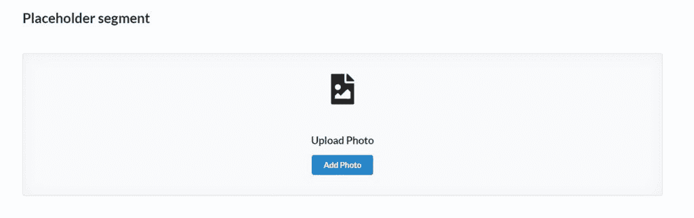

**示例:**此示例显示了凸起的线段，在页面上给出了俯视图。

```html
<!DOCTYPE html>
<html>

<head>
    <title>Semantic UI</title>
    <link href=
"https://cdnjs.cloudflare.com/ajax/libs/semantic-ui/2.4.1/semantic.min.css"
        rel="stylesheet" />
</head>

<body>
    <div style="margin-top: 100px" 
        class="ui container">

        <h2>Raised segment</h2>
        <br>
        <div class="ui raised segment">
            <h2>
                Hello, Welcome to 
                geeksforgeeks
            </h2>
        </div>
    </div>
    <script src=
"https://code.jquery.com/jquery-3.1.1.min.js"
        integrity=
"sha256-hVVnYaiADRTO2PzUGmuLJr8BLUSjGIZsDYGmIJLv2b8="
        crossorigin="anonymous">
    </script>

    <script src=
"https://cdnjs.cloudflare.com/ajax/libs/semantic-ui/2.4.1/semantic.min.js">
    </script>
</body>

</html>
```

**输出:**
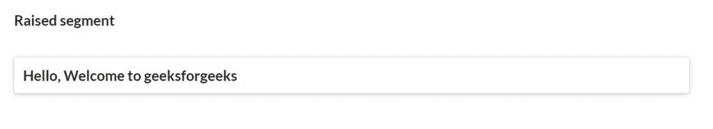

**示例:**以下示例显示了看起来像多页的堆叠段。

```html
<!DOCTYPE html>
<html>

<head>
    <title>Semantic UI</title>
    <link href=
"https://cdnjs.cloudflare.com/ajax/libs/semantic-ui/2.4.1/semantic.min.css"
        rel="stylesheet" />
</head>

<body>
    <div style="margin-top: 100px" 
        class="ui container">

        <h2>Stacked segment</h2>
        <br>
        <div class="ui tall stacked segment">

            <h2>
                Hello, Welcome to 
                geeksforgeeks
            </h2>
        </div>
    </div>
    <script src=
"https://code.jquery.com/jquery-3.1.1.min.js"
        integrity=
"sha256-hVVnYaiADRTO2PzUGmuLJr8BLUSjGIZsDYGmIJLv2b8="
        crossorigin="anonymous">
    </script>

    <script src=
"https://cdnjs.cloudflare.com/ajax/libs/semantic-ui/2.4.1/semantic.min.js">
    </script>
</body>

</html>
```

**输出:**
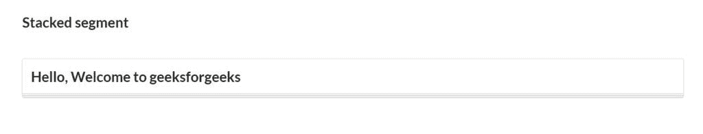

**示例:**以下示例显示了堆积的段状页面。

```html
<!DOCTYPE html>
<html>

<head>
    <title>Semantic UI</title>
    <link href=
"https://cdnjs.cloudflare.com/ajax/libs/semantic-ui/2.4.1/semantic.min.css"
        rel="stylesheet" />
</head>

<body>
    <div style="margin-top: 100px" 
        class="ui container">

        <h2>Piled segment</h2>
        <br>
        <div class="ui piled segment">
            <h2>
                Hello, Welcome to 
                geeksforgeeks
            </h2>
        </div>
    </div>
    <script src=
"https://code.jquery.com/jquery-3.1.1.min.js"
        integrity=
"sha256-hVVnYaiADRTO2PzUGmuLJr8BLUSjGIZsDYGmIJLv2b8="
        crossorigin="anonymous">
    </script>

    <script src=
"https://cdnjs.cloudflare.com/ajax/libs/semantic-ui/2.4.1/semantic.min.js">
    </script>
</body>

</html>
```

**输出:**
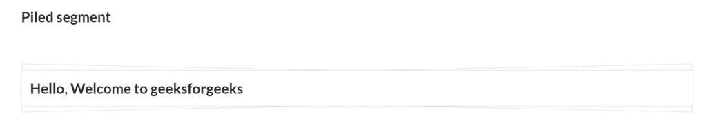

**示例:**以下示例显示了垂直线段。

```html
<!DOCTYPE html>
<html>

<head>
    <title>Semantic UI</title>
    <link href=
"https://cdnjs.cloudflare.com/ajax/libs/semantic-ui/2.4.1/semantic.min.css"
        rel="stylesheet" />
</head>

<body>
    <div style="margin-top: 100px" 
        class="ui container">

        <h2>Vertical segment</h2>
        <br>
        <div class="ui vertical segment">
            <p>Data Structure</p>
        </div>
        <div class="ui vertical segment">
            <p>Web Programming</p>
        </div>
        <div class="ui vertical segment">
            <p>Competative Programming</p>
        </div>
    </div>
    <script src=
"https://code.jquery.com/jquery-3.1.1.min.js"
        integrity=
"sha256-hVVnYaiADRTO2PzUGmuLJr8BLUSjGIZsDYGmIJLv2b8=" 
        crossorigin="anonymous">
    </script>

    <script src=
"https://cdnjs.cloudflare.com/ajax/libs/semantic-ui/2.4.1/semantic.min.js">
    </script>
</body>

</html>
```

**输出:**
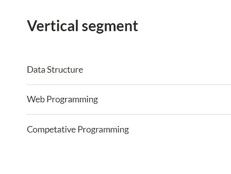

**示例:**以下示例显示了组段。

```html
<!DOCTYPE html>
<html>

<head>
    <title>Semantic UI</title>
    <link href=
"https://cdnjs.cloudflare.com/ajax/libs/semantic-ui/2.4.1/semantic.min.css"
        rel="stylesheet" />
</head>

<body>
    <div style="margin-top: 100px" 
        class="ui container">

        <h2>Group segment</h2>
        <br>
        <div class="ui segments">
            <div class="ui segment">
                <p>Data Structure</p>
            </div>
            <div class="ui green segment">
                <p>Web Programming</p>
            </div>
            <div class="ui blue segment">
                <p>Competative Programming</p>
            </div>
        </div>
    </div>
    <script src=
"https://code.jquery.com/jquery-3.1.1.min.js"
        integrity=
"sha256-hVVnYaiADRTO2PzUGmuLJr8BLUSjGIZsDYGmIJLv2b8="
        crossorigin="anonymous">
    </script>

    <script src=
"https://cdnjs.cloudflare.com/ajax/libs/semantic-ui/2.4.1/semantic.min.js">
    </script>
</body>

</html>
```

**输出:**
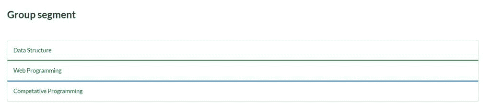

**示例:**以下示例显示嵌套段。

```html
<!DOCTYPE html>
<html>

<head>
    <title>Semantic UI</title>
    <link href=
"https://cdnjs.cloudflare.com/ajax/libs/semantic-ui/2.4.1/semantic.min.css"
        rel="stylesheet" />
</head>

<body>
    <div style="margin-top: 100px" 
        class="ui container">

        <h2>Nested segment</h2>
        <br>
        <div class="ui segment">
            <p>Web Programming</p>
            <div class="ui segments">
                <div class="ui segment">
                    <p>Django</p>
                </div>
                <div class="ui segment">
                    <p>NodeJS</p>
                </div>
            </div>
        </div>

        <div class="ui segment">
            <p>Data Structure</p>
            <div class="ui segments">
                <div class="ui segment">
                    <p>Array</p>
                </div>
                <div class="ui segment">
                    <p>Linklist</p>
                </div>
                <div class="ui segment">
                    <p>Tree</p>
                </div>
            </div>
        </div>
    </div>
    <script src=
"https://code.jquery.com/jquery-3.1.1.min.js"
        integrity=
"sha256-hVVnYaiADRTO2PzUGmuLJr8BLUSjGIZsDYGmIJLv2b8="
        crossorigin="anonymous">
    </script>

    <script src=
"https://cdnjs.cloudflare.com/ajax/libs/semantic-ui/2.4.1/semantic.min.js">
    </script>
</body>

</html>
```

**输出:**
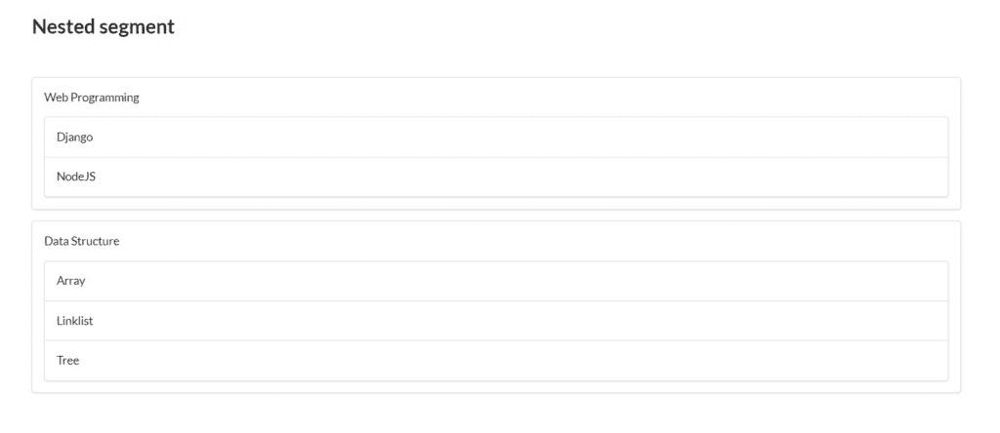

**示例:**以下示例显示了水平线段。

```html
<!DOCTYPE html>
<html>

<head>
    <title>Semantic UI</title>
    <link href=
"https://cdnjs.cloudflare.com/ajax/libs/semantic-ui/2.4.1/semantic.min.css"
        rel="stylesheet" />
</head>

<body>
    <div style="margin-top: 100px" 
        class="ui container">

        <h2>Horizontal segment</h2>
        <br>

        <div class="ui horizontal segments">
            <div class="ui segment">
                <p>Array</p>
            </div>
            <div class="ui segment">
                <p>Linklist</p>
            </div>
            <div class="ui segment">
                <p>Tree</p>
            </div>
        </div>

    </div>
    <script src=
"https://code.jquery.com/jquery-3.1.1.min.js"
        integrity=
"sha256-hVVnYaiADRTO2PzUGmuLJr8BLUSjGIZsDYGmIJLv2b8="
        crossorigin="anonymous">
    </script>

    <script src=
"https://cdnjs.cloudflare.com/ajax/libs/semantic-ui/2.4.1/semantic.min.js">
    </script>
</body>

</html>
```

**输出:**
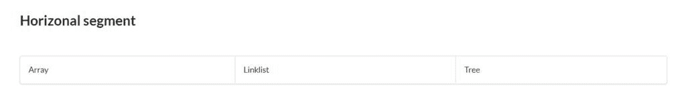

**示例:**以下示例显示了加载段。

```html
<!DOCTYPE html>
<html>

<head>
    <title>Semantic UI</title>
    <link href=
"https://cdnjs.cloudflare.com/ajax/libs/semantic-ui/2.4.1/semantic.min.css"
        rel="stylesheet" />
</head>

<body>
    <div style="margin-top: 100px" 
        class="ui container">

        <h2>Loading segment</h2>
        <br>
        <div class="ui loading segment">
            <p></p>
            <p></p>
        </div>
    </div>
    <script src=
"https://code.jquery.com/jquery-3.1.1.min.js"
        integrity=
"sha256-hVVnYaiADRTO2PzUGmuLJr8BLUSjGIZsDYGmIJLv2b8="
        crossorigin="anonymous">
    </script>

    <script src=
"https://cdnjs.cloudflare.com/ajax/libs/semantic-ui/2.4.1/semantic.min.js">
    </script>
</body>

</html>
```

**输出:**
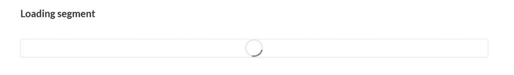

**示例:**下面的示例显示了倒置的线段。

```html
<!DOCTYPE html>
<html>

<head>
    <title>Semantic UI</title>
    <link href=
"https://cdnjs.cloudflare.com/ajax/libs/semantic-ui/2.4.1/semantic.min.css"
        rel="stylesheet" />
</head>

<body>
    <div style="margin-top: 100px" 
            class="ui container">
        <h2>Inverted segment</h2>
        <br>

        <div class="ui inverted segment">
            <h2>
                Hello, welcome to 
                geeksforgeeks.
            </h2>
        </div>
    </div>
    <script src=
"https://code.jquery.com/jquery-3.1.1.min.js"
        integrity=
"sha256-hVVnYaiADRTO2PzUGmuLJr8BLUSjGIZsDYGmIJLv2b8="
        crossorigin="anonymous">
    </script>

    <script src=
"https://cdnjs.cloudflare.com/ajax/libs/semantic-ui/2.4.1/semantic.min.js">
    </script>
</body>

</html>
```

**输出:**
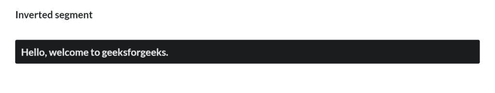

**示例:**以下示例显示了圆形线段。

```html
<!DOCTYPE html>
<html>

<head>
    <title>Semantic UI</title>
    <link href=
"https://cdnjs.cloudflare.com/ajax/libs/semantic-ui/2.4.1/semantic.min.css"
        rel="stylesheet" />
</head>

<body>
    <div style="margin-top: 100px" 
            class="ui container">
        <h2>Circular segment</h2>
        <br>

        <div class="ui circular segment">
            <h2>
                Hello, welcome to 
                geeksforgeeks.
            </h2>
        </div>
    </div>
    <script src=
"https://code.jquery.com/jquery-3.1.1.min.js"
        integrity=
"sha256-hVVnYaiADRTO2PzUGmuLJr8BLUSjGIZsDYGmIJLv2b8="
        crossorigin="anonymous">
    </script>

    <script src=
"https://cdnjs.cloudflare.com/ajax/libs/semantic-ui/2.4.1/semantic.min.js">
    </script>
</body>

</html>
```

**输出:**
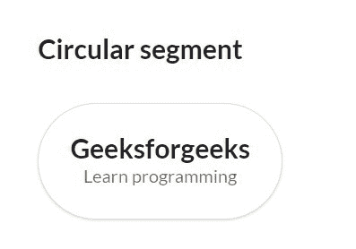