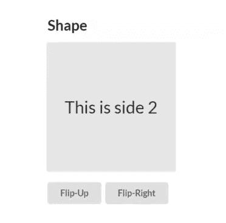
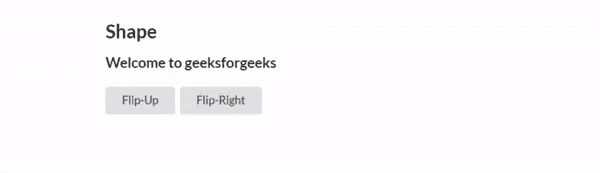

# 语义-UI |形状

> 原文:[https://www.geeksforgeeks.org/semantic-ui-shape/](https://www.geeksforgeeks.org/semantic-ui-shape/)

语义 UI 是一个开源框架，它使用 CSS 和 jQuery 来构建出色的用户界面。它有不同的元素，可以用来让网站看起来更惊艳。语义 UI 中的模块之一是**形状模块**。形状是显示在二维平面中的三维对象。它可以包含所有方面的内容。

**注意:**这个模块利用了目前只有现代浏览器支持的 3D 变换。

**语法:**

```html
$('.shape').shape();
$('.up').click(function() {
   $('.shape').shape('flip up');
})
$('.right').click(function() {
   $('.shape').shape('flip right');
})

```

**示例:**下面的示例显示了如何使用 jQuery 来“向后翻转”或“向左翻转”立方体并相应地旋转它。

## 超文本标记语言

```html
<html>
<head>
  <title>
    Semantic UI
  </title>

  <!-- Include the Semantic UI CSS -->
  <link href=
"https://cdnjs.cloudflare.com/ajax/libs/semantic-ui/2.4.1/semantic.min.css"
    rel="stylesheet" />
</head>

<body>
  <div style="margin-top: 100px" 
       class="ui container">
    <h2>Shape</h2>

    <!-- Define the shape -->
    <div class="ui cube shape">

      <!-- Define the contents of the sides -->
      <div class="sides">
        <div class="side">
          <div class="content">
            <div class="center">
              This is side 1
            </div>
          </div>
        </div>
        <div class="side">
          <div class="content">
            <div class="center">
              This is side 2
            </div>
          </div>
        </div>
        <div class="side active">
          <div class="content">
            <div class="center">
              This is side 3
            </div>
          </div>
        </div>
        <div class="side">
          <div class="content">
            <div class="center">
              This is side 4
            </div>
          </div>
        </div>
        <div class="side">
          <div class="content">
            <div class="center">
              This is side 5
            </div>
          </div>
        </div>
        <div class="side">
          <div class="content">
            <div class="center">
              This is side 6
            </div>
          </div>
        </div>
      </div>
    </div>
    <br>
    <br>

    <!-- Define buttons for flipping the shape -->
    <button class="ui button up">
      Flip-Up
    </button>
    <button class="ui button right">
      Flip-Right
    </button>
  </div>

  <!-- Include jQuery -->
  <script src="https://code.jquery.com/jquery-3.1.1.min.js">
  </script>

  <!-- Include Semantic UI -->
  <script src="https://cdnjs.cloudflare.com/ajax/libs/semantic-ui/2.4.1/semantic.min.js">
  </script>
  <script>

    // Initialize the shape
    $('.shape').shape();

    $('.up').click(function () {

      // Make the shape flip up
      $('.shape').shape('flip up');
    })

    $('.right').click(function () {

      // Make the shape flip to the right
      $('.shape').shape('flip right');
    })
  </script>
</body>
</html>
```

**输出:**



**示例:**下面的示例显示了一个文本形状，它允许在形状的侧面显示文本。

## 超文本标记语言

```html
<html>
<head>
  <title>
    Semantic UI
  </title>

  <!-- Include the Semantic UI CSS -->
  <link href="https://cdnjs.cloudflare.com/ajax/libs/semantic-ui/2.4.1/semantic.min.css" 
        rel="stylesheet" />
</head>
<body>
  <div style="margin-top: 100px"
       class="ui container">
    <h2>Shape</h2>

    <!-- Define the shape -->
    <div class="ui text shape">

      <!-- Define the contents of the sides -->
      <div class="sides">
        <div class="active ui header side">
          Welcome to geeksforgeeks
        </div>
        <div class="ui header side">
          A computer science portal.
        </div>
        <div class="ui header side">
          You can information about
          anything related to computers.
        </div>
        <div class="ui header side">
          You can even contribute
          to help others and earn money.
        </div>
      </div>
    </div>
    <br>
    <br>

    <!-- Define buttons for 
    flipping the shape -->
    <button class="ui button up">
      Flip-Up
    </button>
    <button class="ui button right">
      Flip-Right
    </button>

  </div>
  <!-- Include jQuery -->
  <script src="https://code.jquery.com/jquery-3.1.1.min.js">
  </script>

  <!-- Include Semantic UI -->
  <script src="https://cdnjs.cloudflare.com/ajax/libs/semantic-ui/2.4.1/semantic.min.js">
  </script>
  <script>

    // Initialize the shape
    $('.shape').shape();
    $('.up').click(function () {

      // Make the shape flip up
      $('.shape').shape('flip up');
    })
    $('.right').click(function () {

      // Make the shape flip to the right
      $('.shape').shape('flip right');
    })
  </script>
</body>
</html>
```

**输出:**

