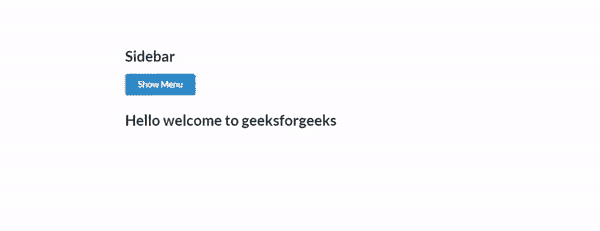
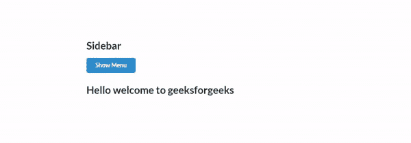
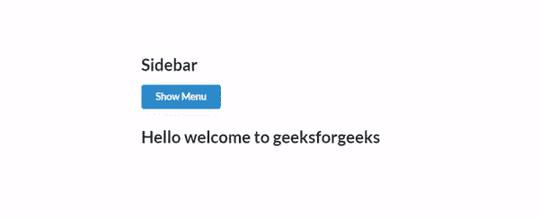

# 语义-UI |侧栏

> 原文:[https://www.geeksforgeeks.org/semantic-ui-sidebar/](https://www.geeksforgeeks.org/semantic-ui-sidebar/)

**Semantic-UI** 开源框架，提供侧边栏功能，使用 CSS、jQuery 创建惊人的用户界面，与 bootstrap 非常相似。它有所有不同的元素来创建令人惊叹的网站。它使用一个类向 HTML 元素添加样式。侧边栏隐藏页面旁边的额外内容。页面内容通常显示在网页的一侧。

**示例:**以下示例演示了网页中的语义-UI 侧边栏功能。

```
<!DOCTYPE html>
<html>

<head>
    <title>Semantic UI</title>
    <link href=
"https://cdnjs.cloudflare.com/ajax/libs/semantic-ui/2.4.1/semantic.min.css"
        rel="stylesheet" />
</head>

<body>
    <div style="margin-top: 100px" 
            class="ui container">
        <h2>Sidebar</h2>

        <button class="ui button primary">
            Show Menu
        </button>

        <div class="ui sidebar inverted 
                        vertical menu">
            <h2 style="color:white">Menu</h2>
            <a class="item">
                Data Structure
            </a>
            <a class="item">
                Web Designing
            </a>
            <a class="item">
                Basic programming
            </a>
        </div>
        <div class="pusher">
            <!-- Site content !-->
        </div>

        <h2>
            Hello welcome to
            geeksforgeeks
        </h2>
    </div>

    <script src="https://code.jquery.com/jquery-3.1.1.min.js"
        integrity=
"sha256-hVVnYaiADRTO2PzUGmuLJr8BLUSjGIZsDYGmIJLv2b8=" 
        crossorigin="anonymous">
    </script>

    <script src=
"https://cdnjs.cloudflare.com/ajax/libs/semantic-ui/2.4.1/semantic.min.js">
    </script>

    <script>
        $('button').click(function () {
            $('.ui.sidebar').sidebar('toggle');
        })
    </script>
</body>

</html>
```

**输出:**


**示例:**下面的示例演示了顶部的语义-UI 侧边栏。

```
<!DOCTYPE html>
<html>

<head>
    <title>Semantic UI</title>
    <link href=
"https://cdnjs.cloudflare.com/ajax/libs/semantic-ui/2.4.1/semantic.min.css"
        rel="stylesheet" />
</head>

<body>
    <div style="margin-top: 100px" 
            class="ui container">

        <h2>Sidebar</h2>

        <button class="ui button primary">
            Show Menu
        </button>

        <div class="ui top sidebar 
                    inverted vertical menu">
            <h2 style="color:white">Menu</h2>
            <a class="item">
                Data Structure
            </a>
            <a class="item">
                Web Designing
            </a>
            <a class="item">
                Basic programming
            </a>
        </div>
        <div class="pusher">
            <!-- Site content !-->
        </div>
        <h2>Hello welcome to geeksforgeeks</h2>
    </div>
    <script src="https://code.jquery.com/jquery-3.1.1.min.js"
        integrity=
"sha256-hVVnYaiADRTO2PzUGmuLJr8BLUSjGIZsDYGmIJLv2b8=" 
        crossorigin="anonymous">
    </script>

    <script src=
"https://cdnjs.cloudflare.com/ajax/libs/semantic-ui/2.4.1/semantic.min.js">
    </script>

    <script>
        $('button').click(function () {
            $('.ui.sidebar').sidebar('toggle');
        })
    </script>
</body>

</html>
```

**输出:**


**示例:**以下示例演示了带有图标的语义-UI 菜单。

```
<!DOCTYPE html>
<html>

<head>
    <title>Semantic UI</title>
    <link href=
"https://cdnjs.cloudflare.com/ajax/libs/semantic-ui/2.4.1/semantic.min.css"
        rel="stylesheet" />
</head>

<body>
    <div style="margin-top: 100px" 
        class="ui container">

        <h2>Sidebar</h2>

        <button class="ui button primary">
            Show Menu
        </button>

        <div class="ui left demo vertical 
                inverted sidebar labeled 
                icon menu">

            <a class="item">
                <i class="globe icon"></i>
                Internet
            </a>
            <a class="item">
                <i class="code icon"></i>
                Coding
            </a>
            <a class="item">
                <i class="phone icon"></i>
                Help
            </a>
        </div>
        <h2>Hello welcome to geeksforgeeks</h2>
    </div>
    <script src="https://code.jquery.com/jquery-3.1.1.min.js"
        integrity=
"sha256-hVVnYaiADRTO2PzUGmuLJr8BLUSjGIZsDYGmIJLv2b8=" 
        crossorigin="anonymous">
    </script>

    <script src=
"https://cdnjs.cloudflare.com/ajax/libs/semantic-ui/2.4.1/semantic.min.js">
    </script>

    <script>
        $('button').click(function () {
            $('.ui.sidebar').sidebar('toggle');
        })
    </script>
</body>

</html>
```

**输出:**
