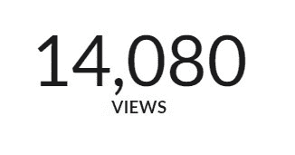
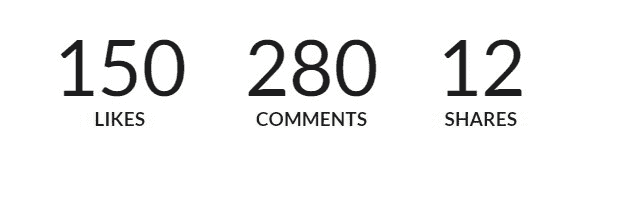
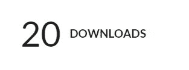
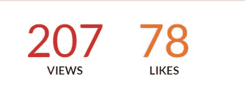

# 语义-UI |统计

> 原文:[https://www.geeksforgeeks.org/semantic-ui-statistics/](https://www.geeksforgeeks.org/semantic-ui-statistics/)

语义 UI 是一个开源框架，它使用 CSS 和 jQuery 来构建出色的用户界面。它和引导程序一样，有很大的不同元素，可以让你的网站看起来更加惊艳。它使用一个类向元素添加 CSS。统计数据显示属性的当前值。

**例 1:**

```html
<!DOCTYPE html>
<html>

<head>
    <title>Semantic UI</title>
    <link href=
"https://cdnjs.cloudflare.com/ajax/libs/semantic-ui/2.4.1/semantic.min.css"
        rel="stylesheet" />
</head>

<body>
    <div style="margin-top: 20px" 
            class="ui container">
        <div class="ui statistic">
            <div class="value">
                14, 080
            </div>
            <div class="label">
                Views
            </div>
        </div>
    </div>
    <script src=
"https://cdnjs.cloudflare.com/ajax/libs/semantic-ui/2.4.1/semantic.min.js">
    </script>
</body>

</html>
```

**输出:**


**示例 2:** 统计组

```html
<!DOCTYPE html>
<html>

<head>
    <title>Semantic UI</title>
    <link href=
"https://cdnjs.cloudflare.com/ajax/libs/semantic-ui/2.4.1/semantic.min.css"
        rel="stylesheet" />

    <script src=
"https://cdnjs.cloudflare.com/ajax/libs/semantic-ui/2.4.1/semantic.min.js">
    </script>
</head>

<body>
    <div style="margin-top: 20px" class="ui container">
        <div class="ui statistic">
            <div class="ui statistics">
                <div class="statistic">
                    <div class="value">
                        150
                    </div>
                    <div class="label">
                        Likes
                    </div>
                </div>
                <div class="statistic">
                    <div class="value">
                        280
                    </div>
                    <div class="label">
                        Comments
                    </div>
                </div>
                <div class="statistic">
                    <div class="value">
                        12
                    </div>
                    <div class="label">
                        Shares
                    </div>
                </div>
            </div>
        </div>
    </div>
</body>

</html>
```

**输出:**


**示例 3:** 带图像和图标的统计

```html
<!DOCTYPE html>
<html>

<head>
    <title>Semantic UI</title>
    <link href=
"https://cdnjs.cloudflare.com/ajax/libs/semantic-ui/2.4.1/semantic.min.css"
        rel="stylesheet" />

    <script src=
"https://cdnjs.cloudflare.com/ajax/libs/semantic-ui/2.4.1/semantic.min.js">
    </script>
</head>

<body>
    <div style="margin-top: 20px" class="ui container">
        <div class="ui statistics">
            <div class="statistic">
                <div class="value">
                    <i class="world icon"></i> 580
                </div>
                <div class="label">
                    Notifications
                </div>
            </div>
            <div class="statistic">
                <div class="value">
                    
                    200k
                </div>
                <div class="label">
                    Followers
                </div>
            </div>
        </div>
    </div>
</body>

</html>
```

**输出:**


**例 4:** 水平

```html
<!DOCTYPE html>
<html>

<head>
    <title>Semantic UI</title>
    <link href=
"https://cdnjs.cloudflare.com/ajax/libs/semantic-ui/2.4.1/semantic.min.css"
        rel="stylesheet" />
</head>

<body>
    <div style="margin-top: 20px" class="ui container">
        <div class="ui horizontal statistic">
            <div class="value">
                20
            </div>
            <div class="label">
                Downloads
            </div>
        </div>
    </div>
    <script src=
"https://cdnjs.cloudflare.com/ajax/libs/semantic-ui/2.4.1/semantic.min.js">
    </script>
</body>

</html>
```

**输出:**


**示例 5:** 彩色统计

```html
<!DOCTYPE html>
<html>

<head>
    <title>Semantic UI</title>
    <link href=
"https://cdnjs.cloudflare.com/ajax/libs/semantic-ui/2.4.1/semantic.min.css"
        rel="stylesheet" />
</head>

<body>
    <div style="margin-top: 20px" class="ui container">
        <div class="ui statistics">
            <div class="red statistic">
                <div class="value">
                    207
                </div>
                <div class="label">
                    Views
                </div>
            </div>
            <div class="orange statistic">
                <div class="value">
                    78
                </div>
                <div class="label">
                    Likes
                </div>
            </div>
        </div>
    </div>
    <script src=
"https://cdnjs.cloudflare.com/ajax/libs/semantic-ui/2.4.1/semantic.min.js">
    </script>
</body>

</html>
```

**输出:**
