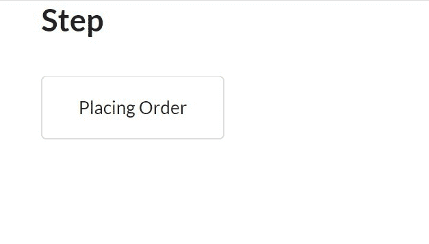
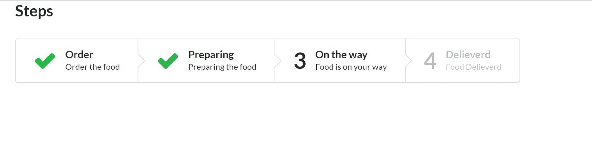
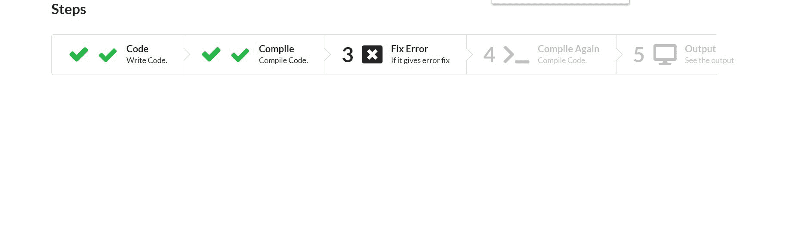
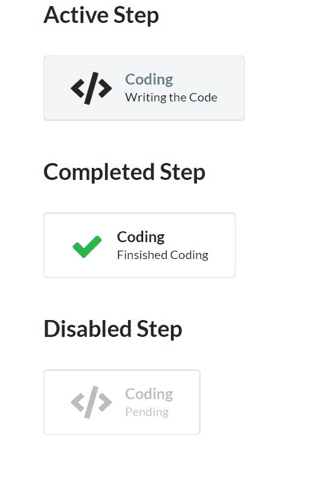

# 语义-界面|步骤

> 原文:[https://www.geeksforgeeks.org/semantic-ui-step/](https://www.geeksforgeeks.org/semantic-ui-step/)

语义 UI 是一个开源框架，它使用 CSS 和 jQuery 来构建出色的用户界面。它和引导程序一样，有很大的不同元素，可以让你的网站看起来更加惊艳。它使用一个类向元素添加 CSS。

一个步骤显示一系列活动的完成。

**示例 1:** 该示例创建了一个简单的完成步骤。

```
<!DOCTYPE html>
<html>

<head>
    <title>Semantic UI</title>
    <link href=
"https://cdnjs.cloudflare.com/ajax/libs/semantic-ui/2.4.1/semantic.min.css"
        rel="stylesheet" />
    <script src=
"https://cdnjs.cloudflare.com/ajax/libs/semantic-ui/2.4.1/semantic.min.js">
    </script>
</head>

<body>
    <div class="ui container">
        <h2>Step</h2>
        <div class="ui steps">
            <div class="step">
                Placing Order
            </div>
        </div>
    </div>
</body>

</html>
```

**输出:**


**示例 2:** 本示例创建一组步骤。

```
<!DOCTYPE html>
<html>

<head>
    <title>Semantic UI</title>
    <link href=
"https://cdnjs.cloudflare.com/ajax/libs/semantic-ui/2.4.1/semantic.min.css"
        rel="stylesheet" />

    <script src=
"https://cdnjs.cloudflare.com/ajax/libs/semantic-ui/2.4.1/semantic.min.js">
    </script>
</head>

<body>
    <div class="ui container">
        <h2>Steps</h2>
        <div class="ui ordered steps">
            <div class="completed step">
                <div class="content">
                    <div class="title">Order</div>
                    <div class="description">
                        Order the food
                    </div>
                </div>
            </div>
            <div class="completed step">
                <div class="content">
                    <div class="title">Preparing</div>
                    <div class="description">
                        Preparing the food
                    </div>
                </div>
            </div>
            <div class="step">
                <div class="content">
                    <div class="title">On the way</div>
                    <div class="description">
                        Food is on your way
                    </div>
                </div>
            </div>
            <div class="disabled step">
                <div class="content">
                    <div class="title">Delieverd</div>
                    <div class="description">
                        Food Delieverd
                    </div>
                </div>
            </div>
        </div>
    </div>
</body>

</html>
```

*   将“已完成”类添加到重新完成的步骤中。
*   将“活动”类添加到正在进行的步骤中。
*   将“禁用”类添加到活动步骤之后的步骤中。

**输出:**


要以垂直顺序显示这些步骤，请将“有序”类替换为“垂直”类。

**示例 3:** 本示例使用图标创建步骤。

```
<!DOCTYPE html>
<html>

<head>
    <title>Semantic UI</title>
    <link href=
"https://cdnjs.cloudflare.com/ajax/libs/semantic-ui/2.4.1/semantic.min.css"
        rel="stylesheet" />

    <script src=
"https://cdnjs.cloudflare.com/ajax/libs/semantic-ui/2.4.1/semantic.min.js">
    </script>
</head>

<body>
    <div class="ui container">
        <h2>Steps</h2>
        <div class="ui ordered steps">
            <div class="completed step">
                <i class="code icon"></i>
                <div class="content">
                    <div class="title">Code</div>
                    <div class="description">
                        Write Code.
                    </div>
                </div>
            </div>
            <div class="completed step">
                <i class="terminal icon"></i>
                <div class="content">
                    <div class="title">Compile</div>
                    <div class="description">
                        Compile Code.
                    </div>
                </div>
            </div>
            <div class="step">
                <i class="window close icon"></i>

                <div class="content">
                    <div class="title">Fix Error</div>
                    <div class="description">
                        If it gives error fix
                    </div>
                </div>
            </div>
            <div class="disabled step">
                <i class="terminal icon"></i>
                <div class="content">
                    <div class="title">Compile Again</div>
                    <div class="description">
                        Compile Code.
                    </div>
                </div>
            </div>
            <div class="disabled step">
                <i class="computer icon"></i>
                <div class="content">
                    <div class="title">Output</div>
                    <div class="description">
                        See the output
                    </div>
                </div>
            </div>
        </div>
    </div>
</body>

</html>
```

**输出:**


**注意:**可以添加 [<一个>标签](https://www.geeksforgeeks.org/html-a-tag/)使其链接

**示例 4:** 本示例分步创建已完成、活动、禁用状态。

```
<!DOCTYPE html>
<html>

<head>
    <title>Semantic UI</title>
    <link href=
"https://cdnjs.cloudflare.com/ajax/libs/semantic-ui/2.4.1/semantic.min.css"
        rel="stylesheet" />

    <script src=
"https://cdnjs.cloudflare.com/ajax/libs/semantic-ui/2.4.1/semantic.min.js">
    </script>
</head>

<body>
    <div class="ui container">
        <h2>Active Step</h2>
        <div class="ui steps">
            <div class="active step">
                <i class="code icon"></i>
                <div class="content">
                    <div class="title">Coding</div>
                    <div class="description">
                        Writing the Code
                    </div>
                </div>
            </div>
        </div>
        <h2>Completed Step</h2>
        <div class="ui steps">
            <div class="completed step">
                <i class="code icon"></i>
                <div class="content">
                    <div class="title">Coding</div>
                    <div class="description">
                        Finsished Coding
                    </div>
                </div>
            </div>
        </div>
        <h2>Disabled Step</h2>
        <div class="ui steps">
            <div class="disabled step">
                <i class="code icon"></i>
                <div class="content">
                    <div class="title">Coding</div>
                    <div class="description">
                        Pending
                    </div>
                </div>
            </div>
        </div>
    </div>
</body>

</html>
```

**输出:**


**注:**

*   您可以添加可堆叠的类来使组步骤可堆叠。
*   您可以为步骤添加“用户界面微小步骤”类，以显示它们微小的另一种尺寸，只需将微小替换为小的、大的、大的。