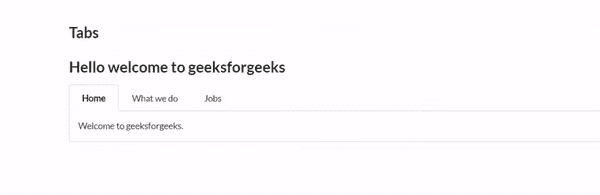
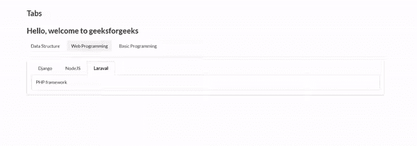

# 语义-用户界面|标签

> 原文:[https://www.geeksforgeeks.org/semantic-ui-tab/](https://www.geeksforgeeks.org/semantic-ui-tab/)

**语义 UI** 是一个开源框架，提供用户友好的选项卡，为网站创建出色的用户界面。它非常类似于用于创建令人惊叹的网站的引导程序。它使用一个类向 HTML 页面结构的不同元素添加样式。选项卡是内容的隐藏部分，可以通过单击它来查看。根据需要，您可以有任意数量的选项卡。

**示例:**下面的示例演示了语义 UI 选项卡的使用。

```
$('.menu .item').tab();

```

```
<!DOCTYPE html>
<html>

<head>
    <title>Semantic UI</title>
    <link href=
"https://cdnjs.cloudflare.com/ajax/libs/semantic-ui/2.4.1/semantic.min.css"
        rel="stylesheet" />
</head>

<body>
    <div style="margin-top: 100px" class="ui container">
        <h2>Tabs</h2>
        <h2>Hello welcome to geeksforgeeks</h2>
        <div class="ui top attached tabular menu">
            <a class="active item" data-tab="first">Home</a>
            <a class="item" data-tab="second">What we do</a>
            <a class="item" data-tab="third">Jobs</a>
        </div>

        <div class="ui bottom attached 
            active tab segment" data-tab="first">
            Welcome to geeksforgeeks.
        </div>

        <div class="ui bottom attached 
            tab segment" data-tab="second">
            Provide tutorials for learning.
        </div>

        <div class="ui bottom attached 
            tab segment" data-tab="third">
            Email your resume at careers@geeksforgeeks.org
        </div>
    </div>

    <script src="https://code.jquery.com/jquery-3.1.1.min.js"
        integrity=
"sha256-hVVnYaiADRTO2PzUGmuLJr8BLUSjGIZsDYGmIJLv2b8="
        crossorigin="anonymous">
    </script>

    <script src=
"https://cdnjs.cloudflare.com/ajax/libs/semantic-ui/2.4.1/semantic.min.js">
    </script>

    <script>
        $('.menu .item').tab();                   
    </script>
</body>

</html>
```

**输出:**


**示例:**以下示例演示了多个选项卡组。

```
<!DOCTYPE html>
<html>

<head>
    <title>Semantic UI</title>
    <link href=
"https://cdnjs.cloudflare.com/ajax/libs/semantic-ui/2.4.1/semantic.min.css"
        rel="stylesheet" />
</head>

<body>
    <div style="margin-top: 100px" 
            class="ui container">

        <h2>Tabs</h2>
        <h2>Hello, welcome to geeksforgeeks</h2>

        <div id="context1">
            <div class="ui secondary menu">
                <a class="item" data-tab="first">
                    Data Structure
                </a>
                <a class="item active" data-tab=
                    "second">Web Programming
                </a>

                <a class="item" data-tab="third">
                    Basic Programming
                </a>
            </div>

            <div class="ui tab segment" data-tab="first">
                <div class="ui top attached tabular menu">
                    <a class="active item" data-tab=
                            "first/a">Array</a>
                    <a class="item" data-tab=
                            "first/b">Link-List</a>
                    <a class="item" data-tab=
                            "first/c">Tree</a>
                </div>

                <div class="ui bottom attached active tab 
                        segment" data-tab="first/a">
                    Collection of data under similar 
                    data type with contigious memory.
                </div>

                <div class="ui bottom attached tab 
                        segment" data-tab="first/b">
                    Collection of data with 
                    dynamic memory allocation
                </div>
                <div class="ui bottom attached 
                    tab segment" data-tab="first/c">
                    Tree like structure to store data
                </div>
            </div>
            <div class="ui tab segment active" 
                    data-tab="second">
                <div class="ui top attached 
                        tabular menu">
                    <a class="item" data-tab=
                            "second/a">Django</a>
                    <a class="item" data-tab=
                            "second/b">NodeJS</a>
                    <a class="item active" 
                        data-tab="second/c">Laraval</a>
                </div>
                <div class="ui bottom attached 
                    tab segment" data-tab="second/a">
                    Python Framework
                </div>
                <div class="ui bottom attached tab 
                    segment" data-tab="second/b">
                    JavaScript Framework
                </div>
                <div class="ui bottom attached tab 
                    segment active" data-tab="second/c">
                    PHP framework
                </div>
            </div>
            <div class="ui tab segment" data-tab="third">
                <div class="ui top attached tabular menu">
                    <a class="item" data-tab="third/a">C</a>
                    <a class="item" data-tab="third/b">C++</a>
                    <a class="item" data-tab="third/c">Java</a>
                </div>
                <div class="ui bottom attached tab
                        segment" data-tab="third/a">
                    The most basic programming language.
                </div>
                <div class="ui bottom attached tab 
                        segment" data-tab="third/b">
                    C language with object oriented feature
                </div>
                <div class="ui bottom attached tab 
                        segment" data-tab="third/c">
                    Java is most popular enterprise 
                    programming language.
                </div>
            </div>
        </div>
    </div>
    <script src="https://code.jquery.com/jquery-3.1.1.min.js"
        integrity=
"sha256-hVVnYaiADRTO2PzUGmuLJr8BLUSjGIZsDYGmIJLv2b8="
        crossorigin="anonymous">
    </script>

    <script src=
"https://cdnjs.cloudflare.com/ajax/libs/semantic-ui/2.4.1/semantic.min.js">
    </script>

    <script>
        $('.menu .item').tab();                   
    </script>
</body>

</html>
```

**输出:**
