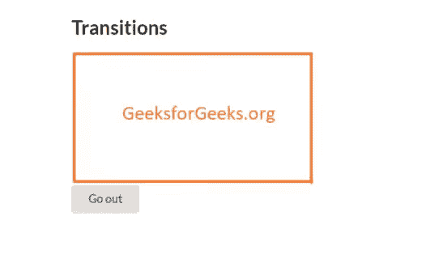
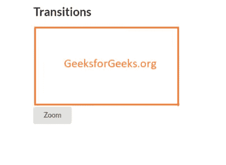
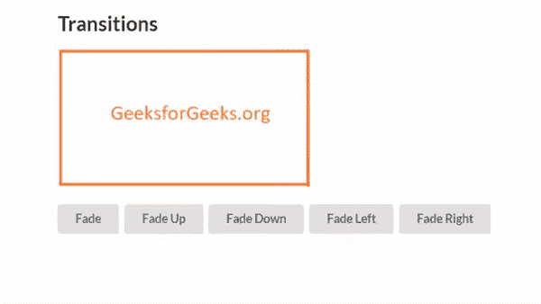
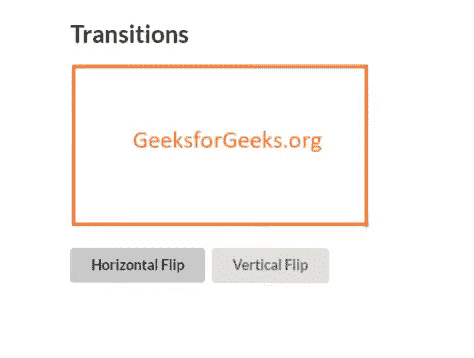
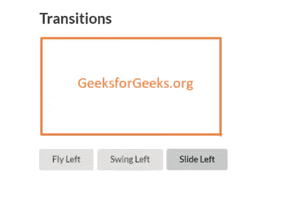
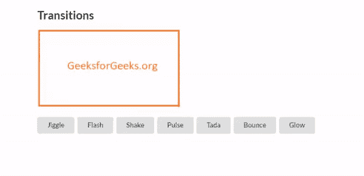

# 语义-界面|过渡

> 原文:[https://www.geeksforgeeks.org/semantic-ui-transition/](https://www.geeksforgeeks.org/semantic-ui-transition/)

语义用户界面是一个开源框架，它提供过渡动画，通常用于将页面内容移入或移出视口。它使用 jQuery 和 CSS 来创建非常类似于 bootstrap 的用户界面。它有许多创建交互式网页的元素。类用于设计 HTML 页面结构中不同元素的样式。

**示例:**以下示例显示了如何在视图中缩放元素。

## 超文本标记语言

```html
<!DOCTYPE html>
<html>

<head>
    <title>Semantic UI</title>
    <link href=
"https://cdnjs.cloudflare.com/ajax/libs/semantic-ui/2.4.1/semantic.min.css"
        rel="stylesheet" />
</head>

<body>
    <div style="margin-top: 100px"
        class="ui container">

        <h2>Transitions</h2>
        
        <button class="ui button">
            Go out
        </button>
    </div>

    <script src=
"https://code.jquery.com/jquery-3.1.1.min.js"
        integrity=
"sha256-hVVnYaiADRTO2PzUGmuLJr8BLUSjGIZsDYGmIJLv2b8="
        crossorigin="anonymous">
    </script>

    <script src=
"https://cdnjs.cloudflare.com/ajax/libs/semantic-ui/2.4.1/semantic.min.js">
    </script>

    <script>
        $('button').click(function () {
            $('.image').transition('scale');
        })
    </script>
</body>

</html>
```

**输出:**



**示例:**以下示例演示了放大和缩小过渡。

## 超文本标记语言

```html
<!DOCTYPE html>
<html>

<head>
    <title>Semantic UI</title>
    <link href=
"https://cdnjs.cloudflare.com/ajax/libs/semantic-ui/2.4.1/semantic.min.css"
        rel="stylesheet" />
</head>

<body>
    <div style="margin-top: 100px"
        class="ui container">

        <h2>Transitions</h2>
        
        <button class="ui button">
            Zoom
        </button>
    </div>

    <script src="https://code.jquery.com/jquery-3.1.1.min.js"
        integrity=
"sha256-hVVnYaiADRTO2PzUGmuLJr8BLUSjGIZsDYGmIJLv2b8="
        crossorigin="anonymous">
    </script>

    <script src=
"https://cdnjs.cloudflare.com/ajax/libs/semantic-ui/2.4.1/semantic.min.js">
    </script>

    <script>
        $('button').click(function () {
            $('.image').transition('zoom');
        })         
    </script>
</body>

</html>
```

**输出:**



**示例:**以下示例演示了渐变过渡。

## 超文本标记语言

```html
<!DOCTYPE html>
<html>

<head>
    <title>Semantic UI</title>
    <link href=
"https://cdnjs.cloudflare.com/ajax/libs/semantic-ui/2.4.1/semantic.min.css"
        rel="stylesheet" />
</head>

<body>
    <div style="margin-top: 100px" class="ui container">
        <h2>Transitions</h2>
        
        <br>
        <button class="ui button one">Fade</button>
        <button class="ui button up">Fade Up</button>
        <button class="ui button down">Fade Down</button>
        <button class="ui button left">Fade Left</button>
        <button class="ui button right">Fade Right</button>
    </div>
    <script src="https://code.jquery.com/jquery-3.1.1.min.js"
        integrity=
"sha256-hVVnYaiADRTO2PzUGmuLJr8BLUSjGIZsDYGmIJLv2b8="
        crossorigin="anonymous">
    </script>

    <script src=
"https://cdnjs.cloudflare.com/ajax/libs/semantic-ui/2.4.1/semantic.min.js">
    </script>

    <script>
        $('.one').click(function () {
            $('.image').transition('fade');
        })
        $('.up').click(function () {
            $('.image').transition('fade up');
        })
        $('.down').click(function () {
            $('.image').transition('fade down');
        })
        $('.left').click(function () {
            $('.image').transition('fade left');
        })
        $('.right').click(function () {
            $('.image').transition('fade right');
        })        
    </script>
</body>

</html>
```

**输出:**



**示例:**以下示例演示翻转过渡。

## 超文本标记语言

```html
<!DOCTYPE html>
<html>

<head>
    <title>Semantic UI</title>
    <link href=
"https://cdnjs.cloudflare.com/ajax/libs/semantic-ui/2.4.1/semantic.min.css"
        rel="stylesheet" />
</head>

<body>
    <div style="margin-top: 100px"
        class="ui container">

        <h2>Transitions</h2>
        
        <br>
        <button class="ui button hor">
            Horizontal Flip
        </button>

        <button class="ui button ver">
            Vertical Flip
        </button>
    </div>

    <script src="https://code.jquery.com/jquery-3.1.1.min.js"
        integrity=
"sha256-hVVnYaiADRTO2PzUGmuLJr8BLUSjGIZsDYGmIJLv2b8="
        crossorigin="anonymous">
    </script>

    <script src=
"https://cdnjs.cloudflare.com/ajax/libs/semantic-ui/2.4.1/semantic.min.js">
    </script>

    <script>
        $('.hor').click(function () {
            $('.image').transition('horizontal flip');
        })
        $('.ver').click(function () {
            $('.image').transition('vertical flip');
        })
    </script>
</body>

</html>
```

**输出:**



**示例:**以下示例演示了飞行、摆动和滑动过渡。

## 超文本标记语言

```html
<!DOCTYPE html>
<html>

<head>
    <title>Semantic UI</title>
    <link href=
"https://cdnjs.cloudflare.com/ajax/libs/semantic-ui/2.4.1/semantic.min.css"
        rel="stylesheet" />
</head>

<body>
    <div style="margin-top: 100px" class="ui container">
        <h2>Transitions</h2>
        
        <br>
        <button class="ui button fly">Fly Left</button>
        <button class="ui button swing">Swing Left</button>
        <button class="ui button slide">Slide Left</button>
    </div>
    <script src="https://code.jquery.com/jquery-3.1.1.min.js"
        integrity=
"sha256-hVVnYaiADRTO2PzUGmuLJr8BLUSjGIZsDYGmIJLv2b8="
        crossorigin="anonymous">
    </script>

    <script src=
"https://cdnjs.cloudflare.com/ajax/libs/semantic-ui/2.4.1/semantic.min.js">
    </script>

    <script>
        $('.fly').click(function () {
            $('.image').transition('fly left');
        })
        $('.swing').click(function () {
            $('.image').transition('swing left');
        })
        $('.slide').click(function () {
            $('.image').transition('slide left');
        })
    </script>
</body>

</html>
```

**输出:**



你可以用右、下、上。

**示例:**以下示例演示静态动画。

## 超文本标记语言

```html
<!DOCTYPE html>
<html>

<head>
    <title>Semantic UI</title>
    <link href=
"https://cdnjs.cloudflare.com/ajax/libs/semantic-ui/2.4.1/semantic.min.css"
        rel="stylesheet" />
</head>

<body>
    <div style="margin-top: 100px"
        class="ui container">

        <h2>Transitions</h2>
        
        <br>
        <button class="ui button jiggle">Jiggle</button>
        <button class="ui button flash">Flash</button>
        <button class="ui button shake">Shake</button>
        <button class="ui button pulse">Pulse</button>
        <button class="ui button tada">Tada</button>
        <button class="ui button bounce">Bounce</button>
        <button class="ui button glow">Glow</button>
    </div>
    <script src="https://code.jquery.com/jquery-3.1.1.min.js"
        integrity=
"sha256-hVVnYaiADRTO2PzUGmuLJr8BLUSjGIZsDYGmIJLv2b8="
        crossorigin="anonymous">
    </script>

    <script src=
"https://cdnjs.cloudflare.com/ajax/libs/semantic-ui/2.4.1/semantic.min.js">
    </script>

    <script>
        $('.jiggle').click(function () {
            $('.image').transition('jiggle');
        })
        $('.flash').click(function () {
            $('.image').transition('flash');
        })
        $('.shake').click(function () {
            $('.image').transition('shake');
        })
        $('.pulse').click(function () {
            $('.image').transition('pulse');
        })
        $('.tada').click(function () {
            $('.image').transition('tada');
        })
        $('.bounce').click(function () {
            $('.image').transition('bounce');
        })
        $('.glow').click(function () {
            $('.image').transition('glow');
        })
    </script>
</body>

</html>
```

**输出:se**

