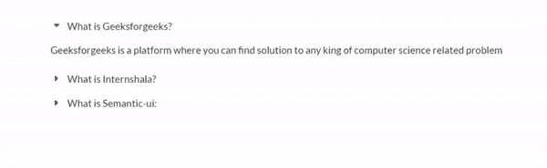
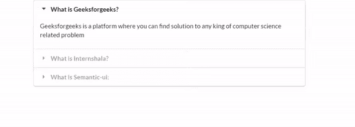
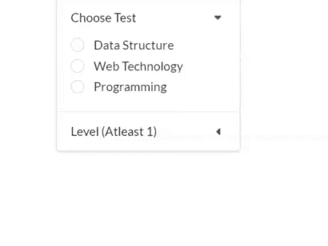

# 语义-UI |手风琴

> 原文:[https://www.geeksforgeeks.org/sementic-ui-accordion/](https://www.geeksforgeeks.org/sementic-ui-accordion/)

语义 UI 是一个开源框架，它使用 CSS 和 jQuery 来构建出色的用户界面。它和引导程序一样，有很大的不同元素，可以让你的网站看起来更加惊艳。它使用一个类向元素添加 CSS。

手风琴是交互式用户界面，允许我们切换隐藏和显示等部分的显示。

**jQuery Code:**

```htmlhtml
$('.ui.accordion').accordion();

```

**示例 1:** 本示例使用 Sementic 创建手风琴。

```htmlhtml
<!DOCTYPE html>
<html>

<head>
    <title>Semantic-UI Accordian</title>

    <link href=
"https://cdnjs.cloudflare.com/ajax/libs/semantic-ui/2.4.1/semantic.min.css"
            rel="stylesheet" />

    <script src="https://code.jquery.com/jquery-3.1.1.min.js" integrity=
"sha256-hVVnYaiADRTO2PzUGmuLJr8BLUSjGIZsDYGmIJLv2b8="
            crossorigin="anonymous">
    </script>

    <script src=
"https://cdnjs.cloudflare.com/ajax/libs/semantic-ui/2.4.1/semantic.min.js">
    </script>
</head>

<body>
    <div style="margin-top: 20px" class="ui container">
        <div class="ui accordion">
            <div class="active title">
                <i class="dropdown icon"></i>
                What is Geeksforgeeks?
            </div>
            <div class="active content">
                <p>
                    Geeksforgeeks is a platform where 
                    you can find solution to any king 
                    of computer science related problem
                </p>
            </div>
            <div class="title">
                <i class="dropdown icon"></i>
                What is Internshala?
            </div>
            <div class="content">
                <p>
                    It's an online platform which 
                    provide opportunity for student 
                    to get internship.
                </p>
            </div>
            <div class="title">
                <i class="dropdown icon"></i>
                What is Semantic-ui:
            </div>
            <div class="content">
                <p>
                    It's a really cool framework
                    by which you can do cool stuff
                </p>
            </div>
        </div>
    </div>

    <script>
        $('.ui.accordion').accordion();
    </script>
</body>

</html>
```

**输出:**


但是上面例子的输出看起来很简单。为了让它看起来非常酷，就像在一个正方形的盒子里一样，你只需要添加一个风格化的类，比如“用户界面风格的手风琴”。

示例 2:本示例使用 Sementic 创建了一个时尚的手风琴。

```htmlhtml
<!DOCTYPE html>
<html>

<head>
    <title>Semantic UI Stylish Accordian</title>

    <link href=
"https://cdnjs.cloudflare.com/ajax/libs/semantic-ui/2.4.1/semantic.min.css"
            rel="stylesheet" />

    <script src="https://code.jquery.com/jquery-3.1.1.min.js" integrity=
"sha256-hVVnYaiADRTO2PzUGmuLJr8BLUSjGIZsDYGmIJLv2b8=" 
            crossorigin="anonymous">
    </script>

    <script src=
"https://cdnjs.cloudflare.com/ajax/libs/semantic-ui/2.4.1/semantic.min.js">
    </script>
</head>

<body>
    <div style="margin-top: 20px" class="ui container">
        <div class="ui styled accordion">
            <div class="active title">
                <i class="dropdown icon"></i>
                What is Geeksforgeeks?
            </div>
            <div class="active content">
                <p>
                    Geeksforgeeks is a platform where 
                    you can find solution to any king
                    of computer science related problem
                </p>
            </div>
            <div class="title">
                <i class="dropdown icon"></i>
                What is Internshala?
            </div>
            <div class="content">
                <p>
                    It's an online platform which
                    provide opportunity for student
                    to get internship.
                </p>
            </div>
            <div class="title">
                <i class="dropdown icon"></i>
                What is Semantic-ui:
            </div>
            <div class="content">
                <p>
                    It's a really cool framework by
                    which you can do cool stuff
                </p>
            </div>
        </div>
    </div>

    <script>
        $('.ui.accordion').accordion();
    </script>
</body>

</html>
```

**输出:**


**示例 3:** 本示例使用 Sementic 创建嵌套手风琴。

```htmlhtml
<!DOCTYPE html>
<html>

<head>
    <title>Semantic UI Nested Accordian</title>

    <link href=
"https://cdnjs.cloudflare.com/ajax/libs/semantic-ui/2.4.1/semantic.min.css"
            rel="stylesheet" />

    <script src="https://code.jquery.com/jquery-3.1.1.min.js" integrity=
"sha256-hVVnYaiADRTO2PzUGmuLJr8BLUSjGIZsDYGmIJLv2b8="
            crossorigin="anonymous">
    </script>

    <script src=
"https://cdnjs.cloudflare.com/ajax/libs/semantic-ui/2.4.1/semantic.min.js">
    </script>
</head>

<body>
    <div style="margin-top: 20px" class="ui container">
        <div class="ui styled accordion">
            <div class="active title">
                <i class="dropdown icon"></i>
                Geeksforgeeks Articles
            </div>
            <div class="active content">
                Data Structure
                <div class="accordion">
                    <div class="active title">
                        <i class="dropdown icon"></i>
                        Link-List
                    </div>
                    <div class="active content">
                        <p>Types of Link-List</p>
                        <div class="accordion">
                            <div class="title">
                                <i class="dropdown icon"></i>
                                Singly Link-List
                            </div>
                            <div class="content">
                                It contain data part and next pointer.
                            </div>
                            <div class="title">
                                <i class="dropdown icon"></i>
                                Doubly Link-List
                            </div>
                            <div class="content">
                                It contain data part, next and prev pointer.
                            </div>
                        </div>
                    </div>
                    <div class="title">
                        <i class="dropdown icon"></i>
                        Tree
                    </div>
                    <div class="content">
                        Binary Tree
                    </div>
                </div>
            </div>
            <div class="title">
                <i class="dropdown icon"></i>
                Geekforgeeks Courses
            </div>
            <div class="content">
                <p>Courses</p>
                <div class="accordion">
                    <div class="active title">
                        <i class="dropdown icon"></i>
                        Web Technologies
                    </div>
                </div>
            </div>
        </div>
    </div>

    <script>
        $('.ui.accordion').accordion();
    </script>
</body>

</html>
```

**输出:**


**示例 4:** 本示例使用 Semantic-UI 创建一个手风琴式菜单。这里我们将使用复选框和单选按钮。

**jQuery Code:**

```htmlhtml
$('.ui.accordion').accordion();
$('.ui.radio.checkbox').checkbox();
$('.ui.checkbox').checkbox();

```

**完整代码:**

```htmlhtml
<!DOCTYPE html>
<html>

<head>
    <title>Semantic UI Accordian Menu</title>

    <link href=
"https://cdnjs.cloudflare.com/ajax/libs/semantic-ui/2.4.1/semantic.min.css"
            rel="stylesheet" />

    <script src="https://code.jquery.com/jquery-3.1.1.min.js" integrity=
"sha256-hVVnYaiADRTO2PzUGmuLJr8BLUSjGIZsDYGmIJLv2b8=" 
            crossorigin="anonymous">
    </script>

    <script src=
"https://cdnjs.cloudflare.com/ajax/libs/semantic-ui/2.4.1/semantic.min.js">
    </script>
</head>

<body>
    <div style="margin-top: 20px" class="ui container">
        <div class="ui vertical accordion menu">
            <div class="item">
                <a class="active title">
                    <i class="dropdown icon"></i>
                    Choose Test
                </a>
                <div class="active content">
                    <div class="ui form">
                        <div class="grouped fields">
                            <div class="field">
                                <div class="ui radio checkbox">
                                    <input type="radio" 
                                        name="test" value="ds">
                                    <label>Data Structure</label>
                                </div>
                            </div>
                            <div class="field">
                                <div class="ui radio checkbox">
                                    <input type="radio" 
                                        name="test" value="web">
                                    <label>Web Technology</label>
                                </div>
                            </div>
                            <div class="field">
                                <div class="ui radio checkbox">
                                    <input type="radio" name="test"
                                        value="programming">
                                    <label>Programming</label>
                                </div>
                            </div>
                        </div>
                    </div>
                </div>
            </div>
            <div class="item">
                <a class="title">
                    <i class="dropdown icon"></i>
                    Level (Atleast 1)
                </a>
                <div class="content">
                    <div class="ui form">
                        <div class="grouped fields">
                            <div class="field">
                                <div class="ui checkbox">
                                    <input type="checkbox"
                                        name="easy">
                                    <label>Easy</label>
                                </div>
                            </div>
                            <div class="field">
                                <div class="ui checkbox">
                                    <input type="checkbox"
                                        name="intermediate">
                                    <label>Intermediate</label>
                                </div>
                            </div>
                            <div class="field">
                                <div class="ui checkbox">
                                    <input type="checkbox"
                                        name="diff">
                                    <label>Difficult</label>
                                </div>
                            </div>
                        </div>
                    </div>
                </div>
            </div>
        </div>
    </div>

    <script>
        $('.ui.accordion').accordion();
        $('.ui.radio.checkbox').checkbox();
        $('.ui.checkbox').checkbox();
    </script>
</body>

</html>
```

输出:
