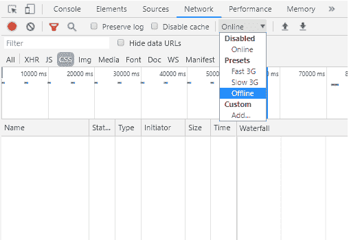

# 服务人员|如何创建自定义离线页面？

> 原文:[https://www . geesforgeks . org/service-worker-how-create-custom-offline-page/](https://www.geeksforgeeks.org/service-worker-how-to-create-custom-offline-page/)

**服务人员**允许拦截网络请求并决定加载什么*(获取)*。当用户失去连接时，此功能可用于加载自定义缓存的离线页面，这可以改善他们的浏览体验。

**了解应用生命周期**

1.  当用户最初加载页面时，*服务人员*被安装和激活。然后自定义离线页面被存储到浏览器缓存中。
2.  当用户触发导致重新加载或导航到另一个页面的事件，但同时他不再连接到互联网时，服务人员拦截网络请求并返回离线缓存页面作为响应。

**启动文件**

考虑到“*index.html*”和“ *style.css* 在同一个文件夹中，为了更简单。

*   **index.html**T3

    ```
    <!-- index.html -->
    <!DOCTYPE html>
    <html lang="en">

    <head>
        <meta charset="UTF-8" />
        <meta name="viewport" 
              content="width=device-width, initial-scale=1.0" />
        <meta http-equiv="X-UA-Compatible" content="ie=edge" />
        <link rel="stylesheet" href="./style.css" />
        <title>Service Worker App</title>
    </head>

    <body>
        <!-- Button causing page reload -->
        <div class="wrapper">
            <!-- GfG logo -->
            
            <button type="button" 
                    onClick="window.location.reload();">
                Refresh Page
            </button>
        </div>
    </body>

    </html>
    ```

    T4】
*   **stylew.css**

    ```
    /*   style.css   */

    * {
        margin: 0;
        padding: 0;
    }

    *,
    *::before,
    *::after {
        box-sizing: inherit;
    }

    html {
        box-sizing: border-box;
        font-size: 62.5%;
    }

    .wrapper {
        display: flex;
        flex-direction: column;
        justify-content: center;
        align-items: center;
        height: 80vh;
    }

    button {
        padding: .5rem;
        font-size: 1.5rem;
    }
    ```

**输出:**

**用户失去连接时的默认行为:**


连接丢失时的默认页面行为

**添加服务人员:**

为了更简单起见，请考虑“index.html”、“style.css”、“service-worker.js”和“offline-page.html”位于同一个文件夹中。

*   **index.html**T3

    ```
    <!-- index.html -->
    <!DOCTYPE html>
    <html lang="en">

    <head>
        <meta charset="UTF-8" />
        <meta name="viewport"
              content="width=device-width, initial-scale=1.0" />

        <meta http-equiv="X-UA-Compatible" 
              content="ie=edge" />

        <link rel="stylesheet" href="./style.css" />
        <title>Service Worker App</title>
    </head>

    <body>
        <div class="wrapper">
            
            <!-- Button causing page reload -->
            <button type="button" 
                    onClick="window.location.reload();">
                Refresh Page
            </button>
        </div>
        <script>
            // Check if browser supports service workers
            if (navigator.serviceWorker) {
                console.log("Service Worker Supported");

                // Start registration process on page load
                window.addEventListener("load", () => {
                    navigator.serviceWorker

                        // The register function takes as argument
                        // the file path to the worker's file
                        .register("./service_worker.js")

                        // Gives us registration object
                        .then(reg => console.log("Service Worker Registered"))
                        .catch(swErr => console.log(
                          `Service Worker Error: ${swErr}}`));
                });
            }
        </script>
    </body>

    </html>
    ```

    T4】
*   **style.css**

    ```
    /*   style.css   */

    * {
        margin: 0;
        padding: 0;
    }

    *,
    *::before,
    *::after {
        box-sizing: inherit;
    }

    html {
        box-sizing: border-box;
        font-size: 62.5%;
    }

    .wrapper {
        display: flex;
        flex-direction: column;
        justify-content: center;
        align-items: center;
        height: 80vh;
    }

    button {
        padding: .5rem;
        font-size: 1.5rem;
    }
    ```

*   **服务**

    ```
    /*  service_worker.js  */

    const offlineCache = './offline-page.html';
    // Adding the offline page 
    // when installing the service worker
    self.addEventListener('install', e => {
        // Wait until promise is finished 
        // Until it get rid of the service worker
        e.waitUntil(
            caches.open(offlineCache)
            .then(cache => {
                cache.add(offlineCache)
                    // When everything is set
                    .then(() => self.skipWaiting())
            })
        );
    })

    // Call Activate Event
    self.addEventListener('activate', e => {
        console.log('Service Worker - Activated')
        e.waitUntil(
            caches.keys().then(cacheNames => {
                return Promise.all(
                    cacheNames.map(
                        cache => {
                            if (cache !== offlineCache) {
                                console.log(
                                  'Service Worker: Clearing Old Cache');
                                return caches.delete(cache);
                            }
                        }
                    )
                )
            })
        );

    });

    // Call Fetch Event 
    self.addEventListener('fetch', e => {
        console.log('Service Worker: Fetching');
        e.respondWith(
            // If there is no internet
            fetch(e.request).catch((error) =>
                caches.match(offlineCache)
            )
        );
    });
    ```

*   **offline-page.html**T3

    ```
    <!-- offline-page.html-->
    <!DOCTYPE html>
    <html lang="en">

    <head>
        <meta charset="UTF-8" />
        <meta name="viewport" 
              content="width=device-width, initial-scale=1.0" />

        <meta http-equiv="X-UA-Compatible" 
              content="ie=edge" />

        <title>Custom Offline Page</title>
        <style>
            .wrapper {
                display: flex;
                flex-direction: column;
                justify-content: center;
                align-items: center;
                height: 80vh;
            }
        </style>
    </head>

    <body>
        <div class="wrapper">
            <h1>Ooops, it looks like you lost connection.</h1>
            <h2>Please check your network and try again!</h2>
            <h3>Sincerely, GeeksForGeeks team!</h3>
        </div>
    </body>

    </html>
    ```

    T4】

**添加服务人员后失去连接重新加载行为:**


服务人员示例代码的页面行为

**如何重建失去的连接**

几乎每个浏览器都附带内置的开发工具。在大多数情况下，打开工具的快捷方式是 *F12* 或右键单击网页并选择检查元素。然后你可以去*网*把框*【在线】*改成*【离线】*刷新页面。



谷歌 Chrome 的开发者工具