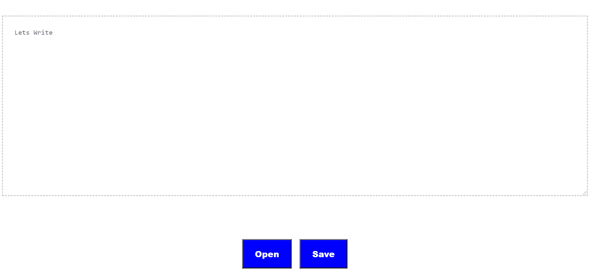

# 使用文件系统访问 API 的简单文本编辑器

> 原文:[https://www . geesforgeks . org/simple-text-editor-use-file-system-access-API/](https://www.geeksforgeeks.org/simple-text-editor-using-file-system-access-api/)

在本文中，我们将创建一个类似应用程序的简单文本编辑器，我们可以借助**文件系统访问 API** 来打开、编辑和保存文本文件。

**文件系统访问 API** 使我们能够与本地设备(如照片和视频编辑器)上的文件进行交互。当用户授予权限时，这有助于我们直接读取或保存对本地存储上的文件和文件夹的更改。使用这个应用编程接口，我们可以读取、写入、修改，还可以打开一个目录来修改它的内容。

我们将分三步创建这个应用程序。

*   用 HTML 做一个大概的结构。
*   用 CSS 给出一个大概的风格。
*   借助文件系统访问接口用 JavaScript 编写一些代码。

**HTML 代码:**我们将使用 HTML 来设计网页结构或布局。创建一个带有文本区域和两个按钮的容器来打开文件和保存文件。

## 超文本标记语言

```html
<!DOCTYPE html>
<html>

<body>
    <div class="container">

        <!--Text Area -->
        <textarea id="content" 
            placeholder="Lets Write ">
        </textarea>

        <!--Buttons -->
        <div class="buttons">

            <!--To open -->
            <button id="openfile">
                Open
            </button>

            <!-- To save-->
            <button id="savefile">
                Save
            </button>
        </div>
    </div>
</body>

</html>
```

**CSS 代码:** CSS 用于给出一般的样式，使其更具视觉吸引力。给整个页面一般的风格，如颜色和对齐。我们使用*弯曲*使元素居中。在上面的 HTML 代码中，在代码头部的样式部分包含以下内容。

```html
/* General Alignment to container 
using flexbox */
.container{
    display: flex;
    height: 100vh;
    flex-wrap: wrap;
    align-items: center;
    justify-content: center;
}

/* Styling to the textarea */
textarea {
    width: 90vw;
    color: #777;
    font-size: 1.1rem;
    min-height: 20rem;
    border: 2px dashed rgba(0, 0, 0, 0.2);
    padding: 1.5rem;
}

/* Aligning buttons to center */
.buttons{
    width: 100%;
    display: flex;
    justify-content: center;
}

/* General styling to button */
button{
    margin:0 0.5rem;
    font-size: 1.1rem;
    font-weight: 800;
    background-color: blue;
    color: #ffffff;
    padding: 1rem 1.5rem;
}
```

**输出:**



**JavaScript:** 我们将使用**文件系统 API** 来打开、编辑和保存文件。我们将把 JavaScript 代码分成三个步骤。

*   创建变量并访问 id 为的元素，打开文件并保存文件。
*   创建一个函数来打开文件。
*   创建关闭文件的函数

**步骤 1:** 获取元素

## 超文本标记语言

```html
const openFile = document.getElementById('openfile');
const saveFile = document.getElementById('savefile');
const contentTextArea = document.getElementById('content');
let fileHandle;
```

**第二步:**演示一个打开文件的功能。要打开一个文件，首先我们需要提示用户选择一个文件。为此，我们将使用 **showOpenFilePicker()** 方法。此方法将返回一个 filehandles 数组。

现在我们有了一个文件句柄，所以我们可以通过使用方法*来访问文件本身。文件句柄. getFile()* 它返回文件对象，其中包含一个 blob。要访问数据，我们将使用方法*文本()*。

## 超文本标记语言

```html
const open = async () => {
  [fileHandle] = await window.showOpenFilePicker();
  const file = await fileHandle.getFile();
  const contents = await file.text();
  contentTextArea.value = contents;
}
```

**第三步:**演示保存文件的功能。要保存文件，我们将使用 **showSaveFilePicker()** 方法。我们也想把它保存在。txt 格式，所以我们会提供一些可选的参数。

现在我们必须将文件写入磁盘，为此我们将使用**文件系统可写文件流**对象。我们将通过调用**创建可写()**方法来创建一个流。当调用此方法时，它将检查写权限。如果没有授予权限，它将向用户请求权限。如果权限被拒绝，它将引发异常。然后我们将使用 **write()** 方法将文件的内容写入流中。我们将关闭可写流并返回句柄。

## 超文本标记语言

```html
const save = async content => {
    try {
        const handle = await window.showSaveFilePicker({
            types: [
                {
                    accept: {
                        'text/plain': ['.txt'],
                    },
                },
            ],
        })

        // Create a FileSystemWritableFileStream to write
        const writable = await handle.createWritable();

        // Write the contents of the file to the stream
        await writable.write(content);

        // Close the file and write the contents to disk
        await writable.close();
        return handle;
    } catch (err) {
        console.error(err.name);
    }
}
```

最后，我们将把 open 和 save 方法与变量 open file 和 save file 关联起来。

## 超文本标记语言

```html
openFile.addEventListener('click', () => open());
saveFile.addEventListener('click', 
    () => save(contentTextArea.value));
```

**输出:**那么我们的编辑器现在准备好了。

<video class="wp-video-shortcode" id="video-528166-1" width="640" height="360" preload="metadata" controls=""><source type="video/mp4" src="https://media.geeksforgeeks.org/wp-content/uploads/20201215110553/up.mp4?_=1">[https://media.geeksforgeeks.org/wp-content/uploads/20201215110553/up.mp4](https://media.geeksforgeeks.org/wp-content/uploads/20201215110553/up.mp4)</video>

```html
https://github.com/Nandini-72/Notepad
```