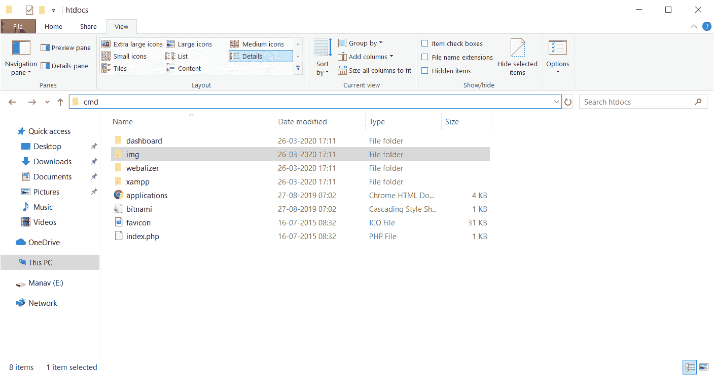
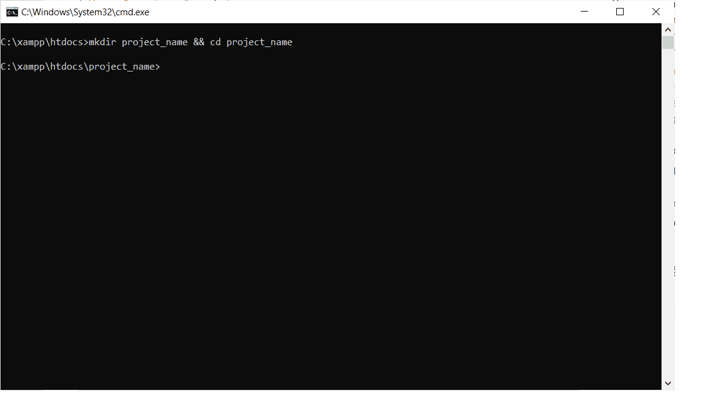
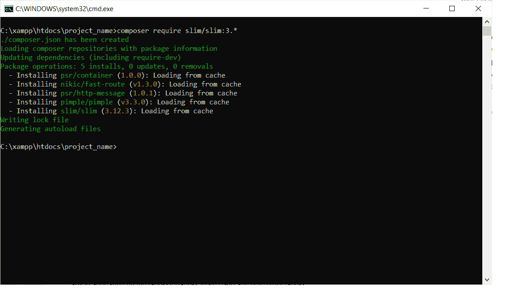
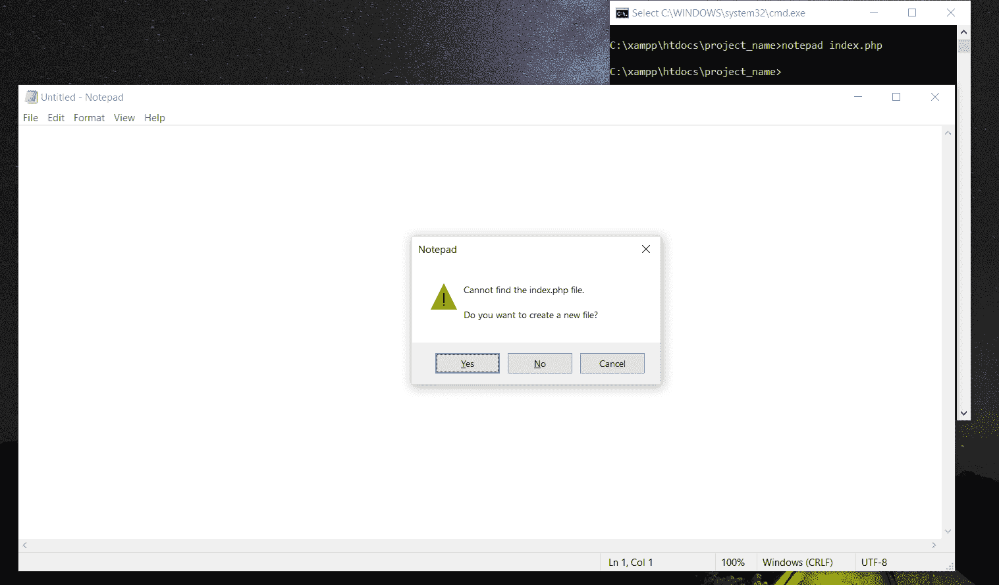
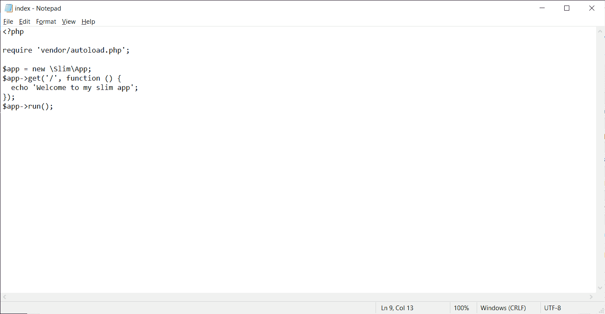
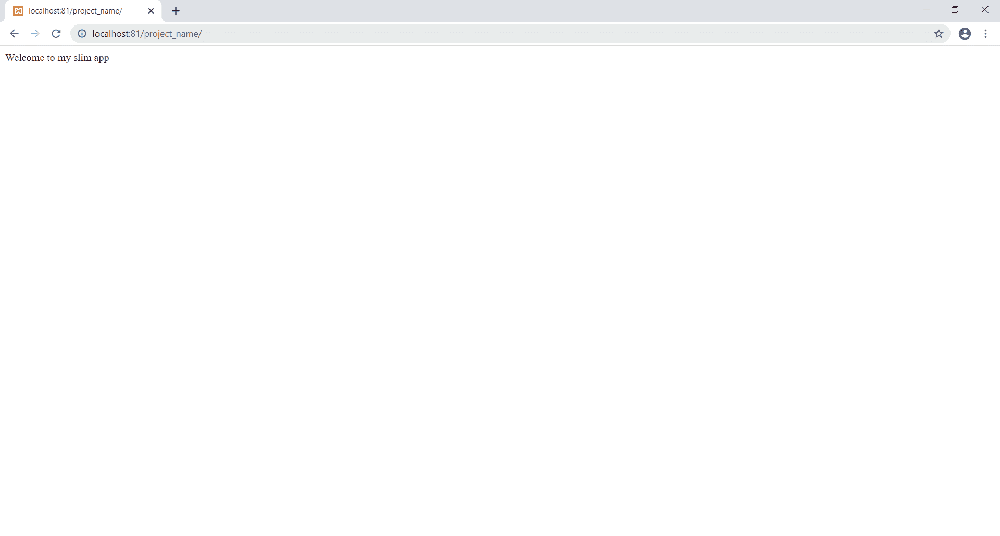

# 细长框架|安装和配置

> 原文:[https://www . geesforgeks . org/slim-framework-安装和配置/](https://www.geeksforgeeks.org/slim-framework-installation-and-configuration/)

Slim 是一个轻量级、易于使用和快速的 PHP 框架，用于轻松快速地开发强大的网站。像其他 PHP 框架一样，slim 也支持路由器、中间件、bodyparser、页面模板、加密 cookies 等等。

**先决条件:**

1.  [在 windows 上安装 PHP](https://www.geeksforgeeks.org/how-to-execute-php-code-using-command-line/)
2.  [运行项目的环境设置](https://www.geeksforgeeks.org/how-to-set-php-development-environment-in-windows/)
3.  [安装 slim 的 Composer 软件](https://getcomposer.org/download/)

**安装:**

1.  进入你安装 XAMPP 的目录**打开 htdocs 文件夹**。(在我的例子中是 C:\xampp\htdocs)。
2.  打开命令提示符，将当前工作目录设为当前目录。
    
3.  Enter the command

    ```
    mkdir project_name && cd project_name
    ```

    该命令将创建一个名为 project_name 的项目文件夹，并将当前工作目录设置为该文件夹。
    

4.  Now enter the command

    ```
    composer require slim/slim:3.* 
    ```

    (这里 3。*指版本号)
    这将在当前目录下安装 slim 框架。
    

5.  Now enter the command

    ```
    notepad index.php
    ```

    点击是。它将创建一个新文件 index.php，并将打开它进行编辑。
    

6.  Now type the following code in the file

    ```
    <?php

    require 'vendor/autoload.php';

    $app = new \Slim\App;
    $app->get('/', function () {
      echo 'Welcome to my slim app';
    });
    $app->run();
    ?>
    ```

    这是我们第一个超薄应用程序的代码。
    

7.  **保存文件**并关闭。
8.  打开 xampp 控制面板**运行 apache 服务器**。
9.  现在打开一个网页浏览器**转到 URL->[http://localhost:81/project _ name/](http://localhost:81/project_name/)**
    可以看到我们的第一个 app 在服务器上成功运行。
    
    你已经成功安装了 slim，并用它创建了你的第一个应用程序。