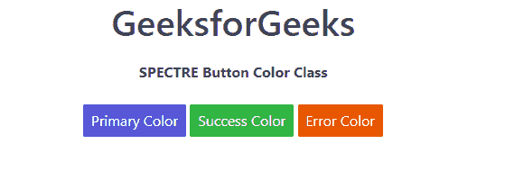

# 频谱按钮颜色

> 原文:[https://www.geeksforgeeks.org/spectre-button-colors/](https://www.geeksforgeeks.org/spectre-button-colors/)

[按钮](https://www.geeksforgeeks.org/html-button-tag/)是任何网站或任何应用的重要功能。Spectre 按钮颜色类用于定义按钮的颜色。

**按钮颜色等级:**

*   **btn-primary:** 此类用于将按钮的颜色设置为蓝色。
*   **btn-success:** 此类用于将按钮的颜色设置为绿色。
*   **BTN-错误:**此类用于将按钮的颜色设置为红色。

**注意:**如果需要更多的按钮颜色，请使用按钮混合来创建自己的按钮颜色变体。

**示例:**下面的示例说明了 Spectre 中的按钮颜色。

## 超文本标记语言

```html
<!DOCTYPE html>
<html>

<head>
    <title>SPECTRE Buttons Class</title>
    <link rel="stylesheet" 
          href=
"https://unpkg.com/spectre.css/dist/spectre.min.css">
    <link rel="stylesheet" 
          href=
"https://unpkg.com/spectre.css/dist/spectre-exp.min.css">
    <link rel="stylesheet" 
          href=
"https://unpkg.com/spectre.css/dist/spectre-icons.min.css"> 
</head>

<body>
    <center>
        <h1>GeeksforGeeks</h1> 
        <strong>SPECTRE Button Color Class</strong>
        <br>
        <button class="btn btn-primary">Primary Color</button>
        <button class="btn btn-success">Success Color</button>
        <button class="btn btn-error">Error Color</button>
    </center>
</body>

</html>
```

**输出:**



**参考:**[https://picturepan2 . github . io/spectre/elements/buttons . html # buttons-colors](https://picturepan2.github.io/spectre/elements/buttons.html#buttons-colors)