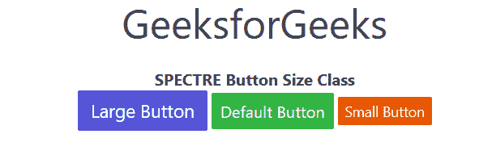
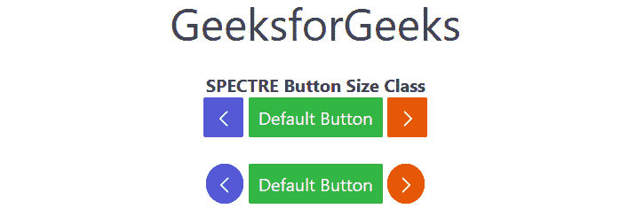

# 频谱按钮大小

> 原文:[https://www.geeksforgeeks.org/spectre-button-size/](https://www.geeksforgeeks.org/spectre-button-size/)

按钮是任何网站或任何应用程序的重要功能。Spectre 按钮大小类用于定义按钮的大小。

**按钮尺寸等级:**

*   **btn-lg:** 此类用于将按钮大小设置为大。
*   **btn-sm:** 此类用于将按钮大小设置为小。

**注意:**您可以为方形按钮使用“btn-action”类，或者为圆形按钮添加另一个 s-circle 类，这通常被用作浮动操作按钮(FAB)。

*   **btn-action:** 这个类用于将按钮形状设置成正方形。
*   **s-circle:** 此类用于将按钮形状设置为圆形。

以下示例说明了 Spectre 中的按钮大小。

**示例 1:** 在本例中，我们将定义按钮的大小。

## 超文本标记语言

```html
<!DOCTYPE html>
<html>

<head>
    <title>SPECTRE CSS Buttons Class</title>
    <link rel="stylesheet" 
          href=
"https://unpkg.com/spectre.css/dist/spectre.min.css">
    <link rel="stylesheet" 
          href=
"https://unpkg.com/spectre.css/dist/spectre-exp.min.css">
    <link rel="stylesheet" 
          href=
"https://unpkg.com/spectre.css/dist/spectre-icons.min.css"> 
</head>

<body>
    <center>
        <h1>GeeksforGeeks</h1> 
        <strong>SPECTRE Button Size Class</strong>
        <br>
        <button class="btn btn-primary btn-lg">Large Button</button>
        <button class="btn btn-success">Default Button</button>
        <button class="btn btn-error btn-sm">Small Button</button>
    </center>
</body>

</html>
```

**输出:**



**示例 2:** 在本例中，我们将定义按钮的形状。

## 超文本标记语言

```html
<!DOCTYPE html>
<html>

<head>
    <title>SPECTRE CSS Buttons Class</title>
    <link rel="stylesheet" 
          href=
"https://unpkg.com/spectre.css/dist/spectre.min.css">
    <link rel="stylesheet" 
          href=
"https://unpkg.com/spectre.css/dist/spectre-exp.min.css">
    <link rel="stylesheet" 
          href=
"https://unpkg.com/spectre.css/dist/spectre-icons.min.css"> 
</head>

<body>
    <center>
        <h1>GeeksforGeeks</h1> 
        <strong>SPECTRE Button Size Class</strong>
        <br>
        <button class="btn btn-primary btn-action">
          <i class="icon icon-arrow-left"></i>
        </button>
        <button class="btn btn-success">
          Default Button
        </button>
        <button class="btn btn-error btn-action">
          <i class="icon icon-arrow-right"></i>
        </button>
        <br><br>
        <button class="btn btn-primary s-circle">
          <i class="icon icon-arrow-left"></i>
        </button>
        <button class="btn btn-success">
          Default Button
        </button>
        <button class="btn btn-error s-circle">
          <i class="icon icon-arrow-right"></i>
        </button>
    </center>
</body>

</html>
```

**输出:**



**参考:**T2【https://picturepan2 . github . io/spectre/elements/buttons . html # buttons-size