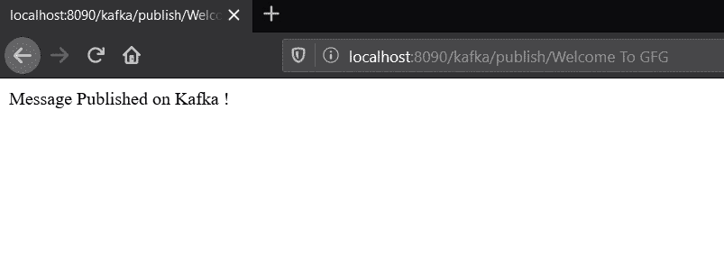
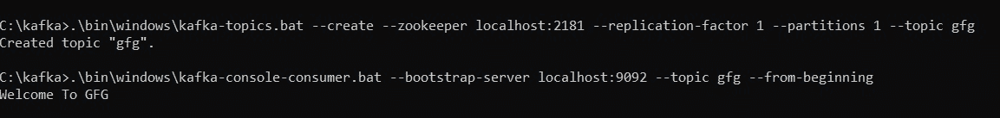

# Spring Boot |如何在 Apache Kafka 上发布字符串消息

> 原文:[https://www . geesforgeks . org/spring-boot-how-publish-string-messages-on-Apache-Kafka/](https://www.geeksforgeeks.org/spring-boot-how-to-publish-string-messages-on-apache-kafka/)

[Apache Kafka](https://www.geeksforgeeks.org/apache-kafka/) 是一个发布-订阅消息系统。消息队列允许您在进程、应用程序和服务器之间发送消息。在本文中，我们将看到如何在 spring boot 应用程序中向 Apache Kafka 发送[字符串](https://www.geeksforgeeks.org/string-class-in-java/)消息。

为了学习如何创建一个弹簧靴项目，参考[这篇文章](https://www.geeksforgeeks.org/how-to-create-a-basic-application-in-java-spring-boot/?ref=rp)。

字符串是一系列字符。在 java 中，String 的对象是不可变的，这意味着一个常量，一旦创建就不能更改。此外，java 允许[显式类型转换](https://www.geeksforgeeks.org/type-conversion-java-examples/)，其中一种类型的变量可以强制转换为另一种类型。例如，如果字符串仅由数字组成，并且需要用于某些计算，则同一字符串消息可以进一步转换为 int 或 float。为了向 Apache Kafka 发布字符串消息，可以遵循以下步骤:

1.  转到 [spring initializr](https://start.spring.io/) 并创建一个包含以下依赖项的初始项目:
    *   弹簧网
    *   阿帕奇卡夫卡的春天
2.  在集成开发环境中打开项目，并同步依赖项。现在用注释 *@RestController* 创建一个新的类 *Controller* 。这个类处理所有 RESTful 路由。
3.  在这个类中，创建一个 GET API，用参数作为字符串初始化 *KafkaTemplate* 。以下是该类的实现:

    ```html
    // Java program to implement the
    // controller for the spring
    // application

    @RestController
    @RequestMapping("/kafka")
    public class Controller {

        @Autowired
        KafkaTemplate<String, String>
            kafkaTemplate;

        static final String TOPIC = "gfg";

        // Implementing a GET method
        @GetMapping("publish/{message}")
        public String publish_message(
            @PathVariable("message") String message)
        {
            kafkaTemplate.send(TOPIC, message);
            return "Message Published on Kafka !";
        }
    }
    ```

4.  启动动物园管理员和卡夫卡服务器。现在我们需要创建一个名为 *gfg* 的新话题。为此，请打开一个新的命令提示符窗口，并将目录更改为卡夫卡目录。
5.  现在使用下面给出的命令创建一个新主题:

    > 对于苹果个人计算机和 Linux:bin/Kafka-主题。sh–create–动物园管理员本地主机:2181–复制因子 1–分区 1–话题 _ 话题 _ 名称
    > 
    > 对于 Windows:\ bin \ windows \ Kafka-主题。bat–create–动物园管理员 localhost:2181–复制因子 1–分区 1–话题话题 _ 名称

6.  现在要实时查看卡夫卡服务器上的消息，请使用下面的命令:

    > 对于测量与控制(Measurement and Control)和 Linux:bin/Kafka-控制台-消费者。sh-bootstrap-server localhost:9092-topic _ name-从头开始
    > 
    > 对于 Windows:\ bin \ windows \ Kafka-控制台-消费者。bat-bootstrap-server localhost:9092-topic _ name-从头开始

7.  Run the application and call the API as:

    > localhost:8080/Kafka/publish/{您的消息}

    **注意:**如果使用了不同的端口，则用 8080 替换该端口。

**输出:**

*   Calling the API:

    [](https://media.geeksforgeeks.org/wp-content/uploads/20200610023949/msg1.jpg)

*   Checking the message in real time:

    [](https://media.geeksforgeeks.org/wp-content/uploads/20200610024009/msg2.jpg)