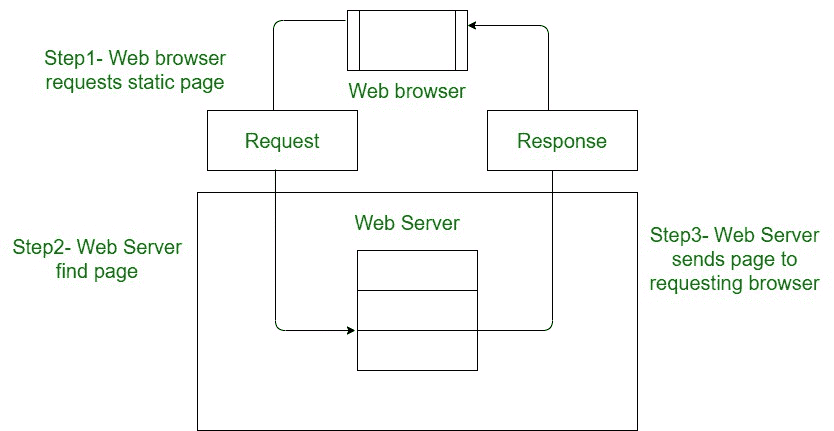

# 静态网站

> 原文:[https://www.geeksforgeeks.org/static-websites/](https://www.geeksforgeeks.org/static-websites/)

**静态网站**是对 web 服务器的每一个请求都不会动态改变内容或布局的网站。静态网站在任何人访问时都会显示完全相同的信息。只有当网络作者使用**文本编辑器**或任何用于创建网站的网络编辑工具手动更新静态网站时，用户才能看到它们的更新内容。静态网页不必是简单的纯文本。它们可以呈现多种设计，甚至视频。

**静态网站的特点:**

*   静态网站是你能建立的最简单的一种网站。
*   每个浏览者每次访问网站时都会看到完全相同的文本、多媒体设计或视频，直到你修改了该页面的源代码。
*   静态网站是借助 **HTML 和 CSS 编写的。**
*   静态网站上交互的唯一形式是**超链接**。
*   静态网站可以用于在几个月甚至几年内没有实质性变化的信息。
*   静态页面易于理解和简单，安全，不太容易出现技术错误和故障，并且容易被搜索引擎看到。
*   **HTML** 是人们开始创建静态网页的第一个工具。

**静态网站的优势:**

*   静态网站对出版来说是非常划算的。
*   它们需要较少的编码和技术知识。
*   静态网站更容易制作。
*   静态网站发展很快。
*   静态网站托管成本低。

**静态网站的缺点:**

*   需要网络开发专业知识来更新网站。
*   网站对用户没那么有用。
*   内容可能会停滞不前。