# 制作第一个 WordPress 插件的步骤指南

> 原文:[https://www . geesforgeks . org/step-guide-to-make-your-first-WordPress-plugin/](https://www.geeksforgeeks.org/step-by-step-guide-to-make-your-first-wordpress-plugin/)

[WordPress](https://www.geeksforgeeks.org/introduction-wordpress/) 中的**插件**是添加或扩展功能的组件，可以根据需要启用或禁用，并且不干扰核心程序/软件及其代码。WordPress 被设计成轻量级和平滑的，以增加灵活性并减少可能对基本网站功能不重要的代码。插件然后添加定制的特性和功能，允许用户根据他们的特定需求设计网站。

在本指南中，您将学习**如何开发您的第一个 WordPress 插件。**

**先决条件:**

*   [一个 WordPress 安装](https://www.geeksforgeeks.org/how-to-make-a-website-using-wordpress-part-1/)
*   [PHP](https://www.geeksforgeeks.org/php/) 基础知识

**制作插件的步骤–**

1.  转到 WordPress 安装-> WordPress/WP-内容/插件。
    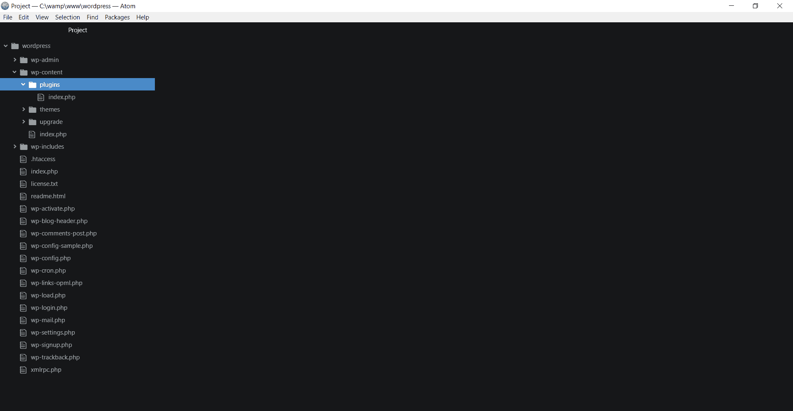
2.  在这里创建一个新的文件夹，并将其命名为“插件名称”，在这种情况下为“第一插件”
    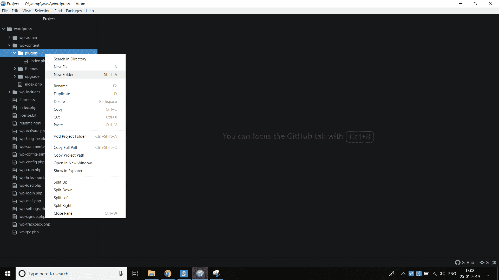
3.  接下来，在这个文件夹中创建一个新的 PHP 文件，并将其命名为与本例中的文件夹相同的名称 First-Plugin.php
    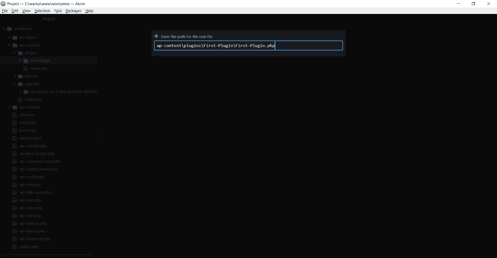
4.  现在，我们添加插件的名称。在文件中添加包含在 PHP 注释中的插件名称。
    PHP 文件 First-Plugin.php 的代码–

```html
<?php
/**
* Plugin Name: First Plugin
**/
?>
```

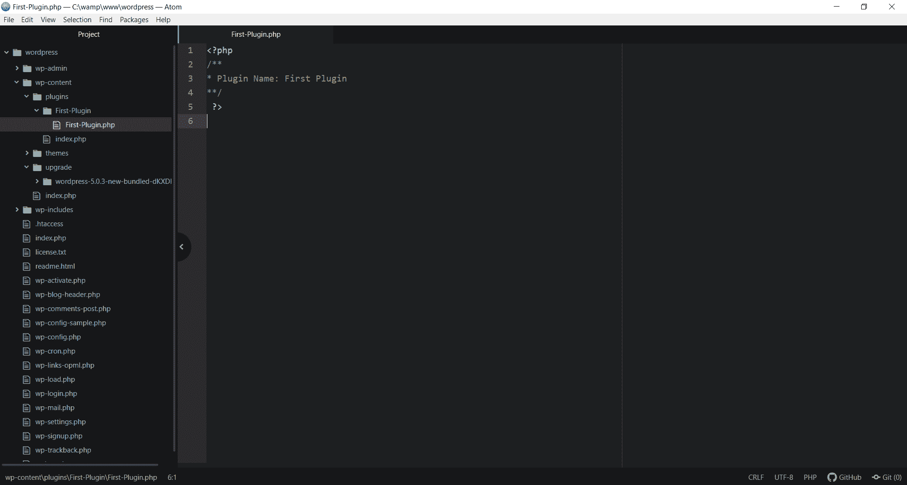

*   现在，转到 WordPress 仪表板->插件，在这里你可以看到我们新创建的插件及其名称。
    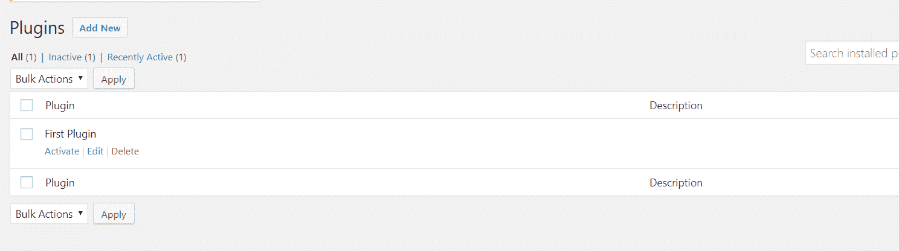*   We should not leave the description blank as it helps the user know what is plugin meant to do. so let’s add the description of our plugin by adding a new comment line after “Plugin Name:” with the title “Description” and save it. Code of PHP file First-Plugin.php –

    ```html
    <?php
    /**
    * Plugin Name: First Plugin
    * Description: This is my first Plugin.
    **/
    ?>
    ```

    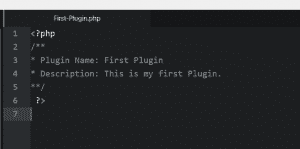

    *   我们成功地添加了我们插件的描述，现在转到仪表板->插件，看看它是什么样子。
    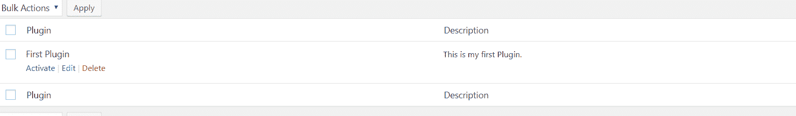*   Next, we add some functionality to our first Plugin. We will add a basic function named first_plugin() which prints “HELLO This is my first Plugin.” and its shortcode which allows this to be placed on a WordPress post or a Page.
    Code –

    ```html
    <?php
    /**
    * Plugin Name: First Plugin
    * Description: This is my first Plugin.
    **/

      function First_Plugin()
      {

          $content="HELLO This is my first Plugin.";
          return $content;
      }
      add_shortcode('myplugin', 'First_Plugin')
     ?>
    ```

    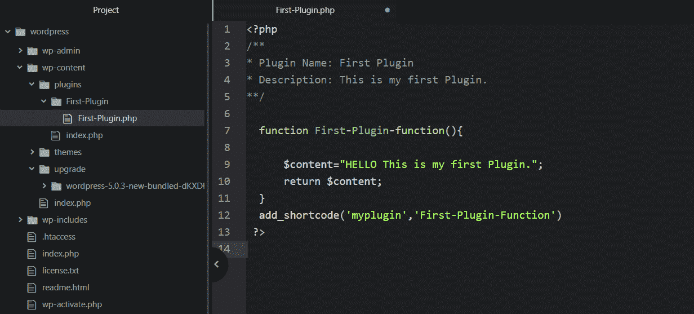

    *   为了显示这个函数的输出值，我们使用了 WordPress 的短代码特性。转到帖子->编辑或创建新帖子。这里添加了我们刚刚制作的插件的短代码。
    短代码–[my plugin]
    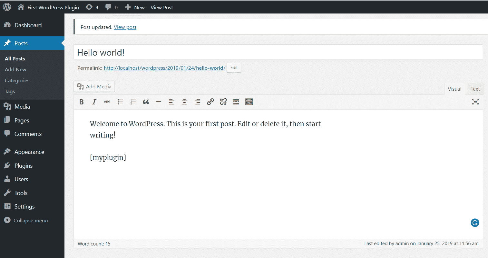*   要查看插件输出，浏览网站并打开我们添加插件短代码的帖子。
    以下是它的样子-
    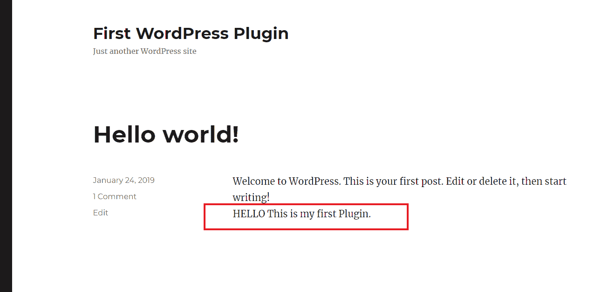*   现在，为了让这个插件功能被多次使用，我们可以多次使用这个短代码。只要在我们需要这个输出的地方添加短代码。
    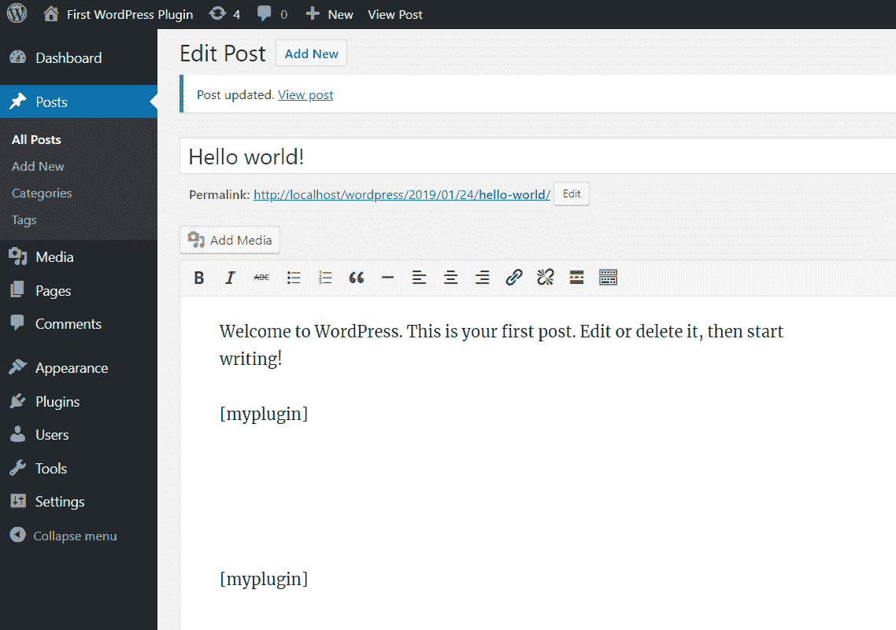*   Check the post for updated output here we get two same sentences because we used the shortcode two times in this post.

    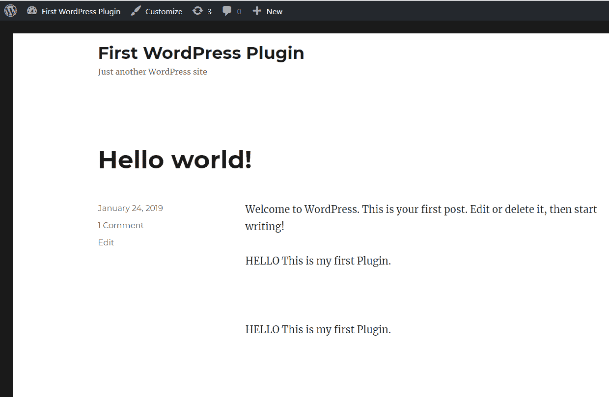

    **现在我们有了返回一个值的插件，通过使用短代码，我们可以在任何地方使用它。**