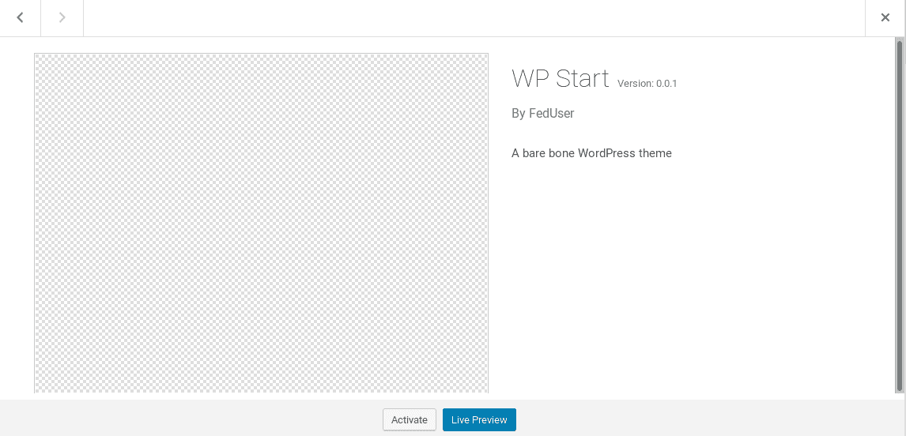
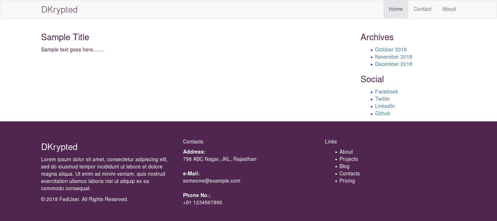
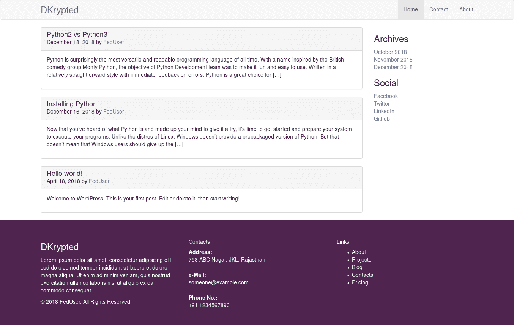

# 编写自己的 WordPress 模板的分步指南

> 原文:[https://www . geesforgeks . org/step-guide-to-write-your-WordPress-template/](https://www.geeksforgeeks.org/step-by-step-guide-to-write-your-own-wordpress-template/)

从头开始编写自己的 WordPress 模板相当简单。如果你从事网络开发行业，你可能已经听说过什么是“WordPress”。可能有客户提过，但你不熟悉。可能你之前已经用过了，但是不知道怎么从头开始做主题。或者你完全是个新手。不管是什么情况，这个帖子是给你的。

**先决条件:**在我们开始之前，您需要满足以下一组要求。

*   你需要有一个完整的 WordPress 设置，无论是本地主机还是直播主机。如果你想了解更多关于从 WordPress 开始的知识，请参考[这篇文章](https://www.geeksforgeeks.org/how-to-make-a-website-using-wordpress-part-1/)。
*   在整个开发过程中遵循的概念设计，如 PSD 或 HTML CSS。
*   [PHP 编程](https://www.geeksforgeeks.org/php/)小介绍。然而，这不是这篇文章的必要条件，但仍然推荐。

<center>**Scope**</center>

Designing a WordPress theme is a long, tedious, never ending but a great programming challenge. The development process depends entirely on how you want your theme to look like. This post is just a tutorial and does not cover all the bits and pieces required for a standard WordPress theme. After going through this article, you have to heavily rely on [WordPress Codex](https://codex.wordpress.org/) and [WordPress StackExchange](https://wordpress.stackexchange.com/) for your further queries.

<center>**Getting Started**</center>

With the prerequisites in mind, let’s get started. The very first thing you need to know is the fact that almost everything you do in WordPress is inside the `wp-content` directory. Everything else is the WordPress CMS itself and you don’t want to mess with that.

当你打开 **wp-content - >主题**目录，你会发现默认的 WordPress 主题，比如*二十五、二十四、二十三*等。从你自己的一个开始，用你喜欢的名字创建一个目录。这个帖子，我们称之为 **wpstart** 。

> 一个 WordPress 主题至少需要两个文件存在–**style . CSS**和**index.php**

所以进入 **wpstart** 文件夹，创建这两个文件。在 **style.css** 中，插入以下注释。这告诉 WordPress 仪表板关于主题细节和元信息。

```
/*
  Theme Name: WP Start
  Author: FedUser
  Description: A bare bone WordPress theme
  Version: 0.0.1
*/
```

现在切换到你的 WordPress 仪表盘，点击**外观>主题**。你会在你的主题收藏中找到 **WP Start** 。



继续激活这个主题，然后访问网站。瞧！技术上来说，你已经创建了一个自定义主题，全部由你自己创建。当然，它除了有一个空白的白色屏幕之外，什么也做不了。这就是`index.php`开始行动的地方。

在文本编辑器中打开**index.php**，并编写以下代码。

```
<!DOCTYPE html>
<html>
<body>
  <h1>This is a sample WordPress theme.</h1>
</body>
</html>
```

再次访问该网站，让您的第一个 WordPress 模板启动并运行。

<center>

### 分治法

</center>

To develop a standard WordPress theme, you need to divide all your work into sections. This is not necessary, as you can do everything in `index.php`, but a good programming practice involves modularity. For this particular post, we will divide our entire work into *four* sections, viz. header, footer, sidebar and content. Corresponding to these sections, we will create four different files, namely `header.php`, `footer.php`, `sidebar.php` and `content.php`.

*   **header.php**: For this particular example, this file will do the following;
    *   为 HTML 定义`<head>`内的所有元标签和链接标签。
    *   显示网站品牌，如名称和描述。
    *   提供不同页面的导航。

    记住这些要点，让我们编写主题标题。

    ```
    <!DOCTYPE html>
    <html>
    <head>
      <meta charset="utf-8" />
      <meta name="viewport" content="width=device-width, initial-scale=1" />

      <title>WP Start</title>

      <link rel="stylesheet" href="https://maxcdn.bootstrapcdn.com/bootstrap/3.3.7/css/bootstrap.min.css" 
            integrity="sha384-BVYiiSIFeK1dGmJRAkycuHAHRg32OmUcww7on3RYdg4Va+PmSTsz/K68vbdEjh4u" 
            crossorigin="anonymous" />  
    </head>

    <body>

    <nav></nav>
    ```

    现在有一件事我想引起你的注意。你可以看到我们的网站标题有多“硬编码”。意思是，标题将保持不变“WP Start”，不管你在哪个网站应用这个主题。如果作者不得不改变它，他必须手动编辑代码来这样做。为了避免这些模板的手动调整，WordPress 提供了各种函数调用来动态处理这些情况。在这种特殊情况下，我希望标题是网站/博客的名称。为此，我将替换

    ```
    <title>WP Start<title>
    ```

    **同**

    ```
    <title> <?php echo get_bloginfo( "name" ); ?> </title>
    ```

    这叫嵌入小 *php* 摘录到 HTML 中。(技术上，我们是用 php 文件写 HTML。所以我们在 php 代码中嵌入 HTML)。

    所以`header.php`，加上一些附加的代码，就变成了；

    ```
    <!DOCTYPE html>
    <html>
    <head>
      <meta charset="utf-8" />
      <meta name="viewport" content="width=device-width, initial-scale=1" />

      <title> <?php echo get_bloginfo( "name" ); ?> </title>

      <link rel="stylesheet" href="https://maxcdn.bootstrapcdn.com/bootstrap/3.3.7/css/bootstrap.min.css"
            integrity="sha384-BVYiiSIFeK1dGmJRAkycuHAHRg32OmUcww7on3RYdg4Va+PmSTsz/K68vbdEjh4u" 
            crossorigin="anonymous" />

      <link rel="stylesheet" href="<?php echo get_bloginfo( 'template_directory' ); ?>/style.css" />
      <?php wp_head(); ?>
    </head>

    <body>

      <nav class="navbar navbar-default">
        <div class="container">
          <div class="navbar-header">
            <a class="navbar-brand" href="<?php echo esc_url( home_url() ); ?>">
              <h3 class="site-branding"> <?php echo get_bloginfo( "name" ); ?> </h3>
            </a>
          </div>

          <ul class="nav navbar-nav navbar-right">
            <li class="active"><a href="#">Home</a></li>
            <li><a href="#">Contact</a></li>
            <li><a href="#">About</a></li>
          </ul>
        </div>
      </nav>
    ```

    本代码中使用的附加 *php* 摘录有；

    ```
    <?php echo get_bloginfo( 'template_directory' ); ?>
    ```

    这是为了获取模板的目录，以便添加资源，如 CSS、JS、字体等。可以定位。

    ```
    <?php echo esc_url( home_url() ); ?>
    ```

    这将呼应网站的主页网址。

*   **footer.php**: This is the file where we will add whatever we want in the site footer, like custom footer, script tags, etc. Also, the HTML tags that started in `header.php` are closed in this file.

    ```
      <footer class="site-footer">
        <div class="container">
          <div class="row row-30">
            <div class="col-md-4 col-xl-5">
              <div class="pr-xl-4">
                <h3>
                  <a href="<?php echo esc_url( home_url() ); ?>">
                    <?php echo get_bloginfo( "name" ); ?>
                  </a>
                </h3>
                <p><?php echo get_bloginfo( "description" ); ?></p>
                <p>© 2018 FedUser. All Rights Reserved.</p>
              </div>
            </div>

            <div class="col-md-4">
              <h5>Contacts</h5>
              <dl class="contact-list">
                <dt>Address:</dt>
                <dd>798 ABC Nagar, JKL, Rajasthan</dd>
              </dl>
              <dl class="contact-list">
                <dt>e-Mail:</dt>
                <dd><a href="mailto:#">someone@example.com</a></dd>
              </dl>
              <dl class="contact-list">
                <dt>Phone No.:</dt>
                <dd><a href="tel:#">+91 1234567890</a>
                </dd>
              </dl>
            </div>

            <div class="col-md-4 col-xl-3">
              <h5>Links</h5>
              <ul class="nav-list">
                <li><a href="#">About</a></li>
                <li><a href="#">Projects</a></li>
                <li><a href="#">Blog</a></li>
                <li><a href="#">Contacts</a></li>
                <li><a href="#">Pricing</a></li>
              </ul>
            </div>
          </div>
        </div>
      </footer>

      <script src="https://code.jquery.com/jquery-1.12.4.min.js"
        integrity="sha256-ZosEbRLbNQzLpnKIkEdrPv7lOy9C27hHQ+Xp8a4MxAQ="
        crossorigin="anonymous">
      </script>

      <script src="https://maxcdn.bootstrapcdn.com/bootstrap/3.3.7/js/bootstrap.min.js"
        integrity="sha384-Tc5IQib027qvyjSMfHjOMaLkfuWVxZxUPnCJA7l2mCWNIpG9mGCD8wGNIcPD7Txa"
        crossorigin="anonymous">
      </script>

      </body>
    </html>
    ```

    本文件中使用的附加 *php* 摘录为；

    ```
    <?php echo get_bloginfo( "description" ); ?>
    ```

    这将获取和放置站点描述。

    这里要提到的另一件事是，我在`footer.php`文件中使用了“硬编码”的子部分，如“联系人”和“链接”。相反，您可以使用 WordPress 小部件来实现自动化，并通过定制器直接修改它们。然而，这超出了本文的范围，我们将在以后的文章中随时讨论它。

*   **sidebar.php**:大部分网站都有侧栏，我们的也有。通常，边栏显示档案链接、最近的帖子、社交媒体账户、广告等。在我们的例子中，我们将使用存档链接和社交媒体链接。再说一遍，WordPress 小部件比“硬编码”垃圾好得多！但为了清楚起见，我们还是坚持后者。

    ```
    <div class="sidebar">
      <div class="widget">
        <h3 class="widget-title">Archives</h3>
        <div class="widget-content">
          <ul>
            <li><a href="#">October 2018</a></li>
            <li><a href="#">November 2018</a></li>
            <li><a href="#">December 2018</a></li>
          </ul>
        </div>
      </div>

      <div class="widget">
        <h3 class="widget-title">Social</h3>
        <div class="widget-content">
          <ul>
            <li><a href="#">Facebook</a></li>
            <li><a href="#">Twitter</a></li>
            <li><a href="#">LinkedIn</a></li>
            <li><a href="#">Github</a></li>
          </ul>
        </div>
      </div>
    </div>
    ```

*   **content.php**:现在页眉、页脚和侧边栏都设置好了，我们将向网站的主要内容前进。目前，我们将只关注这个文件中的一些虚拟内容。

    ```
    <div class="main-content">
      <h3>Sample Title</h3>
      <p>Sample text goes here.......</p>
    </div>
    ```

<center>

## 综合

</center>

Now let’s move back to the `index.php` where we will integrate all the above sections into one. As this file is an entry point for our theme, we can cleverly choose to put these sections. Here’s how I’ve done it.

```
<?php get_header(); ?>

<div class="container">
  <div class="row">
    <div class="col-md-9">
      <?php get_template_part( 'content', get_post_format() ); ?>
    </div>
    <div class="col-md-3">
      <?php get_sidebar(); ?>
    </div>
  </div>
</div>

<?php get_footer(); ?>
```

这里使用的 *php* 摘录不言自明。`get_header(), get_sidebar()`和`get_footer()`是预定义的函数，用于嵌入相应的部分。对于像`content.php`这样的自定义部分，嵌入是通过以下代码完成的；

```
<?php get_template_part( 'content', get_post_format() ); ?>
```

**style.css** :现在我们已经更新了`index.php`文件，让我们用 **CSS** 增加一些魅力。

```
/*
  Theme Name: WP Start
  Author: FedUser
  Description: A bare bone WordPress theme
  Version: 0.0.1
*/

nav.navbar .navbar-brand .site-branding {
  margin: 0;
}

footer.site-footer {
  background-color: #502550;
  color: #fff;
  padding: 40px 0 20px 0;
}

footer.site-footer a {
  color: #fff;
}
```

瞧！自定义 WordPress 主题的第一个外观已经准备好了。


<center>**The Loop**</center>

This is the most exciting part of the entire WordPress theme development where you have control of all the posts. [The Loop](https://codex.wordpress.org/The_Loop) is a functionality with which you can dynamically insert content into your theme. Our aim in this tutorial is to present all the blog posts as a user-friendly list so that the reader can choose any one of them. Let’s see how we do it.

循环本身是不言自明的。

```
<?php if ( have_posts() ) : while ( have_posts() ) : the_post(); ?>

<!-- contents of the loop -->

<?php endwhile; endif; ?>
```

如果有任何帖子，而没有留下，显示它们。这个循环中的任何内容都将被重复，直到页面用完所有帖子。我们可以用这个概念来显示我们的列表。我是这样做的。

```
<div class="panel panel-default blog-post">
  <div class="panel-heading">
    <h3 class="panel-title post-title">

      <?php if( !is_single() ): ?>

        <a href="<?php echo esc_url( get_permalink() ); ?>">
          <?php the_title(); ?>
        </a>

      <?php else:
        the_title();
      endif; ?>

    </h3>

    <p class="post-meta">
      <?php the_date(); ?> 
      by <a href="#">
           <?php the_author(); ?>
         </a>
    </p>
  </div>

  <div class="panel-body">

    <?php if( !is_single() ):
      the_excerpt();
    else:
      the_content();
    endif; ?>

  </div>
</div>
```

并且把**index.php**改成了这个。

```
<?php get_header(); ?>

<div class="container">
  <div class="row">
    <div class="col-md-9 blog-main">
      <?php if( have_posts() ):
              while( have_posts() ):

                the_post();
                get_template_part( 'content', get_post_format() );

              endwhile;
            endif;
      ?>
    </div>
    <div class="col-md-3">
      <?php get_sidebar(); ?>
    </div>
  </div>
</div>

<?php get_footer(); ?>
```

让我们看看刚刚发生了什么！

每次页面发帖时，index.php 的循环都会调用 content.php 的循环。在**content.php**里面，我已经查过了当前的帖子**是不是 _single()** 。如果当前页面只包含一个要循环的帖子，此条件将成立。当它不是单一的，我想通过它的标题链接到那个帖子。所以我用 **get_permalink()** 来获取那个特定帖子的 url。然而，如果页面是单一的，就不需要链接，因此，我只使用了**的 _title()** 功能。

转到帖子的元信息。我已经显示了文章发表的日期和作者的 T2。

最后，我使用了相同的概念 **is_single()** 来显示帖子的**_ 摘录()**或**_ 内容()**。

看，就是这么简单有趣。现在带着一点`CSS`的魅力，我得到了以下结果。



**结论**:

*   我们将在这一点上结束这篇文章，但是你需要知道仍然有很多关于 WordPress 的知识。这只是一个示例练习，但是一个标准的主题将会非常复杂。不过，我们希望你学到了一些新东西。
*   如果有什么不明白的地方，一定要在评论里提一下。如果有需要更正的地方，请告诉我们！如果您对进一步的改进有任何反馈或建议，我们也将非常感谢。
*   我们很想看看你从这篇文章中学到了什么。所以一定要分享你的第一个 WordPress 主题的链接。你的第一步可以让新来者振作起来。

快乐编程！