# 创建和发布 NPM 包的步骤

> 原文:[https://www . geesforgeks . org/steps-to-create-and-publish-NPM-packages/](https://www.geeksforgeeks.org/steps-to-create-and-publish-npm-packages/)

在本文中，我们将学习如何开发和发布您自己的 [npm](https://www.geeksforgeeks.org/node-js-npm-node-package-manager/) 包(也称为 npm 模块)。

NPM 套餐有许多好处，其中一些列举如下:

*   可重用代码
*   管理代码(使用[版本控制](https://www.geeksforgeeks.org/introduction-semantic-versioning/))
*   共享代码

npm 包的生命周期如下所示:

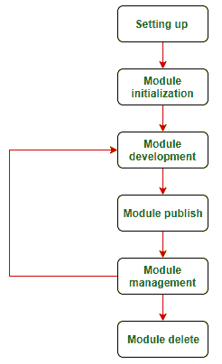

模块生命周期

**1。设置项目:**做任何事情之前都需要设置项目。

*   安装[节点](https://nodejs.org/en/download/)
*   创建一个 npm 帐户。
    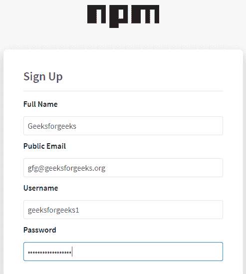

    npm 签名

*   使用`npm login`
    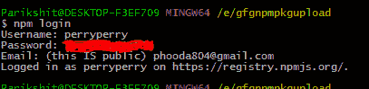

    npm 登录 npm 账户登录

**2。初始化模块:**要初始化模块，进入终端/命令行，输入`npm init`并回答提示。

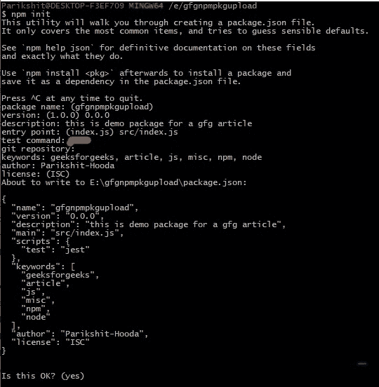

npm 初始化

*   在**版本**提示中，设置为 **0.0.0** 。它初始化模块。如果你保持 1.0.0，这意味着当前的模块版本是潜在下载者的第一个主要版本。当然，你不希望第一个主要版本只是一张白纸，充满 bug。
*   在主提示中，选择模块的入口点。潜在的下载者将使用它作为模块的入口点。请注意，入口点是“src/index.js”，这被认为是目前将代码放入“src”目录的标准做法。
*   在测试命令提示符下，只需按回车键。在上面的照片中，由于一些错别字，它已经被编辑掉了。您也可以从最终形成的 package.json 文件中更改测试命令。
*   在 git 存储库提示中，您可以填写托管包的 git 存储库的 url。
*   填写关键词、作者、许可证，或者您可以按“回车”键浏览。稍后可以在 package.json 中修改这些内容。
*   在项目中包含一个 **README.md** 文件，供潜在下载者查看。这将出现在您模块的主页中。请注意，文件应该是[减价](https://guides.github.com/features/mastering-markdown/)。
    应在 npm 模块中添加 README.md，以便潜在用户为他们提供模块描述、如何使用软件包、如何为软件包做出贡献等信息。

最终，如果我们的项目目录看起来像:
是可取的

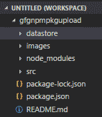

项目目录结构

**3。构建模块:**这个阶段就是编码阶段。如果你有使用 NPM 模块的经验，你会知道 NPM 模块公开了项目使用的方法。典型的控制流程是:

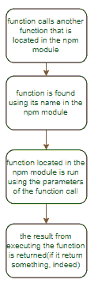

功能调用工作流在 npm 中存在模块

让我们首先实现一个简单的函数，在 npm 模块中添加两个数字。该函数如下所示:

**文件名:index.js**

```html
const gfgFns = {
  add : function addTwoNums( num1, num2 ) {
    return (num1 + num2) ;
  }
}

module.exports = gfgFns
```

请注意，index.js 文件的结构(这是我们正在构建的 npm 模块的入口点)。

*   **const gfgFns = {}** 导出供他人使用的对象。
*   **add:函数 addtwunoms()**函数名(addtwunoms)用‘add’标记。这个“add”名称用于调用这个函数来添加两个数字。
*   **module . exports = gfgfgfns**然后 gfgFns 对象以此名称导出。当这个函数需要在其他文件中使用时。

**4。发布模块:**编码模块完成后，发布 npm 包。要发布包，有一点要记住:如果您的包名已经存在于 npm 注册表中，您将无法发布包。要检查包名是否可用，请转到命令行并键入

```html
npm search packagename
```

如果您的包名可用，它应该显示如下图所示的内容。

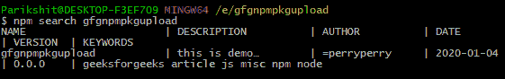

npm 搜索-gfgnpmpkgupload-cmd-1

如果您的模块名称已经存在，请转到 npm 模块项目的 package.json 文件，并将模块名称更改为其他名称。

现在，检查名称可用性后，转到命令行/终端并执行以下操作:

```html
npm publish
```

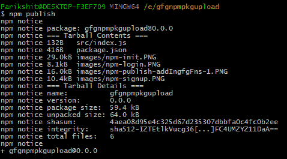

NPM-发布-cmd

现在，让我们尝试使用这个模块，看看它是否有效。

*   制作一个新的项目目录。
*   在终端中，输入`npm init`初始化节点项目。
*   现在做`npm install gfgnpmpkgupload`下载我们刚做的 npm 模块。
    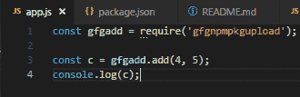

    app js-npmpkgupload-directory-add _ function

*   现在一切都设置好了，让我们试着运行 node.js 文件，看看我们的模块是否被正确地上传、发布、导入到我们的新项目中并被使用。
    

    节点-appjs-add(4+5 = 9)-run-success-11

**5。更新和管理版本:**如果一个软件正在开发，很明显它有版本。版本是错误修复、小改进、大改进和大发布的结果。为了适应版本控制，NPM 为我们提供了以下功能。

**版本化和发布代码:** NPM 允许我们在语义版本化的基础上对模块进行版本化。有三种类型的版本颠簸，我们可以做，即补丁，次要的，和主要的。例如，如果当前模块版本为 0.4.5:

```html
# note how minor version upgrade resets patch version to 0, similarly,
# major version upgrade sets minor and patch #to 0.
> npm version patch  # update version to 0.4.6
> npm version minor  # update version to 0.5.0
> npm version major  # update version to 1.0.0

```

当我们运行上面的命令时，package.json 文件中的版本号也会自动更新。

**注意:**如果模块在没有升级版本的情况下重新发布，NPM 命令行会抛出一个错误。例如，看下图。

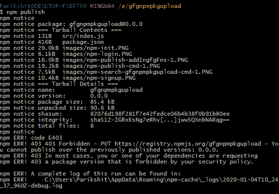

由于版本号未更改，npm 发布中止

这里，命令行抛出了一个错误，因为在没有升级版本的情况下尝试了“npm 发布”。
**一个显而易见的注意:**你不能撞下版本。例如，版本不能从 0.1.2 更改为 0.1.1。

**当用户拥有旧版本的模块时会发生什么？**当 npm 模块重新发布(更新)时，用户只需再次运行‘NPM install gfgnpmpkgupload’(NPM install package name)即可获得最新版本。

**依赖于其他包的包:**在开发包的旅程中，搜索、使用和查看依赖是很常见的。这样做的过程如下:

*   在 npm 模块项目中，安装 npm 模块所需的依赖项。
*   使用

    ```html
    npm install packagename1[ packagename2]

    ```

    将这些依赖项安装到您的项目中
*   检查这些依赖项现在是否在 package.json 文件的“dependencies”键中提到。请注意，这里提到的依赖项及其版本将在 npm 包中继续使用。
*   After assuring that all the above steps are rightly executed, simply publish the module using

    ```html
    > npm version minor
    npm publish

    ```

    。
    上述程序应该成功执行，结果应该可以在 npm 注册网站上看到，如下所示:

    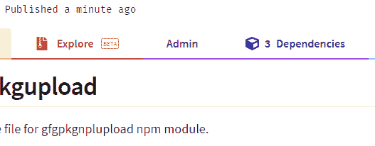

    三依赖-提示-笑话-数学

**构建更复杂的模块:**让我们尝试构建一个读取 txt 文件、从文件中提取数字、将它们全部相加并在控制台中显示结果的模块。
要做到这一点，我们的 npm 模块应该是[这个](https://www.npmjs.com/package/gfgnpmpkgupload/v/1.0.3)。
现在，我们有了我们的模块集，让我们使用将其导入到我们的新项目中

```html
npm install gfgnpmpkgupload
```

在运行上述命令之前，请务必运行

```html
npm init -y
```

来建立这个项目。

让您的项目如下所示:

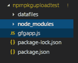

npmpkguploadtest 项目结构

数据文件应该包含一个 numFile.txt，其中包含必须添加并在控制台中显示的数字。

```html
// numFile.txt - sum = 55
1 2 3 4 5 6 7 8 9 10

```

为了使用这个 numFile.txt，我们将有一个 gfgapp.js 来进行实际的添加。

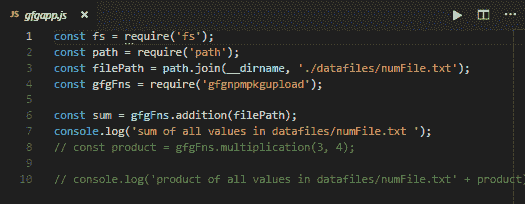

npmpkguploadtest-gfgapjs

要对此进行测试，请转到命令行并运行

```html
node gfgapp.js
```

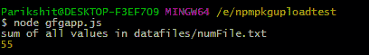

节点 gfgappjs 命令行视图运行成功

**NPM 模块样板:** NPM 模块样板也可用于[约曼. io](https://yeoman.io/) 上的项目脚手架。各种技术组合都有，你可以使用你喜欢的发电机。首先，进入[约曼发电机搜索](https://yeoman.io/generators/)并搜索类似“npm 模块样板”的内容。

**取消发布 NPM 套餐:**NPM 套餐应在首次发布后 72 小时内取消。另一种方法是联系国家预防机制登记处。如果要在 72 小时内取消发布，请使用以下命令:

```html
npm unpublish packageName
```

NPM 的[从注册表](https://docs.npmjs.com/unpublishing-packages-from-the-registry)中取消发布软件包是一个很好的页面来了解更多信息。

**示例:**使用发布的包添加两个数字。
T3】文件名:app.js

```html
const GFGFns = require('gfgnpmpkgupload');
console.log(GFGFns.add(4, 5));
```

**输出:**

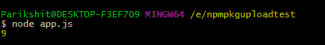

node-appjs-add 459-run-success-1