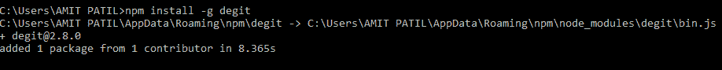
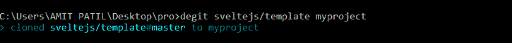
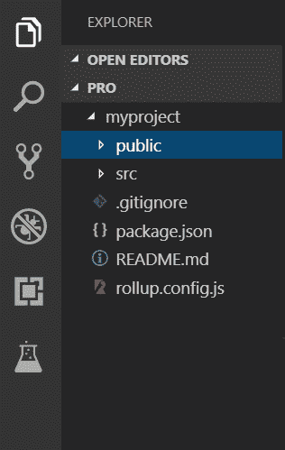
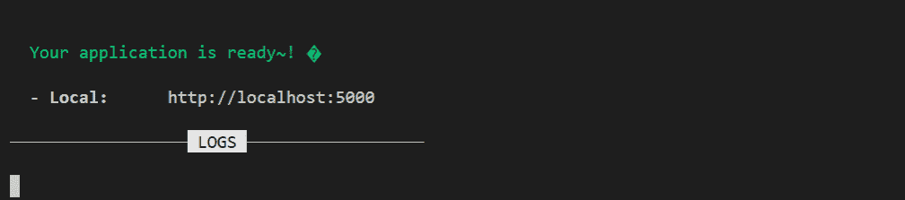
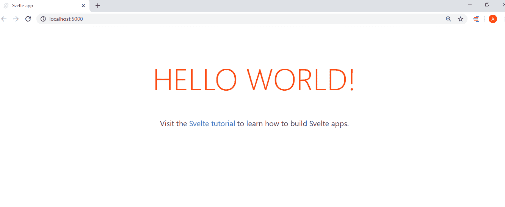

# 斯维特|介绍与安装

> 原文:[https://www . geesforgeks . org/svelte-introduction-and-installation/](https://www.geeksforgeeks.org/svelte-introduction-and-installation/)

**Svelte** 是创建网络应用的新方法。它可以用于一小部分代码或整个单页应用程序。它是一个**编译器**而不是一个框架，比其他类似[**【ReactJS】**](https://www.geeksforgeeks.org/react-js-introduction-working/)[**AngularJS**](https://www.geeksforgeeks.org/angularjs-tutorials/)[**VueJS**](https://www.geeksforgeeks.org/vue-js-introduction-installation/)这样的 JavaScript 库要快。用于创建**反应性**网络应用。如果数据发生任何变化，该变化将立即反映在页面上。它也用于**快速应用程序开发(RAD)** 手段快速产生最低限度编码的软件应用程序。用于**网页优化**。但是它没有使用**虚拟 DOM** ，这使得它与众不同。是 **Rich Harris** 写的免费开源。Svelte 在执行时将您的生产代码编译成**普通 JavaScript 包**。如果您通过互联网部署您的应用程序，那么**不需要像我们部署其他库一样部署 Sverte**。这就是为什么它会导致快速执行。

**先决条件:**在安装或开始在 Svelte 上工作之前，我们必须确保我们的系统中几乎没有可用的东西。

*   任何文本编辑器(例如 vs 代码、Atom 等)。)
*   安装在系统中的 node.js
    1.  [在 Windows 上安装 node . js](https://www.geeksforgeeks.org/installation-of-node-js-on-windows/)
    2.  [在 Linux 上安装 node . js](https://www.geeksforgeeks.org/installation-of-node-js-on-linux/)

**斯维特的安装:**现在我们准备安装斯维特。

*   **第一步:**打开命令提示符或终端，安装一个名为 **degit** 的包，可以让我们从 github 存储库中轻松克隆最新的 commit。

```html
npm install -g degit
```



*   **步骤 2:** 现在在桌面上创建一个目录，运行下面的命令。degit 转到存储库(sveltejs)找到模板，并在名为 myproject 的项目中为我们本地下载它。

```html
degit sveltejs/template myproject
```



*   **步骤 3:** 项目创建完毕，现在在文本编辑器中打开。在 **src 文件夹**中，我们有 **main.js** 文件，该文件用于执行我们的 svelte 应用程序 **App.svelte** 是我们应用程序的根组件，而 **package.json** 文件包含所有需要安装的依赖项。



*   **步骤 4:** 现在安装所有的依赖项，确保你在**“我的项目”**目录中。

```html
npm install
```

*   **步骤 5:** 现在创建一个本地开发服务器来运行我们的应用程序。

```html
npm run dev
```



*   **第 6 步:**现在按照上面的链接，应用程序将在浏览器中打开。

